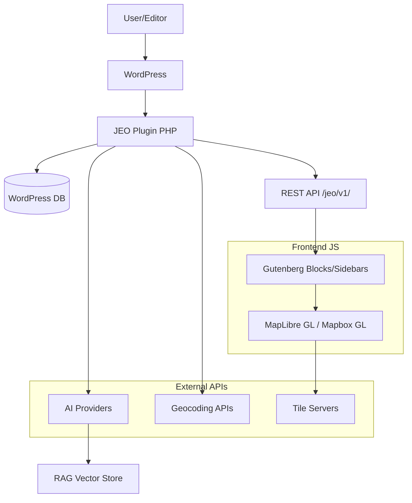
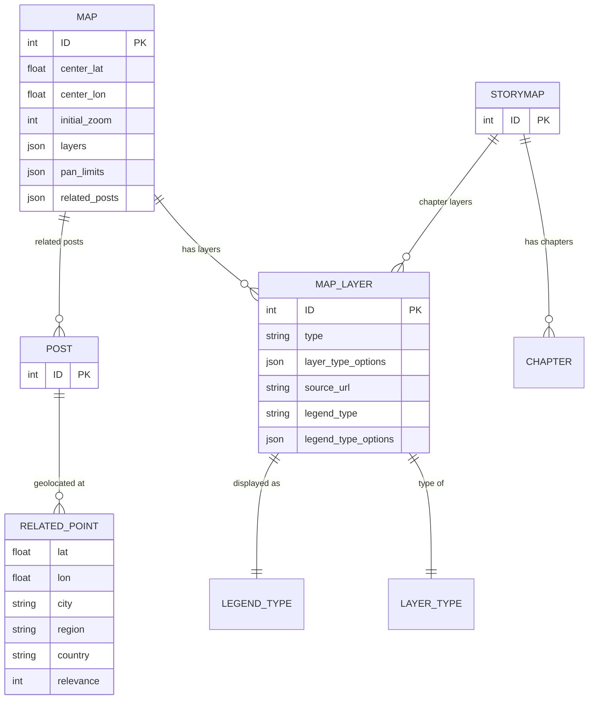

# JEO Plugin — Architecture for AI Agents

> **Navigation index** — consult the files below based on your current task.

## Quick Reference

| Task | File |
|------|------|
| Create/modify Gutenberg blocks | [`blocks/README.md`](blocks/README.md) |
| Work with maps (CPT `map`) | [`maps/README.md`](maps/README.md) |
| Work with layers | [`layers/README.md`](layers/README.md) |
| Geocoding, post geolocation | [`geocoding/README.md`](geocoding/README.md) |
| Storymap (scrollytelling) | [`storymap/README.md`](storymap/README.md) |
| Discovery feature | [`discovery/README.md`](discovery/README.md) |
| AI integration (georef, RAG, bulk) | [`ai/README.md`](ai/README.md) |
| REST API endpoints | [`rest-api/README.md`](rest-api/README.md) |
| Settings, admin pages | [`settings/README.md`](settings/README.md) |
| Frontend: MapLibre/Mapbox, React, iframe | [`frontend/README.md`](frontend/README.md) |
| Templates PHP/EJS, shortcodes, embeds | [`templates/README.md`](templates/README.md) |
| Build (webpack), scripts, CI | [`build/README.md`](build/README.md) |
| Deploy to WordPress.org | [`deployment/README.md`](deployment/README.md) |

## Project Overview

```
jeo-plugin/
├── src/                          # WordPress plugin (deployed as-is)
│   ├── jeo.php                   # Main entry point (PHP 8.2+)
│   ├── includes/                 # Backend PHP
│   │   ├── class-jeo.php         # Central orchestrator (Singleton)
│   │   ├── loaders.php           # PSR-0 autoloader + global functions
│   │   ├── maps/                 # CPT `map`
│   │   ├── layers/               # CPT `map-layer`
│   │   ├── layer-types/          # Layer types + JS renderers
│   │   ├── legend-types/         # Legend types + JS renderers
│   │   ├── geocode/              # Geocoders (Nominatim, Mapbox)
│   │   ├── storymap/             # CPT `storymap`
│   │   ├── ai/                   # AI: georef, RAG, bulk, providers
│   │   ├── settings/             # Settings page
│   │   ├── sidebars/             # Gutenberg sidebars (assets)
│   │   ├── menu/                 # Admin menu
│   │   ├── admin/                # Dashboard + Welcome pages
│   │   ├── cli/                  # WP-CLI commands
│   │   └── traits/               # Singleton, Rest_Validate_Meta
│   ├── js/
│   │   ├── src/                  # JS/React source
│   │   │   ├── lib/              # MapLibre/Mapbox abstraction
│   │   │   ├── jeo-map/          # Frontend map rendering
│   │   │   ├── map-blocks/       # Gutenberg blocks
│   │   │   ├── layers-sidebar/   # Layer editor sidebar
│   │   │   ├── maps-sidebar/     # Map editor sidebar
│   │   │   ├── posts-sidebar/    # Geolocation sidebar
│   │   │   ├── posts-selector/   # Related posts selector
│   │   │   ├── jeo-storymap/     # Storymap display
│   │   │   ├── discovery/        # Discovery app
│   │   │   ├── icons/            # SVG/PNG assets
│   │   │   └── shared/           # Hooks, utils, shared components
│   │   └── build/                # Build output (webpack)
│   ├── css/                      # SCSS
│   ├── templates/                # PHP + EJS templates
│   └── languages/                # .pot / translations
├── scripts/                      # Build and CI scripts
├── docs/                         # MkDocs documentation
└── .github/workflows/            # CI/CD
```

## Stack

| Layer | Technology |
|-------|-----------|
| Backend | PHP 8.2+, WordPress 6.x |
| Frontend | React 18, WordPress Element, Gutenberg Data |
| Maps | MapLibre GL JS (default) / Mapbox GL JS (optional) |
| Build | Webpack 5, @wordpress/scripts |
| Lint | PHPCS (WPCS), ESLint (via wp-scripts) |
| Tests | Jest (JS), PHPUnit (PHP) |
| AI | NeuronAI (10 providers: Gemini, OpenAI, DeepSeek, etc.) |

## Key Conventions

- **PHP**: PSR-0 autoloading (`Jeo\ClassName` → `class-class-name.php`), WPCS coding standards
- **Singleton**: All main classes use `Jeo\Singleton` trait
- **Global accessors**: `jeo()`, `jeo_maps()`, `jeo_layers()`, `jeo_settings()`, etc.
- **Meta REST**: `_related_point` for geolocation, registered with full REST schema
- **Iframe compat**: Extensive patching for Block API v3 (Gutenberg iframe editor)
- **JS entries**: Each webpack entry point is independent; `dependOn` for shared chunks

## Architecture Diagram (C4 Container)



## Data Model


