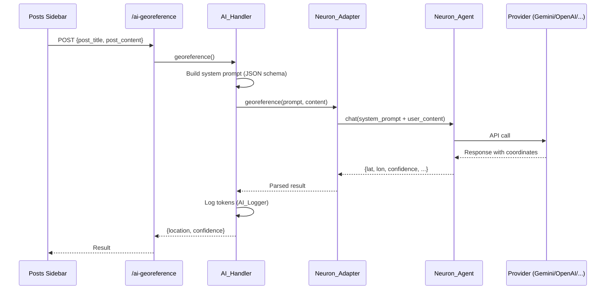
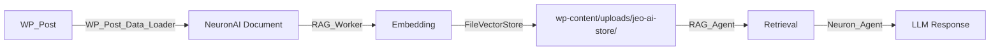

# AI Integration

## Key Files

| File | Role |
|------|------|
| `src/includes/class-ai-handler.php` | Central orchestrator, 12 REST routes |
| `src/includes/class-ai-adapter.php` | Abstract base class for adapters |
| `src/includes/ai/class-neuron-adapter.php` | Universal adapter → NeuronAI |
| `src/includes/ai/class-neuron-agent.php` | NeuronAI agent (chat + tokens) |
| `src/includes/ai/class-neuron-factory.php` | Provider factory (10 providers) |
| `src/includes/ai/class-ai-logger.php` | Cost tracking (CPT `jeo-ai-log`) |
| `src/includes/ai/class-ai-settings.php` | AI settings page |
| `src/includes/ai/class-bulk-processor.php` | Batch geolocation (WP-Cron) |
| `src/includes/ai/class-rag-agent.php` | RAG pipeline (FileVectorStore) |
| `src/includes/ai/class-rag-worker.php` | Background vectorization worker |
| `src/includes/ai/class-rag-backup.php` | Vector store backup/restore |
| `src/includes/ai/class-wp-post-data-loader.php` | Converts WP_Post → NeuronAI Document |
| `src/includes/ai/data/*.json` | Brazilian geographic dictionaries |
| `src/includes/cli/class-ai-cli.php` | WP-CLI `wp jeo ai vectorize` |

## Supported Providers (10)

| Provider | Chat | Embedding | Factory Method |
|----------|------|-----------|----------------|
| Gemini | Yes | Yes | `Neuron_Factory::get_chat_provider()` |
| OpenAI | Yes | Yes | `Neuron_Factory::get_chat_provider()` |
| DeepSeek | Yes | — | `Neuron_Factory::get_chat_provider()` |
| Anthropic | Yes | — | `Neuron_Factory::get_chat_provider()` |
| Ollama | Yes | Yes | `Neuron_Factory::get_chat_provider()` |
| Mistral | Yes | — | `Neuron_Factory::get_chat_provider()` |
| ZAI | Yes | — | `Neuron_Factory::get_chat_provider()` |
| HuggingFace | Yes | — | `Neuron_Factory::get_chat_provider()` |
| Grok | Yes | — | `Neuron_Factory::get_chat_provider()` |
| Cohere | Yes | — | `Neuron_Factory::get_chat_provider()` |

## REST Routes (12+)

| Route | Method | Description |
|-------|--------|-------------|
| `/jeo/v1/ai-georeference` | POST | Georeference post content |
| `/jeo/v1/ai-chat-prompt-generator` | POST | Generate chat prompt |
| `/jeo/v1/ai-validate-prompt` | POST | Validate prompt |
| `/jeo/v1/ai-test-key` | POST | Test provider API key |
| `/jeo/v1/ai-get-models` | GET | List provider models |
| `/jeo/v1/ai-test-embedding` | POST | Test embedding |
| `/jeo/v1/ai-test-retrieval` | POST | Test RAG retrieval |
| `/jeo/v1/ai-backup-store` | POST | Backup vector store |
| `/jeo/v1/ai-list-backups` | GET | List backups |
| `/jeo/v1/ai-delete-backup` | DELETE | Delete backup |
| `/jeo/v1/ai-clear-store` | POST | Clear vector store |
| `/jeo/v1/bulk-ai-run` | POST | Start batch geolocation |
| `/jeo/v1/bulk-ai-clear-batch` | POST | Clear batch |
| `/jeo/v1/bulk-ai-clear-all` | POST | Clear all |
| `/jeo/v1/bulk-ai-clear-logs` | POST | Clear logs |
| `/jeo/v1/bulk-ai-preview-approval` | POST | Preview batch approval |
| `/jeo/v1/ai-rag-run-manual` | POST | Manual vectorization trigger |

## AI Georeferencing

### Flow

### System Prompt

The base adapter (`class-ai-adapter.php`) builds a prompt that:
- Defines the task as georeferencing
- Provides strict JSON schema for the response
- Includes confidence scoring instructions
- Applies aggressive JSON format enforcement

## Bulk Processing

`Bulk_Processor` geolocates legacy posts in batches:

1. Config: post types, confidence threshold, batch size
2. WP-Cron schedules periodic processing
3. Each batch: selects posts without `_related_point`, sends to AI
4. "JEO AI Status" column in admin post list
5. Approval modal with preview
6. Individual or bulk approval

## RAG (Retrieval-Augmented Generation)

### Pipeline

### Components

- **FileVectorStore**: Stored in `wp-content/uploads/jeo-ai-store/`
- **Model Lock**: Ensures consistency between embedding and retrieval models
- **Backup**: ZIP with rotation (max 3 backups)
- **WP-CLI**: `wp jeo ai vectorize --post_type=post --batch_size=20`

### Embedded Dictionaries

`ai/data/` contains 10 JSONs with Brazilian geographic data:
- Biomes, Conservation Units, Indigenous Lands
- Hydrographic Basins, Settlements, Quilombola territories
- Legal Amazon, Extractive Reserves, etc.

## AI Settings

4 tabs under **Jeo → AI**:
1. **Provider**: Selection + API key + model
2. **Knowledge Base**: Manage vector store
3. **Embedded Data**: Geographic dictionaries
4. **Bulk Geolocation**: Batch processing config

## Cost Tracking

`AI_Logger` records via CPT `jeo-ai-log`:
- Provider, model
- Input/output tokens
- Prompt, response
- Timestamp

Dashboard at **Jeo → AI Debug Logs** with metrics per model/provider.
