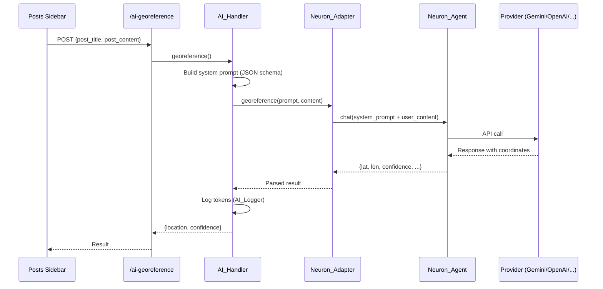
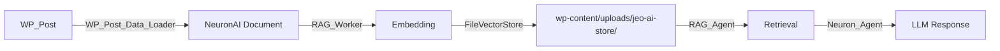
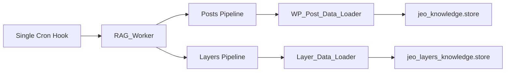
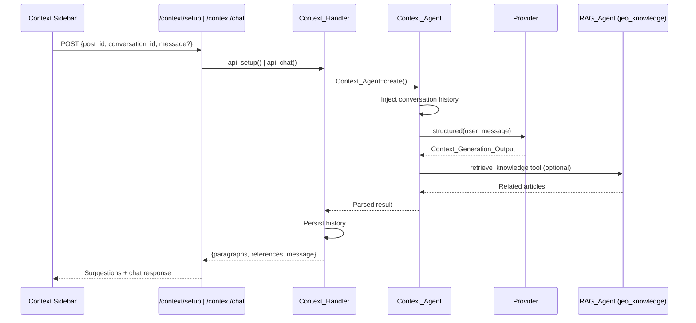

# AI Integration

## Key Files

| File | Role |
|------|------|
| `src/includes/class-ai-handler.php` | Central orchestrator, 12 REST routes |
| `src/includes/class-ai-adapter.php` | Abstract base class for adapters |
| `src/includes/ai/class-neuron-adapter.php` | Universal adapter → NeuronAI |
| `src/includes/ai/class-neuron-agent.php` | NeuronAI agent (chat + tokens) |
| `src/includes/ai/class-neuron-factory.php` | Provider factory (10 providers) |
| `src/includes/ai/class-ai-logger.php` | Cost tracking (CPT `jeo-ai-log`) |
| `src/includes/ai/class-ai-settings.php` | AI settings page |
| `src/includes/ai/class-bulk-processor.php` | Batch geolocation (WP-Cron) |
| `src/includes/ai/class-rag-agent.php` | RAG pipeline (FileVectorStore), accepts store name |
| `src/includes/ai/class-rag-worker.php` | Unified background worker (posts + layers pipelines) |
| `src/includes/ai/class-rag-backup.php` | Vector store backup/restore |
| `src/includes/ai/class-rag-pipeline-config.php` | Pipeline configuration value object |
| `src/includes/ai/class-wp-post-data-loader.php` | Converts WP_Post → NeuronAI Document |
| `src/includes/ai/class-layer-data-loader.php` | Converts map-layer → NeuronAI Document |
| `src/includes/ai/class-color-describer.php` | HSL color analysis for legend embeddings |
| `src/includes/ai/class-minilayer-agent.php` | Minilayer agent factory (Assistant with native MCP config) |
| `src/includes/ai/class-minilayer-handler.php` | Minilayer REST endpoint, delegates to `Minilayer_Service` |
| `src/includes/ai/class-minilayer-service.php` | Shared service — AI style generation, JSON parsing, layer CPT creation (used by handler and `Generate_Layer_Tool`) |
| `src/includes/ai/class-generate-layer-tool.php` | NeuronAI tool for minimap agent — generates custom Mapbox styles (conditional on Mapbox key) |
| `src/includes/ai/class-minimap-agent.php` | Minimap agent factory (Assistant::configure with sub-agents, tools, structured output) |
| `src/includes/ai/class-jeo-ai-factory.php` | Unified Assistant factory — provider, logger, storage, tools, MCP |
| `src/includes/ai/class-tool-registry.php` | Central registry for all NeuronAI tools |
| `src/includes/ai/class-ai-rest-permissions.php` | Reusable REST permission callbacks |
| `src/includes/ai/class-system-prompt-builder.php` | Shared prompt construction (calibration, schema blocks, sanitization) |
| `src/includes/ai/class-georeferencing-conversation.php` | Multi-turn georeferencing session manager (ConversationStore) |
| `src/includes/ai/class-minimap-output.php` | Structured output DTO (layers, base_layer, center, zoom, pins, messages) |
| `src/includes/ai/class-search-layers-tool.php` | Agent tool — wraps RAG_Worker::find_matching_layers() |
| `src/includes/ai/class-geocode-tool.php` | Agent tool — active geocoder → Mapbox fallback → defaults |
| `src/includes/ai/class-get-post-content-tool.php` | Agent tool — post content + _related_point meta for sub-agent |
| `src/includes/ai/class-retrieve-knowledge-tool.php` | Agent tool — semantic retrieval from `jeo_knowledge` vector store |
| `src/includes/ai/class-context-agent.php` | Context Assistant agent factory (Assistant::configure with retrieve_knowledge tool, sub-agents, structured output). Uses custom `ai_context_prompt` from settings when available |
| `src/includes/ai/class-context-handler.php` | Context Assistant REST endpoints (setup + chat) |
| `src/includes/ai/class-context-generation-output.php` | Structured output DTO for suggested paragraphs and references |
| `src/includes/ai/class-wp-storage.php` | StorageInterface adapter for post_meta / user_meta |
| `src/includes/ai/class-wp-option-storage.php` | StorageInterface adapter for wp_options (global learning storage) |
| `src/includes/ai/data/*.json` | Brazilian geographic dictionaries |
| `src/includes/cli/class-ai-cli.php` | WP-CLI `wp jeo ai vectorize` |

## Supported Providers (10)

| Provider | Chat | Embedding | Factory Method |
|----------|------|-----------|----------------|
| Gemini | Yes | Yes | `Neuron_Factory::get_chat_provider()` |
| OpenAI | Yes | Yes | `Neuron_Factory::get_chat_provider()` |
| DeepSeek | Yes | — | `Neuron_Factory::get_chat_provider()` |
| Anthropic | Yes | — | `Neuron_Factory::get_chat_provider()` |
| Ollama | Yes | Yes | `Neuron_Factory::get_chat_provider()` |
| Mistral | Yes | — | `Neuron_Factory::get_chat_provider()` |
| ZAI | Yes | — | `Neuron_Factory::get_chat_provider()` |
| HuggingFace | Yes | — | `Neuron_Factory::get_chat_provider()` |
| Grok | Yes | — | `Neuron_Factory::get_chat_provider()` |
| Cohere | Yes | — | `Neuron_Factory::get_chat_provider()` |

## REST Routes (12+)

| Route | Method | Description |
|-------|--------|-------------|
| `/jeo/v1/ai-georeference` | POST | Georeference post content |
| `/jeo/v1/ai-chat-prompt-generator` | POST | Generate chat prompt |
| `/jeo/v1/ai-validate-prompt` | POST | Validate prompt |
| `/jeo/v1/ai-test-key` | POST | Test provider API key |
| `/jeo/v1/ai-get-models` | GET | List provider models |
| `/jeo/v1/ai-test-embedding` | POST | Test embedding |
| `/jeo/v1/ai-test-retrieval` | POST | Test RAG retrieval |
| `/jeo/v1/ai-backup-store` | POST | Backup vector store |
| `/jeo/v1/ai-list-backups` | GET | List backups |
| `/jeo/v1/ai-delete-backup` | DELETE | Delete backup |
| `/jeo/v1/ai-clear-store` | POST | Clear vector store |
| `/jeo/v1/bulk-ai-run` | POST | Start batch geolocation |
| `/jeo/v1/bulk-ai-clear-batch` | POST | Clear batch |
| `/jeo/v1/bulk-ai-clear-all` | POST | Clear all |
| `/jeo/v1/bulk-ai-clear-logs` | POST | Clear logs |
| `/jeo/v1/bulk-ai-preview-approval` | POST | Preview batch approval |
| `/jeo/v1/ai-rag-run-manual` | POST | Manual vectorization trigger (posts) |
| `/jeo/v1/ai-layer-rag-run-manual` | POST | Manual vectorization trigger (layers) |
| `/jeo/v1/ai-clear-layer-store` | POST | Clear layer vector store |
| `/jeo/v1/ai-suggest-layers` | POST | Semantic layer matching (post ID or query) |
| `/jeo/v1/ai-georeference-chat` | POST | Multi-turn georeferencing with conversation history |
| `/jeo/v1/minilayer/generate` | POST | Generate Mapbox style from text prompt (Minilayer) |
| `/jeo/v1/minimap/setup` | POST | Generate minimap from post content (RAG + post geopoints) |
| `/jeo/v1/minimap/setup-prompt` | POST | Generate minimap from text prompt via AI agent |
| `/jeo/v1/minimap/chat` | POST | Multi-turn conversation for map refinement via AI agent |
| `/jeo/v1/context/setup` | POST | Generate initial editorial suggestions from post content |
| `/jeo/v1/context/chat` | POST | Multi-turn conversation for refining editorial suggestions |
| `/jeo/v1/context/state` | GET | Load persisted conversation state (messages, suggestions, conversation_id) |

## AI Georeferencing

### Flow

```mermaid
sequenceDiagram
    participant JS as Posts Sidebar
    participant REST as /ai-georeference
    participant H as AI_Handler
    participant A as Neuron_Adapter
    participant N as Neuron_Agent
    participant LLM as Provider (Gemini/OpenAI/...)

    JS->>REST: POST {post_title, post_content}
    REST->>H: georeference()
    H->>H: Build system prompt (JSON schema)
    H->>A: georeference(prompt, content)
    A->>N: chat(system_prompt + user_content)
    N->>LLM: API call
    LLM-->>N: Response with coordinates
    N-->>A: {lat, lon, confidence, ...}
    A-->>H: Parsed result
    H->>H: Log tokens (AI_Logger)
    H-->>REST: {location, confidence}
    REST-->>JS: Result
```

### System Prompt

The base adapter (`class-ai-adapter.php`) builds a prompt that:
- Defines the task as georeferencing
- Provides strict JSON schema for the response
- Includes confidence scoring instructions
- Applies aggressive JSON format enforcement
- **Incorporates active calibration settings** (granularity, confidence threshold, title weight, primary/secondary thresholds, primary/secondary point count limits) into the default prompt so users who do not generate a custom prompt via the AI Prompt Assistant still benefit from their calibration configuration
- Adapts the precision instruction in the enforced schema based on whether a minimum confidence calibration is active, avoiding conflicting directives
- Enforces max point limits in both the frontend sidebar and the bulk processor when configured

## Bulk Processing

`Bulk_Processor` geolocates legacy posts in batches:

1. Config: post types, confidence threshold, batch size
2. WP-Cron schedules periodic processing
3. Each batch: selects posts without `_related_point`, sends to AI
4. "JEO AI Status" column in admin post list
5. Approval modal with preview
6. Individual or bulk approval

## RAG (Retrieval-Augmented Generation)

### Pipeline

```mermaid
graph LR
    A[WP_Post] -->|WP_Post_Data_Loader| B[NeuronAI Document]
    B -->|RAG_Worker| C[Embedding]
    C -->|FileVectorStore| D[wp-content/uploads/jeo-ai-store/]
    D -->|RAG_Agent| E[Retrieval]
    E -->|Neuron_Agent| F[LLM Response]
```

### Unified Multi-Pipeline Architecture

The RAG system uses a **unified pipeline** managed by `RAG_Worker` with a `RAG_Pipeline_Config` value object that parameterizes the indexing process for different content types.

#### Active Pipelines

| Pipeline | Store Name | Post Type | Data Loader | Meta Key |
|----------|-----------|-----------|-------------|----------|
| Posts | `jeo_knowledge` | Configurable (`['post']` default) | `WP_Post_Data_Loader` | `_jeo_vectorized_at` |
| Layers | `jeo_layers_knowledge` | `map-layer` | `Layer_Data_Loader` | `_jeo_layer_vectorized_at` |

#### Pipeline Flow

```mermaid
graph LR
    A[Single Cron Hook] --> B[RAG_Worker]
    B --> C1[Posts Pipeline]
    B --> C2[Layers Pipeline]
    C1 --> D1[WP_Post_Data_Loader]
    C2 --> D2[Layer_Data_Loader]
    D1 --> E1[jeo_knowledge.store]
    D2 --> E2[jeo_layers_knowledge.store]
```

### Layer Store

#### Layer Data Loader (`class-layer-data-loader.php`)

Converts `map-layer` CPT posts into `NeuronAI\RAG\Document[]`. Composes embedding text from:

- Title (always)
- Content (optional — future-ready)
- Layer type (human-readable label)
- Attribution
- Source URL/path (only if human-readable keywords detected)
- Source layer (only if human-readable keywords detected)
- Legend labels + color descriptions (via `Color_Describer`)
- Palette summary

#### Color Describer (`class-color-describer.php`)

Analyzes hex colors via HSL conversion for semantic embedding:

- Hue name (red, green, blue, etc.)
- Lightness: very dark / dark / medium / light / very light
- Saturation: gray / muted / vivid
- Temperature: warm / cool / neutral
- Palette summary across all legend colors

#### Cross-Store Retrieval

`RAG_Worker::find_matching_layers($text, $topK)` enables semantic matching between post content and layers by embedding the query text and searching the layer store.

### Components

- **FileVectorStore**: Stored in `wp-content/uploads/jeo-ai-store/`
- **Model Lock**: Per-store model consistency (`<store_name>.model_info`)
- **Backup**: ZIP with rotation (max 3 backups), includes both stores
- **WP-CLI**: `wp jeo ai vectorize --store=posts|layers --batch_size=20`
- **WP-CLI Aliases**: `vectorize-posts`, `vectorize-layers`

### Embedded Dictionaries

`ai/data/` contains 10 JSONs with Brazilian geographic data:
- Biomes, Conservation Units, Indigenous Lands
- Hydrographic Basins, Settlements, Quilombola territories
- Legal Amazon, Extractive Reserves, etc.

## RAG Vector Store Configuration

| Setting | Key | Default | Range | Description |
|---------|-----|---------|-------|-------------|
| Search Results (topK) | `ai_rag_topk` | 10 | 1–50 | Maximum semantic matches returned per search by `FileVectorStore` |

The `topK` value is read from JEO settings in `RAG_Agent::vectorStore()` and passed to `FileVectorStore`. Previously hardcoded to 3, it is now configurable so callers like `Search_Layers_Tool` and `find_matching_layers()` can receive the full number of results they request.

### Layer Deduplication

`Layer_Data_Loader` sets `Document->sourceType = 'layer'` and `Document->sourceName = (string) $post->ID` so each embedding is tagged with its layer ID. When a layer is saved, `RAG_Worker::on_layer_save()` calls `deleteBy('layer', $post_id)` on the vector store before adding the new embedding, preventing duplicate entries that would pollute search results.

## Unified AI Architecture (Phase 1–2)

The JEO AI system is converging onto `hacklabr/ai-assistant` as the unified execution layer:

- **JEO_AI_Factory**: Creates all `Assistant` instances with shared provider, logger, storage, and tool registry.
- **Tool_Registry**: Central singleton registering `search_layers`, `geocode`, `generate_layer`, `get_post_content`.
- **AI_REST_Permissions**: Reusable `permission_callback` closures replacing inline anonymous functions.
- **System_Prompt_Builder**: Extracts calibration-aware prompt construction from `AI_Adapter` into reusable static methods.
- **Georeferencing_Conversation**: Enables multi-turn refinement of georeferencing results via `ConversationStore`.

## AI Settings

4 tabs under **Jeo → AI**:
1. **Provider**: Selection + API key + model
2. **Knowledge Base**: Manage vector store (embedding model, auto-indexing, batch size, cron interval, topK)
3. **Embedded Data**: Geographic dictionaries
4. **Bulk Geolocation**: Batch processing config

## Cost Tracking

`AI_Logger` records via CPT `jeo-ai-log`:
- Provider, model
- Input/output tokens
- Prompt, response
- Timestamp

Dashboard at **Jeo → AI Debug Logs** with metrics per model/provider.

## Minimap (AI-Assisted Map Block)

See [`minimap/README.md`](../minimap/README.md) for full architecture, agent details, REST endpoints, and data flows.

The `jeo/ai-minimap` block provides:

- **Post content mode**: Legacy RAG-based generation via `RAG_Worker::find_matching_layers()` (`/minimap/setup`)
- **Prompt mode**: Full AI agent with structured output, sub-agents, and tools (`/minimap/setup-prompt`)
- **Chat refinement**: Multi-turn conversation for iterative map changes (`/minimap/chat`)

### Key Agent Files

| File | Role |
|------|------|
| `src/includes/ai/class-minimap-agent.php` | Agent factory (Assistant::configure with tools, sub-agents, storages). Conditionally includes `Generate_Layer_Tool` when Mapbox key is available |
| `src/includes/ai/class-minimap-output.php` | Structured output DTO |
| `src/includes/ai/class-search-layers-tool.php` | Semantic layer search tool |
| `src/includes/ai/class-geocode-tool.php` | Geocoding tool with fallback chain |
| `src/includes/ai/class-generate-layer-tool.php` | Custom Mapbox style generation tool (conditional, requires Mapbox key + user authorization) |
| `src/includes/ai/class-get-post-content-tool.php` | Post content tool for post_analyzer sub-agent |
| `src/includes/ai/class-wp-storage.php` | Post/user meta storage adapter |
| `src/includes/ai/class-wp-option-storage.php` | WP options storage adapter (global learning) |

## AI Context Assistant (Editorial Suggestions)

The AI Context Assistant is a Gutenberg sidebar plugin that suggests new paragraphs and related article references for editorial posts. It uses the same Assistant architecture as the minimap: structured output, sub-agents, tools, conversation storage in `post_meta`, and user memory in `user_meta`.

### Flow

```mermaid
sequenceDiagram
    participant JS as Context Sidebar
    participant REST as /context/setup | /context/chat
    participant H as Context_Handler
    participant A as Context_Agent
    participant LLM as Provider
    participant RAG as RAG_Agent (jeo_knowledge)

    JS->>REST: POST {post_id, conversation_id, message?}
    REST->>H: api_setup() | api_chat()
    H->>A: Context_Agent::create()
    A->>A: Inject conversation history
    A->>LLM: structured(user_message)
    LLM-->>A: Context_Generation_Output
    A->>RAG: retrieve_knowledge tool (optional)
    RAG-->>A: Related articles
    A-->>H: Parsed result
    H->>H: Persist history
    H-->>REST: {paragraphs, references, message}
    REST-->>JS: Suggestions + chat response
```

### Key Files

| File | Role |
|------|------|
| `src/includes/ai/class-context-agent.php` | Agent factory with `retrieve_knowledge` and `get_post_content` tools, `post_analyzer` sub-agent |
| `src/includes/ai/class-context-handler.php` | REST handler: `/context/setup`, `/context/chat`, `/context/state`. Dual storage: `ConversationStore` for AI context, `_jeo_ai_context_chat_messages` for clean UI messages |
| `src/includes/ai/class-context-generation-output.php` | Structured output DTO: paragraphs (text may contain inline HTML), references, message, assistant_message |
| `src/includes/ai/class-retrieve-knowledge-tool.php` | NeuronAI tool that queries `jeo_knowledge` via `RAG_Agent::resolveRetrieval()` |
| `src/js/src/context-sidebar/index.js` | Gutenberg plugin entry point (`registerPlugin`) |
| `src/js/src/context-sidebar/context-chat-panel.js` | Chat UI, state management, API calls |
| `src/js/src/context-sidebar/suggested-paragraphs.js` | Renders suggested paragraphs with inline HTML support. "Insert" creates `core/paragraph` with HTML content; "Copy" uses triple-fallback rich-text clipboard |

### Features
- **Manual setup**: User clicks "Generate Suggestions" to start; no automatic trigger on panel open.
- **State persistence**: Conversation ID, last suggestions, and clean chat messages are stored in post meta (`_jeo_ai_context_conversation_id`, `_jeo_ai_context_last_response`, `_jeo_ai_context_chat_messages`). Closing/reopening the panel or refreshing the page restores the session via `GET /context/state`.
- **Dual conversation storage**: `ConversationStore` (backed by `WP_Storage` on post meta) holds the raw AI conversation history, including schema-injected messages required for structured output continuity. A separate `_jeo_ai_context_chat_messages` meta holds clean, human-readable messages (user text + `assistant_message`) for UI display only. The REST state endpoint reads from the clean meta, never from the raw store.
- **Rich-text paragraphs**: Suggested paragraphs support inline HTML (`<strong>`, `<em>`, `<a href="...">`) generated by the AI. The frontend sanitizes HTML before rendering and preserves formatting on both Copy (rich-text clipboard) and Insert (`core/paragraph` block).
- **Chat refinement**: Multi-turn conversation for iterative editorial changes.
- **Expand modal**: Button in the compact sidebar opens a larger modal for better chat UX.
- **Copy / Insert**: Each suggested paragraph has both "Copy to clipboard" (triple-fallback rich text: `ClipboardItem` → `execCommand` → plain text) and "Insert into article" (creates `core/paragraph` block with sanitized HTML).
- **Customizable prompt**: System prompt can be edited via **JEO → AI Configuration → Context Assistant** tab (`ai_context_prompt`).
- **RAG integration**: Automatically queries the site's knowledge base (`jeo_knowledge`) for related articles.
- **Post type gate**: Only appears for post types in `enabled_post_types` (same rule as geolocation and minimap).

## Minilayer (AI-Generated Layers)

See [`minilayer/README.md`](../minilayer/README.md).

The minilayer pipeline is shared between:
- The standalone REST endpoint (`/jeo/v1/minilayer/generate`)
- The minimap agent's `Generate_Layer_Tool` (conditional, requires Mapbox key + user authorization)

See [`minimap/README.md`](../minimap/README.md) for the minimap-side integration: default style activation, tool error handling, and the authorization gate for layer generation.
