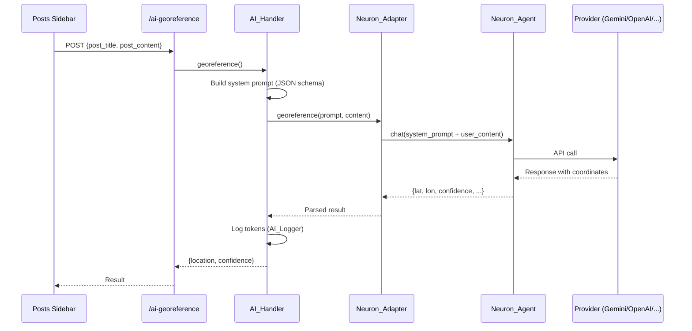
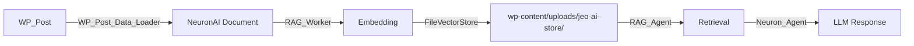
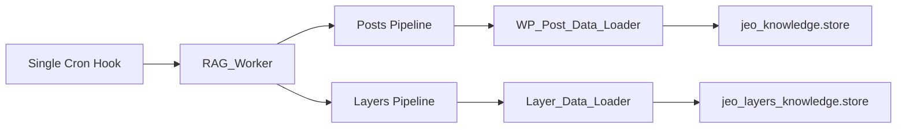
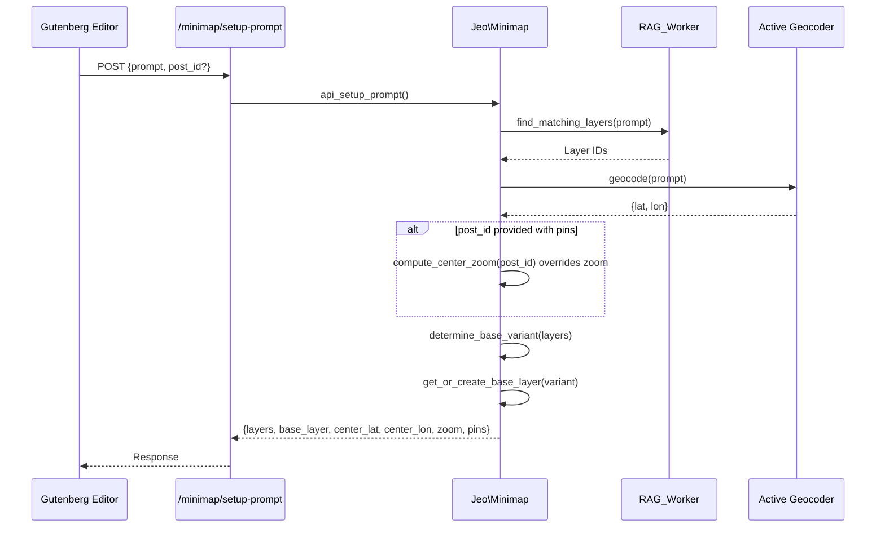

# AI Integration

## Key Files

| File | Role |
|------|------|
| `src/includes/class-ai-handler.php` | Central orchestrator, 12 REST routes |
| `src/includes/class-ai-adapter.php` | Abstract base class for adapters |
| `src/includes/ai/class-neuron-adapter.php` | Universal adapter → NeuronAI |
| `src/includes/ai/class-neuron-agent.php` | NeuronAI agent (chat + tokens) |
| `src/includes/ai/class-neuron-factory.php` | Provider factory (10 providers) |
| `src/includes/ai/class-ai-logger.php` | Cost tracking (CPT `jeo-ai-log`) |
| `src/includes/ai/class-ai-settings.php` | AI settings page |
| `src/includes/ai/class-bulk-processor.php` | Batch geolocation (WP-Cron) |
| `src/includes/ai/class-rag-agent.php` | RAG pipeline (FileVectorStore), accepts store name |
| `src/includes/ai/class-rag-worker.php` | Unified background worker (posts + layers pipelines) |
| `src/includes/ai/class-rag-backup.php` | Vector store backup/restore |
| `src/includes/ai/class-rag-pipeline-config.php` | Pipeline configuration value object |
| `src/includes/ai/class-wp-post-data-loader.php` | Converts WP_Post → NeuronAI Document |
| `src/includes/ai/class-layer-data-loader.php` | Converts map-layer → NeuronAI Document |
| `src/includes/ai/class-color-describer.php` | HSL color analysis for legend embeddings |
| `src/includes/ai/class-minilayer-agent.php` | NeuronAI agent for Minilayer (MCP tools) |
| `src/includes/ai/class-minilayer-handler.php` | Minilayer REST endpoint + layer CPT creation |
| `src/includes/ai/data/*.json` | Brazilian geographic dictionaries |
| `src/includes/cli/class-ai-cli.php` | WP-CLI `wp jeo ai vectorize` |

## Supported Providers (10)

| Provider | Chat | Embedding | Factory Method |
|----------|------|-----------|----------------|
| Gemini | Yes | Yes | `Neuron_Factory::get_chat_provider()` |
| OpenAI | Yes | Yes | `Neuron_Factory::get_chat_provider()` |
| DeepSeek | Yes | — | `Neuron_Factory::get_chat_provider()` |
| Anthropic | Yes | — | `Neuron_Factory::get_chat_provider()` |
| Ollama | Yes | Yes | `Neuron_Factory::get_chat_provider()` |
| Mistral | Yes | — | `Neuron_Factory::get_chat_provider()` |
| ZAI | Yes | — | `Neuron_Factory::get_chat_provider()` |
| HuggingFace | Yes | — | `Neuron_Factory::get_chat_provider()` |
| Grok | Yes | — | `Neuron_Factory::get_chat_provider()` |
| Cohere | Yes | — | `Neuron_Factory::get_chat_provider()` |

## REST Routes (12+)

| Route | Method | Description |
|-------|--------|-------------|
| `/jeo/v1/ai-georeference` | POST | Georeference post content |
| `/jeo/v1/ai-chat-prompt-generator` | POST | Generate chat prompt |
| `/jeo/v1/ai-validate-prompt` | POST | Validate prompt |
| `/jeo/v1/ai-test-key` | POST | Test provider API key |
| `/jeo/v1/ai-get-models` | GET | List provider models |
| `/jeo/v1/ai-test-embedding` | POST | Test embedding |
| `/jeo/v1/ai-test-retrieval` | POST | Test RAG retrieval |
| `/jeo/v1/ai-backup-store` | POST | Backup vector store |
| `/jeo/v1/ai-list-backups` | GET | List backups |
| `/jeo/v1/ai-delete-backup` | DELETE | Delete backup |
| `/jeo/v1/ai-clear-store` | POST | Clear vector store |
| `/jeo/v1/bulk-ai-run` | POST | Start batch geolocation |
| `/jeo/v1/bulk-ai-clear-batch` | POST | Clear batch |
| `/jeo/v1/bulk-ai-clear-all` | POST | Clear all |
| `/jeo/v1/bulk-ai-clear-logs` | POST | Clear logs |
| `/jeo/v1/bulk-ai-preview-approval` | POST | Preview batch approval |
| `/jeo/v1/ai-rag-run-manual` | POST | Manual vectorization trigger (posts) |
| `/jeo/v1/ai-layer-rag-run-manual` | POST | Manual vectorization trigger (layers) |
| `/jeo/v1/ai-clear-layer-store` | POST | Clear layer vector store |
| `/jeo/v1/ai-suggest-layers` | POST | Semantic layer matching (post ID or query) |
| `/jeo/v1/minilayer/generate` | POST | Generate Mapbox style from text prompt (Minilayer) |
| `/jeo/v1/minimap/setup` | POST | Generate minimap from post content (RAG + post geopoints) |
| `/jeo/v1/minimap/setup-prompt` | POST | Generate minimap from text prompt (RAG + geocoder) |

## AI Georeferencing

### Flow

```mermaid
sequenceDiagram
    participant JS as Posts Sidebar
    participant REST as /ai-georeference
    participant H as AI_Handler
    participant A as Neuron_Adapter
    participant N as Neuron_Agent
    participant LLM as Provider (Gemini/OpenAI/...)

    JS->>REST: POST {post_title, post_content}
    REST->>H: georeference()
    H->>H: Build system prompt (JSON schema)
    H->>A: georeference(prompt, content)
    A->>N: chat(system_prompt + user_content)
    N->>LLM: API call
    LLM-->>N: Response with coordinates
    N-->>A: {lat, lon, confidence, ...}
    A-->>H: Parsed result
    H->>H: Log tokens (AI_Logger)
    H-->>REST: {location, confidence}
    REST-->>JS: Result
```

### System Prompt

The base adapter (`class-ai-adapter.php`) builds a prompt that:
- Defines the task as georeferencing
- Provides strict JSON schema for the response
- Includes confidence scoring instructions
- Applies aggressive JSON format enforcement

## Bulk Processing

`Bulk_Processor` geolocates legacy posts in batches:

1. Config: post types, confidence threshold, batch size
2. WP-Cron schedules periodic processing
3. Each batch: selects posts without `_related_point`, sends to AI
4. "JEO AI Status" column in admin post list
5. Approval modal with preview
6. Individual or bulk approval

## RAG (Retrieval-Augmented Generation)

### Pipeline

```mermaid
graph LR
    A[WP_Post] -->|WP_Post_Data_Loader| B[NeuronAI Document]
    B -->|RAG_Worker| C[Embedding]
    C -->|FileVectorStore| D[wp-content/uploads/jeo-ai-store/]
    D -->|RAG_Agent| E[Retrieval]
    E -->|Neuron_Agent| F[LLM Response]
```

### Unified Multi-Pipeline Architecture

The RAG system uses a **unified pipeline** managed by `RAG_Worker` with a `RAG_Pipeline_Config` value object that parameterizes the indexing process for different content types.

#### Active Pipelines

| Pipeline | Store Name | Post Type | Data Loader | Meta Key |
|----------|-----------|-----------|-------------|----------|
| Posts | `jeo_knowledge` | Configurable (`['post']` default) | `WP_Post_Data_Loader` | `_jeo_vectorized_at` |
| Layers | `jeo_layers_knowledge` | `map-layer` | `Layer_Data_Loader` | `_jeo_layer_vectorized_at` |

#### Pipeline Flow

```mermaid
graph LR
    A[Single Cron Hook] --> B[RAG_Worker]
    B --> C1[Posts Pipeline]
    B --> C2[Layers Pipeline]
    C1 --> D1[WP_Post_Data_Loader]
    C2 --> D2[Layer_Data_Loader]
    D1 --> E1[jeo_knowledge.store]
    D2 --> E2[jeo_layers_knowledge.store]
```

### Layer Store

#### Layer Data Loader (`class-layer-data-loader.php`)

Converts `map-layer` CPT posts into `NeuronAI\RAG\Document[]`. Composes embedding text from:

- Title (always)
- Content (optional — future-ready)
- Layer type (human-readable label)
- Attribution
- Source URL/path (only if human-readable keywords detected)
- Source layer (only if human-readable keywords detected)
- Legend labels + color descriptions (via `Color_Describer`)
- Palette summary

#### Color Describer (`class-color-describer.php`)

Analyzes hex colors via HSL conversion for semantic embedding:

- Hue name (red, green, blue, etc.)
- Lightness: very dark / dark / medium / light / very light
- Saturation: gray / muted / vivid
- Temperature: warm / cool / neutral
- Palette summary across all legend colors

#### Cross-Store Retrieval

`RAG_Worker::find_matching_layers($text, $topK)` enables semantic matching between post content and layers by embedding the query text and searching the layer store.

### Components

- **FileVectorStore**: Stored in `wp-content/uploads/jeo-ai-store/`
- **Model Lock**: Per-store model consistency (`<store_name>.model_info`)
- **Backup**: ZIP with rotation (max 3 backups), includes both stores
- **WP-CLI**: `wp jeo ai vectorize --store=posts|layers --batch_size=20`
- **WP-CLI Aliases**: `vectorize-posts`, `vectorize-layers`

### Embedded Dictionaries

`ai/data/` contains 10 JSONs with Brazilian geographic data:
- Biomes, Conservation Units, Indigenous Lands
- Hydrographic Basins, Settlements, Quilombola territories
- Legal Amazon, Extractive Reserves, etc.

## AI Settings

4 tabs under **Jeo → AI**:
1. **Provider**: Selection + API key + model
2. **Knowledge Base**: Manage vector store
3. **Embedded Data**: Geographic dictionaries
4. **Bulk Geolocation**: Batch processing config

## Cost Tracking

`AI_Logger` records via CPT `jeo-ai-log`:
- Provider, model
- Input/output tokens
- Prompt, response
- Timestamp

Dashboard at **Jeo → AI Debug Logs** with metrics per model/provider.

## Minimap (AI-Assisted Map Block)

The `jeo/ai-minimap` block provides two generation modes, both producing the same output: a map with RAG-matched layers, a base terrain layer, center/zoom, and optional geolocation pins.

### Generation Modes

| Mode | Endpoint | Input | Center/Zoom Source |
|------|----------|-------|--------------------|
| Post content | `POST /jeo/v1/minimap/setup` | `post_id` | Post `_related_point` meta |
| Text prompt | `POST /jeo/v1/minimap/setup-prompt` | `prompt` (required), `post_id` (optional) | Geocoder (prompt), or post `_related_point` if `post_id` provided with pins |

### Prompt Mode Flow

```mermaid
sequenceDiagram
    participant Editor as Gutenberg Editor
    participant REST as /minimap/setup-prompt
    participant Minimap as Jeo\Minimap
    participant RAG as RAG_Worker
    participant GEO as Active Geocoder

    Editor->>REST: POST {prompt, post_id?}
    REST->>Minimap: api_setup_prompt()
    Minimap->>RAG: find_matching_layers(prompt)
    RAG-->>Minimap: Layer IDs
    Minimap->>GEO: geocode(prompt)
    GEO-->>Minimap: {lat, lon}
    alt post_id provided with pins
        Minimap->>Minimap: compute_center_zoom(post_id) overrides zoom
    end
    Minimap->>Minimap: determine_base_variant(layers)
    Minimap->>Minimap: get_or_create_base_layer(variant)
    Minimap-->>REST: {layers, base_layer, center_lat, center_lon, zoom, pins}
    REST-->>Editor: Response
```

### Key Files

| File | Role |
|------|------|
| `src/includes/minimap/class-minimap.php` | `Jeo\Minimap` — REST endpoints (`/setup`, `/setup-prompt`), base layer logic, geocode prompt |
| `src/js/src/map-blocks/minimap-editor.js` | Edit component with prompt textarea + dual generation buttons |
| `src/js/src/map-blocks/minimap-config.js` | Block attributes including `prompt` |

### Block Attributes (prompt-related)

| Attribute | Type | Default | Description |
|-----------|------|---------|-------------|
| `prompt` | `string` | `''` | User's text prompt for map generation |
| `status` | `string` | `'idle'` | `idle` → `loading` → `ready` / `error` |

## Minilayer (AI-Generated Layers)

See [`minilayer/README.md`](../minilayer/README.md).
