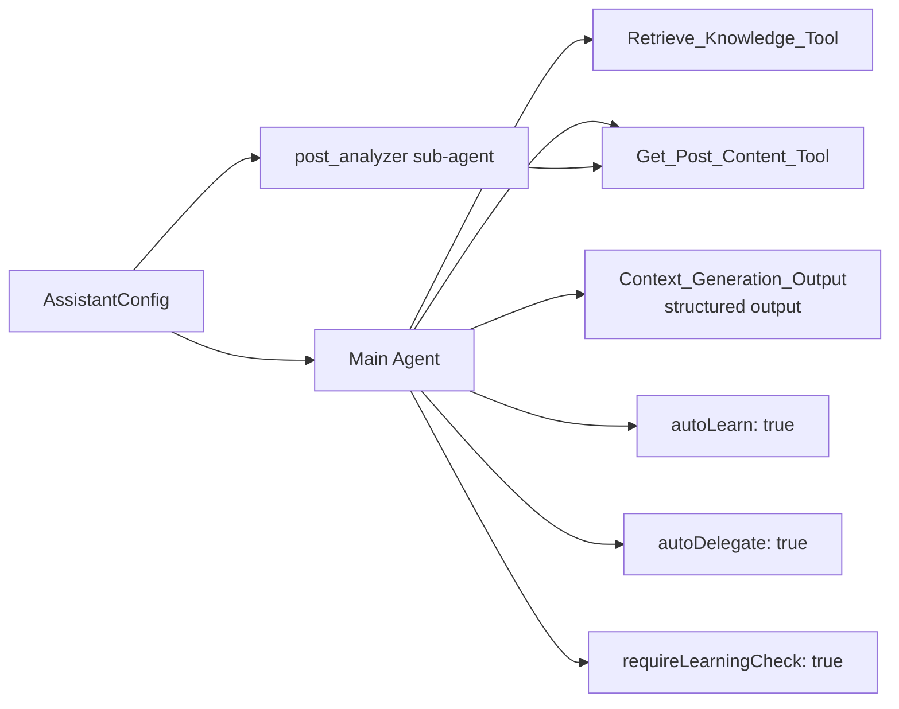
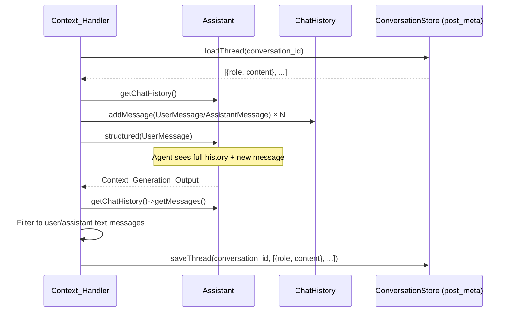
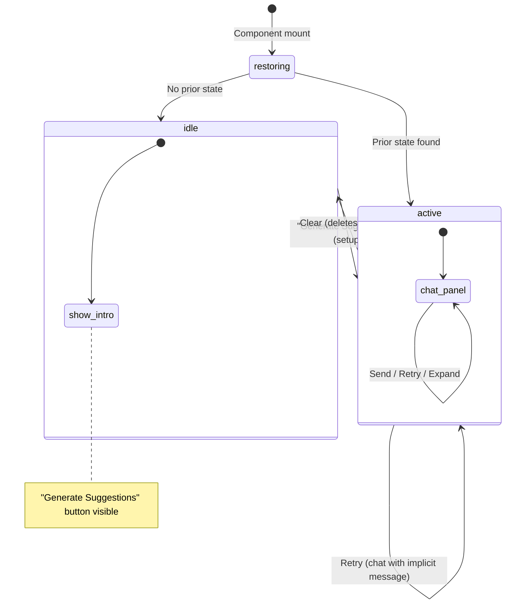

# AI Context Assistant — Editorial Suggestions

The AI Context Assistant is a Gutenberg sidebar plugin that suggests new paragraphs and related article references for editorial posts. It uses the same Assistant architecture as the minimap: structured output, sub-agents, tools, conversation storage in `post_meta`, and user memory in `user_meta`.

## Key Files

### Backend (PHP)

| File | Role |
|------|------|
| `src/includes/ai/class-context-agent.php` | Agent factory (`Assistant::configure`) with `retrieve_knowledge` and `get_post_content` tools, `post_analyzer` sub-agent, structured output (`Context_Generation_Output`), triple storage (conversation/learning/user memory) |
| `src/includes/ai/class-context-handler.php` | REST handler: `/context/setup`, `/context/chat`, `/context/state`, `/context/clear`. Dual storage: `ConversationStore` for AI context, `_jeo_ai_context_chat_messages` for clean UI messages |
| `src/includes/ai/class-context-generation-output.php` | Structured output DTO: `paragraphs` (with inline HTML), `references`, `message`, `assistant_message` |
| `src/includes/ai/class-retrieve-knowledge-tool.php` | NeuronAI tool — queries `jeo_knowledge` via `RAG_Agent::resolveRetrieval()` |
| `src/includes/ai/class-get-post-content-tool.php` | NeuronAI tool — post content + `_related_point` meta for sub-agent |
| `src/includes/ai/settings/tab-context.php` | Settings tab template — custom prompt textarea, default prompt reference, "Suggest initial prompt" button, and "AI Context Prompt Engineer Assistant" with a separate natural-language description box whose content is saved to localStorage |

### Frontend (JS)

| File | Role |
|------|------|
| `src/js/src/context-sidebar/index.js` | Entry point — `registerPlugin('jeo-context-sidebar')` with `PluginDocumentSettingPanel` |
| `src/js/src/context-sidebar/context-chat-panel.js` | Chat UI, state management, API calls, expand modal |
| `src/js/src/context-sidebar/suggested-paragraphs.js` | Renders suggested paragraphs with inline HTML support. "Insert" creates `core/paragraph` block; "Copy" uses triple-fallback rich-text clipboard |
| `src/includes/ai/class-neuron-agent.php` | Base `Neuron_Agent` extending `NeuronAI\Agent\Agent`; reused by the prompt engineering assistant |
| `src/js/src/context-sidebar/context-sidebar.css` | Styles for panel, chat, suggestions, modal |
| `src/includes/ai/class-context-validator.php` | Post-generation link/reference validation *(planned)* |

## Architecture Overview

```mermaid
graph TB
    subgraph "Gutenberg Editor"
        PH[Intro State<br/>Generate Suggestions button] -->|Click| API1[/context/setup]
        CP[Chat Panel<br/>Document sidebar] -->|Send/Retry| API2[/context/chat]
        CP -->|Clear| API3[/context/clear]
        EXP[Expand Modal] -->|Same chat UI| API2
    end

    subgraph "Backend — Context_Handler"
        API1 --> SETUP[api_setup]
        API2 --> CHAT[api_chat]
        API3 --> CLEAR[api_clear]
        GETST[/context/state GET] --> STATE[api_get_state]
        SETUP --> RUN[run_agent]
        CHAT --> RUN
    end

    subgraph "AI Agent (hacklabr/ai-assistant)"
        RUN --> AGENT[Context_Agent::create]
        AGENT --> MAIN[Main Agent]
        AGENT --> SUB[post_analyzer<br/>Sub-Agent]
        MAIN --> T1[Retrieve_Knowledge_Tool<br/>jeo_knowledge]
        SUB --> T2[Get_Post_Content_Tool]
        MAIN --> OUT[Structured Output<br/>Context_Generation_Output]
    end

    subgraph "Storages"
        S1[WP_Storage<br/>post_meta<br/>conversations]
        S2[WP_Option_Storage<br/>wp_options<br/>learning]
        S3[WP_User_Memory_Storage<br/>user_meta<br/>user memory]
    end

    AGENT --> S1
    AGENT --> S2
    AGENT --> S3

    RUN --> PERSIST[persist_history<br/>save_context_state<br/>save_chat_message]
    PERSIST --> META[(post_meta<br/>3 meta keys)]
    STATE --> META
```

## REST Endpoints

### `POST /jeo/v1/context/setup` — Generate initial editorial suggestions

Analyzes the current post content via the AI agent. If the post has fewer than 100 characters (after stripping tags), returns immediately without calling the AI, asking the user to write more.

| Parameter | Type | Required | Description |
|-----------|------|----------|-------------|
| `post_id` | int | Yes | Post to analyze |
| `conversation_id` | string | Yes | UUID for conversation continuity |

Response: `{ success, paragraphs[], references[], message, assistant_message }`

### `POST /jeo/v1/context/chat` — Multi-turn conversation for refinement

Refines suggestions through conversation. The agent maintains context via conversation storage.

| Parameter | Type | Required | Description |
|-----------|------|----------|-------------|
| `post_id` | int | Yes | Post ID for conversation storage |
| `conversation_id` | string | Yes | UUID for conversation continuity |
| `message` | string | Yes | User message |
| `current_state` | object | No | Live editor state (`paragraphs`, `references`) — injected as context so the AI knows the current suggestions |

Response: `{ success, paragraphs[], references[], message, assistant_message }`

### `GET /jeo/v1/context/state` — Load persisted conversation state

Returns the full conversation state for a post: conversation ID, chat messages, last suggestions, and references. Used on mount to restore a previous session.

| Parameter | Type | Required | Description |
|-----------|------|----------|-------------|
| `post_id` | int | Yes | Post to load state for |

Response: `{ success, has_started, conversation_id?, messages[], paragraphs?, references?, message? }`

Messages include a `username` field for user messages (resolved from `user_id`).

### `POST /jeo/v1/context/clear` — Reset conversation and suggestions

Deletes all four meta keys for the post and removes the raw AI conversation thread from `ConversationStore`, resetting the conversation completely.

| Parameter | Type | Required | Description |
|-----------|------|----------|-------------|
| `post_id` | int | Yes | Post to clear state for |

Response: `{ success, message }`

### `POST /jeo/v1/context/engineer-prompt` — Generate a custom system prompt

Uses the configured AI provider to turn a natural-language description into a highly optimized system prompt while preserving the user's intent and enforcing the plugin's critical rules. Requires `manage_options`.

| Parameter | Type | Required | Description |
|-----------|------|----------|-------------|
| `prompt` | string | Yes | Natural-language description of the desired assistant behavior |

Response: `{ success, prompt }` or `{ success: false, message }`

This endpoint powers the **"Generate Custom Prompt"** button in the AI Context Prompt Engineer Assistant card on the Context Assistant settings tab.

## Agent Architecture

### Context_Agent Factory

`Context_Agent::create()` builds an `Assistant` with:



### Configuration

| Property | Value | Purpose |
|----------|-------|---------|
| `outputClass` | `Context_Generation_Output::class` | Enforces structured output schema |
| `conversationStorage` | `WP_Storage(post_id, 'post')` | Chat history per post |
| `learningStorage` | `WP_Option_Storage` | Global agent self-improvement |
| `userMemoryStorage` | `WP_User_Memory_Storage(user_id)` | Per-user preferences |
| `structuredMaxRetries` | 1 | One retry on schema violation |
| `contextWindow` | 200000 | Token context window |
| `tools` | `retrieve_knowledge`, `get_post_content` | Registered via `Tool_Registry` |
| `subAgents` | `post_analyzer` | Analyzes post content for topics/gaps |

### System Prompt

The system prompt is loaded via `Context_Agent::system_prompt()`:

1. **Custom prompt** — If `ai_use_context_custom_prompt` is enabled and `ai_context_prompt` is non-empty, uses it as the base. The stored value may be either a legacy plain-text prompt or a structured-output JSON object such as `{"prompt": "..."}`. Always route the stored value through `Context_Agent::extract_prompt_text()` before using it as a system prompt; this keeps the runtime unaffected even if the storage format changes later.
2. **Default prompt** — Otherwise, uses `Context_Agent::default_system_prompt()` which defines the editorial assistant role, workflow, tool usage rules, output schema, editorial guidelines, off-topic handling, and tool error handling. The default prompt always appends `Context_Agent::critical_prompt_rules()`.
3. **Critical Rules** — `Context_Agent::critical_prompt_rules()` contains non-negotiable instructions for inline contextual links, factual grounding, references array, and language. They are automatically included in the default prompt and enforced in custom prompts by the prompt engineering assistant. Additional rules forbid combining facts from multiple references into a single unattributed claim and require retracting terms/facts that the user marks as unsupported.
4. **User Preferences** — Appends `## User Preferences` section from `WP_User_Memory_Storage` (if any preferences exist).
5. **Additional Context** — Appends `## Additional Context` section with post metadata and locale from the caller.

When editing the prompt, preserve the `## User Preferences` and `## Additional Context` injection points or user memory and live state will be lost.

> **Storage format note:** The settings UI stores `ai_context_prompt` as structured-output JSON (`{"prompt":"..."}`) while rendering it as plain text. Any code that reads this option for runtime use must call `Context_Agent::extract_prompt_text()` instead of using the raw option value directly.

### post_analyzer Sub-Agent

The `post_analyzer` sub-agent uses `Get_Post_Content_Tool` to read the post and returns a JSON analysis:

| Field | Description |
|-------|-------------|
| `topics` | Main subjects |
| `tone` | Editorial tone |
| `gaps` | Content gaps/angles not explored |
| `key_facts` | Important facts mentioned |
| `target_audience` | Intended audience description |
| `suggested_search_queries` | 3–5 queries for `retrieve_knowledge` |

## Structured Output (Context_Generation_Output)

| Property | Type | Description |
|----------|------|-------------|
| `paragraphs` | `array` | Suggested paragraphs. Each has `text` (supports inline HTML: `<strong>`, `<em>`, `<a href="...">`) and `relevance_score` (int 0–100). Link anchors must be the specific phrase, name, fact, or number the reference supports — never the full article title |
| `references` | `array` | Related articles from the knowledge base. Each has `post_id` (int), `title` (string), `url` (string), `reason` (string) |
| `message` | `string` | Cumulative summary shown as UI notice. Plain text — no HTML |
| `assistant_message` | `string` | Chat message shown in the panel. Plain text — no HTML |

## Post-Generation Validation

`Context_Handler::validate_generated_output()` runs after every AI response in `api_setup()` and `api_chat()`:

1. Extracts all `<a href="URL">anchor</a>` tags from paragraph texts.
2. Removes self-references from the `references` array (entries whose `post_id` or `url` match the post being edited).
3. Strips self-links from paragraph text (links pointing to the post's own permalink are converted to plain text silently).
4. Verifies remaining link URLs exist in the `references` array.
5. Links to URLs not listed in references are converted to plain text; a verification note is appended to `assistant_message`.

Anchor quality (whether the linked phrase is grounded in the referenced article) is enforced by the system prompt (`Context_Agent::critical_prompt_rules()`) and verified by the human editor. The prompt instructs the AI to prefer short, specific anchors that closely reflect the source, and to never attach a real URL to a phrase the source does not support.

## Dual Conversation Storage

The system uses two separate storage mechanisms to avoid JSON schema pollution from structured output:

```mermaid
graph TB
    subgraph "AI Context Storage (raw)"
        CS[ConversationStore<br/>WP_Storage → post_meta] --> K1[_jeo_ai_conversations_{uuid}]
        K1 --> |Schema-injected messages<br/>tool calls/results| AI[Agent reads on next call]
    end

    subgraph "UI Display Storage (clean)"
        META[_jeo_ai_context_chat_messages] --> |User text + assistant_message<br/>+ user_id + timestamp| UI[Frontend renders messages]
    end

    subgraph "State Storage"
        CID[_jeo_ai_context_conversation_id] --> |UUID| STATE[api_get_state reads]
        LR[_jeo_ai_context_last_response] --> |paragraphs + references| STATE
        MSG[_jeo_ai_context_chat_messages] --> |messages with usernames| STATE
    end
```

**Key rule**: `api_get_state()` reads from `_jeo_ai_context_chat_messages` for messages and `_jeo_ai_context_last_response` for suggestions. It does **not** read from `ConversationStore`.

## Conversation History Persistence



**Serialization**: Only `user` and `assistant` text messages are stored (tool calls/results excluded). Each message is `{role: string, content: string}`. Stored via `ConversationStore` → `WP_Storage` → `update_post_meta()`.

## Editor State Machine



## Storage Strategy

| Storage | Class | Backend | Key | Purpose |
|---------|-------|---------|-----|---------|
| Conversation | `WP_Storage` → `ConversationStore` | `post_meta` | `_jeo_ai_conversations_{uuid}` | Raw AI history (includes schema messages) |
| UI Messages | Direct `update_post_meta()` | `post_meta` | `_jeo_ai_context_chat_messages` | Clean messages for UI (user text + assistant_message + user_id) |
| Last Response | Direct `update_post_meta()` | `post_meta` | `_jeo_ai_context_last_response` | Latest paragraphs + references + message |
| Conversation ID | Direct `update_post_meta()` | `post_meta` | `_jeo_ai_context_conversation_id` | UUID for thread lookup |
| Learning | `WP_Option_Storage` | `wp_options` | Global | Agent self-improvement across sessions |
| User Memory | `WP_User_Memory_Storage` | `user_meta` | `_jeo_ai_memories_*` | Per-user preferences |

## Post Meta Keys

| Meta Key | Type | Registered | Description |
|----------|------|-----------|-------------|
| `_jeo_ai_context_conversation_id` | `string` | Yes (`show_in_rest`) | Active conversation UUID |
| `_jeo_ai_context_last_response` | `object` | Yes (`show_in_rest`) | Last generated `{paragraphs, references, message}` |
| `_jeo_ai_context_chat_messages` | `object` | Yes (`show_in_rest`) | Clean UI messages array `[{role, content, timestamp, user_id?}]` |

All three are registered per post type via `register_post_meta()` for each type in `enabled_post_types`. Auth callback requires `edit_posts`.

## Retry Logic

`run_agent()` implements a retry loop with exponential backoff:

- **Max attempts**: 3 (initial + 2 retries)
- **Backoff**: `sleep(min(attempt * 2, 8))` seconds between retries
- **Retryable**: Network errors, 5xx, 429 (rate limit), timeouts, empty AI response (`TypeError` on `getJson()`)
- **Non-retryable**: 4xx errors (except 429) — auth failures, invalid config, bad requests. Classification uses `HttpException->response->statusCode` (numeric), not string matching.
- **Exhausted retries**: Throws user-friendly exception: "The AI did not respond after multiple attempts. Please try again or rephrase your request."

## Error Persistence

When `run_agent()` exhausts all retries, the user message is still persisted to **both** storage layers before throwing:

1. **UI messages** (`_jeo_ai_context_chat_messages`) — saved in `api_chat()` **before** calling `run_agent()`, so it survives any AI failure.
2. **ConversationStore** (AI thread) — appended via `appendToThread()` after the retry loop exits, so the next successful call sees the unanswered message via `inject_history()`.

This ensures the user's message is visible after a page reload and the AI retains context for subsequent turns. `api_setup()` does **not** persist on error (system-generated message, no prior context to lose).

## Content Validation

`api_setup()` checks post content length before calling the AI:

- **Fewer than 100 characters** (after `wp_strip_all_tags()`): Returns immediately without calling the AI. Saves a synthetic user message and an assistant message asking the user to write more or specify what they want.
- **100+ characters**: Proceeds with AI generation.

## Frontend Components

### `index.js` — Plugin Registration

- Registers `jeo-context-sidebar` plugin with `PluginDocumentSettingPanel`
- Passes `postId`, `title`, `content`, `postType` to `ContextChatPanel`
- Post type gate: Only loads for post types in `enabled_post_types` (enforced by PHP asset enqueue in `class-jeo.php`)

### `context-chat-panel.js` — Main Chat Panel

State management and API interaction:

| State | Type | Purpose |
|-------|------|---------|
| `conversationId` | string | UUID for conversation continuity |
| `messages` | array | Chat messages for display |
| `inputValue` | string | Textarea content |
| `isLoading` | boolean | API call in progress |
| `isRestoring` | boolean | Loading persisted state on mount |
| `error` | string/null | Error notice |
| `suggestedParagraphs` | array | Current paragraph suggestions |
| `references` | array | Current article references |
| `isExpanded` | boolean | Modal open state |
| `hasStarted` | boolean | Whether a conversation exists |

**Lifecycle**:
1. On mount → `loadState()` calls `GET /context/state` to restore previous session
2. If no prior state → generates new UUID, shows intro with "Generate Suggestions" button
3. If prior state found → restores messages, paragraphs, references, conversation ID

**Actions**:

| Action | Endpoint | Method | Behavior |
|--------|----------|--------|----------|
| Generate Suggestions | `/context/setup` | `runSetup()` | Creates initial suggestions from post content |
| Send | `/context/chat` | `sendMessage()` | Submits user message, receives updated suggestions |
| Retry | `/context/chat` | `handleRetry()` | Sends implicit "Generate new editorial suggestions..." message |
| Clear | `/context/clear` | `handleClear()` | Deletes all state, generates new UUID |

### `suggested-paragraphs.js` — Paragraph Cards

Renders each suggested paragraph with inline HTML support:

- **HTML Sanitization**: `sanitizeHtml()` uses DOM parser walk. Whitelist: `strong`, `b`, `em`, `i`, `br`, `a` (with href). All other tags stripped but text preserved.
- **Entity Decoding**: `decodeHtmlEntities()` handles escaped HTML from structured output.
- **Insert**: Creates `core/paragraph` block with `content: sanitizedHtml` via `wp.data.dispatch('core/block-editor').insertBlocks()`. Tracks inserted indices to prevent duplicates.
- **Copy**: Triple-fallback rich-text clipboard:
  1. `navigator.clipboard.write()` with `ClipboardItem` (`text/html` + `text/plain`)
  2. DOM selection + `document.execCommand('copy')` (most reliable in Gutenberg iframe)
  3. `navigator.clipboard.writeText()` (plain text only)

### User Badge

User messages display a username badge resolved from `msg.username` (returned by `api_get_state()` from `user_id` via `get_userdata()`). Useful for collaborative editing.

### Expand Modal

Compact sidebar panel has an expand button (top-right) that opens a `Modal` component with the same chat UI in a larger viewport.

## Settings Integration

The Context Assistant settings are in **JEO → AI Configuration → Context Assistant** tab.

| Setting | Key | Type | Default | Description |
|---------|-----|------|---------|-------------|
| Use custom prompt | `ai_use_context_custom_prompt` | checkbox | `false` | Toggle between default and custom system prompt |
| Custom prompt | `ai_context_prompt` | textarea (stored as structured-output JSON) | empty | Custom system prompt text. The UI stores it internally as `{"prompt":"..."}`, but displays and edits it as plain text. Empty = use built-in default |
| Default prompt (read-only) | — | textarea (readonly) | Built-in | Shows the default prompt for reference |

When `ai_use_context_custom_prompt` is unchecked, the tab shows the default prompt in a readonly textarea for reference. When checked, it shows an editable textarea for the custom prompt plus a helper button:

- **Suggest initial prompt** — copies the built-in default prompt into the custom textarea as a starting point.

Below the prompt editor, an **AI Context Prompt Engineer Assistant** card mirrors the Provider tab layout:

- A separate natural-language description textarea where editors describe the desired assistant behavior. The description is automatically saved to `localStorage` (`jeo_context_prompt_description`) so it survives page reloads.
- A **Generate Custom Prompt** button that calls `POST /jeo/v1/context/engineer-prompt` and writes the generated system prompt into the custom prompt textarea above, automatically enabling the custom prompt toggle so the result is visible.

## Conventions

- **Manual trigger**: Panel does not auto-generate on open. User must click "Generate Suggestions".
- **Content gate**: Setup returns early if post content < 100 characters.
- **Dual storage**: `ConversationStore` for AI context (may contain schema messages), separate `post_meta` for clean UI messages. Never mix them.
- **Inline HTML**: Paragraph `text` supports `<strong>`, `<em>`, `<a href="...">`, `<br>`. Frontend sanitizes before rendering/inserting/copying.
- **Inline contextual links**: Link anchors must be specific phrases, names, facts, or numbers from the referenced article. Never use the full article title as link text.
- **Factual grounding**: Every factual claim must come from `get_post_content` or `retrieve_knowledge`. The agent must not invent names, dates, statistics, places, or events.
- **Plain text messages**: `message` and `assistant_message` fields must be plain text — no HTML tags. `wp_strip_all_tags()` is applied in the handler.
- **Retry with backoff**: Up to 3 attempts with exponential sleep on transient errors.
- **Post type gate**: Only loads for post types in `enabled_post_types` (same filter as geolocation and minimap).
- **Expand modal**: Compact panel with expand button for better chat UX in a full modal.
- **Insert tracking**: Frontend tracks inserted paragraph indices to prevent duplicate block insertion.
- **State restoration**: On mount, `GET /context/state` restores the previous session so closing/reopening the panel or refreshing the page does not lose context.
