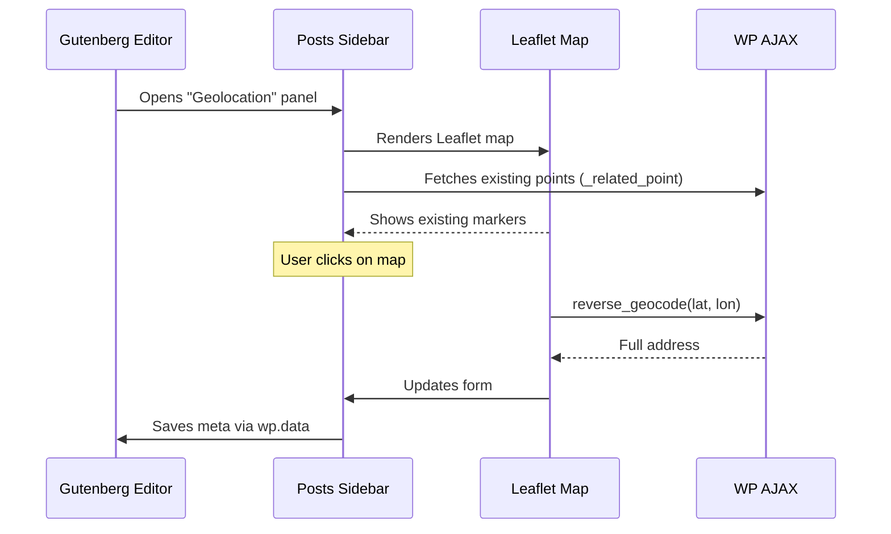
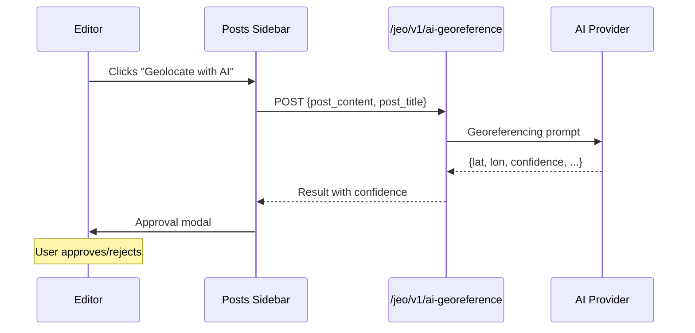

# Geocoding & Geolocation

## Key Files

| File | Role |
|------|------|
| `src/includes/geocode/class-geocode-handler.php` | Orchestrator: meta, AJAX, geocoders |
| `src/includes/geocode/class-geocoder.php` | Abstract base class |
| `src/includes/geocode/geocoders/class-mapbox.php` | Mapbox geocoder |
| `src/includes/geocode/geocoders/class-nominatim.php` | Nominatim/OSM geocoder |
| `src/js/src/posts-sidebar/index.js` | Gutenberg geolocation sidebar |
| `src/js/src/posts-sidebar/geo-posts.js` | Map point editing UI |
| `src/js/src/posts-sidebar/geo-auto-complete.js` | Address autocomplete |
| `src/js/src/posts-sidebar/geo-posts-ai.js` | AI geolocation UI |

## Meta `_related_point`

Registered on all enabled post types (configurable in Settings).

### REST Schema

```json
{
  "lat": "float",
  "lon": "float",
  "city": "string",
  "region": "string",
  "country": "string",
  "full_address": "string",
  "neighborhood": "string",
  "postcode": "string",
  "relevance": "int (1=primary, 2=secondary)"
}
```

### Geographic Indexes

Derived metadata computed automatically from `_related_point`:
- `_geocode_lat_p` / `_geocode_lon_p` — Primary point coordinates
- `_geocode_lat_s` / `_geocode_lon_s` — Secondary point coordinates

These are **read-only** — direct updates are blocked via `update_post_metadata` filter.

## Available Geocoders

| Geocoder | Class | Cache | API |
|----------|-------|-------|-----|
| Nominatim | `Jeo\Geocoders\Nominatim` | Transient 6h TTL | OSM Nominatim (free) |
| Mapbox | `Jeo\Geocoders\Mapbox` | None | Mapbox Geocoding API v5 |

### Active Geocoder

Selected in **Settings → Geocoders**. The slug is stored in `jeo-settings['geocoding_service']`.

### Registering a New Geocoder

```php
add_action( 'jeo_register_geocoders', function( $handler ) {
    require_once '/path/to/class-my-geocoder.php';
    $handler->register_geocoder( new \Jeo\Geocoders\MyGeocoder() );
} );
```

The class must extend `Jeo\Geocoder` and implement:
- `geocode( $query )` — Returns array of results
- `reverse_geocode( $lat, $lon )` — Returns address from coordinates

## AJAX Endpoints

| Action | Direction | Description |
|--------|-----------|-------------|
| `wp_ajax_jeo_geocode` | Forward | Text → coordinates |
| `wp_ajax_jeo_reverse_geocode` | Reverse | Coordinates → address |

Both require nonce `jeo_geocode_nonce` and `is_user_logged_in()`.

## Frontend: Geolocation Sidebar

### Manual Flow



### AI Flow



### Magnetic Markers

When enabled, markers "snap" to the nearest address when dragged, via automatic reverse geocoding.

### Relevance

- **Primary** (relevance=1): Main post location
- **Secondary** (relevance=2): Additional location
