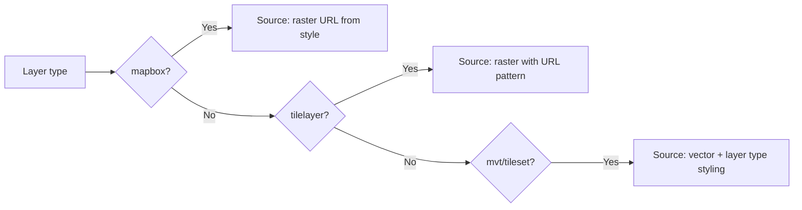

# Layers (CPT `map-layer`)

## Key Files

| File | Role |
|------|------|
| `src/includes/layers/class-layers.php` | `Jeo\Layers` class — CPT, meta, capabilities |
| `src/includes/layer-types/class-layer-types.php` | Layer type registry |
| `src/includes/layer-types/*.js` | JS renderers per type |
| `src/includes/legend-types/class-legend-types.php` | Legend type registry |
| `src/includes/legend-types/*.js` | JS legend renderers |
| `src/js/src/layers-sidebar/` | Gutenberg sidebar for editing |
| `src/js/src/map-blocks/map-preview-layer.js` | Renders layer in preview |

## Custom Post Type: `map-layer`

### Meta Fields

| Meta Key | Type | Description |
|----------|------|-------------|
| `type` | string | Layer type (mapbox, tilelayer, mvt, etc.) |
| `attribution` | string | Attribution text |
| `source_url` | string | Source URL |
| `layer_type_options` | object | Type-specific options |
| `legend_type` | string | Legend type |
| `legend_type_options` | object | Legend options |
| `interactions` | array | Configured interactions |

## Layer Types

### Registration

Types are registered via `Jeo\Layer_Types::register_layer_type()` on the `jeo_register_layer_types` hook.

### Core Types

| Type | Description | JS File |
|------|-------------|---------|
| `mapbox` | Mapbox raster style | `mapbox.js` |
| `tilelayer` | Generic tiled raster | `tilelayer.js` |
| `mvt` | Mapbox Vector Tiles | `mvt.js` |
| `mapbox-tileset-raster` | Mapbox raster tileset | `mapbox-tileset-raster.js` |
| `mapbox-tileset-vector` | Mapbox vector tileset | `mapbox-tileset-vector.js` |

### Schema per Type (JSON Schema for @rjsf/core)

Defined in `layers-sidebar/layer-type-definitions.js`:

| Type | Fields |
|------|--------|
| `mapbox` | `style_id`, `access_token` |
| `tilelayer` | `url`, `scheme` |
| `mvt` | `url`, `source_layer`, `type`, `style_source_type` |
| `mapbox-tileset-raster` | `tileset_id`, `style_source_type`, `type` |
| `mapbox-tileset-vector` | `tileset_id`, `source_layer`, `type`, `style_source_type` |

### Extensibility

Register new types via:
```php
add_action( 'jeo_register_layer_types', function( $layer_types ) {
    $layer_types->register_layer_type( [
        'slug' => 'my-type',
        'name' => 'My Custom Layer',
        'js_handler' => 'my-type-handler',
    ] );
} );
```

The JS handler must be registered as a WordPress script and follow the `window.JeoLayerTypes` pattern.

## Legend Types

### Core Legend Types

| Type | Description | JS File |
|------|-------------|---------|
| `barscale` | Continuous color scale | `barscale.js` |
| `simple-color` | Color categories | `simple-color.js` |
| `icons` | Icon categories | `icons.js` |
| `circles` | Size-based circles | `circles.js` |

### Legend Editor

Located in `posts-sidebar/legends-editor/legend-editor.js`, with type-specific editors in `editors/`.

## Editing Sidebar

The `jeo-layers-sidebar` provides:
- Live map preview with the layer
- Dynamic form via JSON Schema (`@rjsf/core`)
- Attribution settings
- Legend settings
- Interaction settings (popup on click/hover)
- Post save lock until form is complete

## Layer Usage Modes

| Mode | Description |
|------|-------------|
| `fixed` | Always visible |
| `switchable` | Toggle on/off |
| `swappable` | Only one in group visible at a time |

## Frontend Rendering

`map-preview-layer.js` (used in both editor and frontend) renders:


