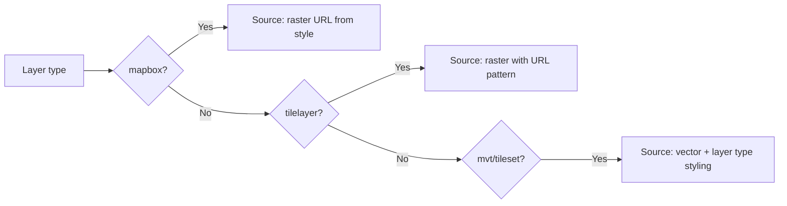

# Layers (CPT `map-layer`)

## Key Files

| File | Role |
|------|------|
| `src/includes/layers/class-layers.php` | `Jeo\Layers` class — CPT, meta, capabilities |
| `src/includes/layer-types/class-layer-types.php` | Layer type registry |
| `src/includes/layer-types/*.js` | JS renderers per type |
| `src/includes/legend-types/class-legend-types.php` | Legend type registry |
| `src/includes/legend-types/*.js` | JS legend renderers |
| `src/js/src/layers-sidebar/` | Gutenberg sidebar for editing |
| `src/js/src/map-blocks/map-preview-layer.js` | Renders layer in preview |

## Custom Post Type: `map-layer`

### Meta Fields

| Meta Key | Type | Description |
|----------|------|-------------|
| `type` | string | Layer type (mapbox, tilelayer, mvt, etc.) |
| `attribution` | string | Attribution text |
| `source_url` | string | Source URL |
| `excerpt` | string | Short description shown in layer selectors (CPT supports `excerpt`) |
| `layer_type_options` | object | Type-specific options |
| `legend_type` | string | Legend type |
| `legend_type_options` | object | Legend options |
| `interactions` | array | Configured interactions |

## Layer Types

### Registration

Types are registered via `Jeo\Layer_Types::register_layer_type()` on the `jeo_register_layer_types` hook.

### Core Types

| Type | Description | JS File |
|------|-------------|---------|
| `mapbox` | Mapbox style (composed via `Map_Style_Composer` — see [`composed-styles/README.md`](../composed-styles/README.md)) | `mapbox.js` |
| `style-json` | Keyless MapLibre style JSON by URL or inline (OpenFreeMap, VersaTiles, self-hosted) | `style-json.js` |
| `tilelayer` | Generic tiled raster | `tilelayer.js` |
| `mvt` | Mapbox Vector Tiles | `mvt.js` |
| `mapbox-tileset-raster` | Mapbox raster tileset | `mapbox-tileset-raster.js` |
| `mapbox-tileset-vector` | Mapbox vector tileset | `mapbox-tileset-vector.js` |

> **Note (3.1.0):** The legacy Static Tiles raster-overlay rendering path for `mapbox`
> layers was removed. `mapbox`-type layers are now merged into a single composite Mapbox
> Style JSON by the backend `Map_Style_Composer` and rendered natively by MapLibre. The
> other types (`tilelayer`, `mvt`, `mapbox-tileset-*`) still render via the legacy
> individual-add path.

### Style Types (`isStyle`)

`mapbox` and `style-json` are **style types**: instead of being added as individual
GL layers, they load a whole MapLibre GL style that becomes the map's **base style**.
The contract is declared on the type itself, in both registries:

- **JS**: `JeoLayerTypes.registerLayerType( slug, { isStyle: true, getStyleUrl?, getInlineStyle?, getStyle? } )`
  (`JeoLayerTypes.isStyle( slug )`). The `JeoLayer` bridge exposes `isStyle` and
  `getStyle()` (inline object takes precedence over URL; both are valid
  `map.setStyle()` inputs).
- **PHP**: `Layer_Types::register_layer_type( $slug, [ 'is_style' => true ] )`
  (`Layer_Types::is_style( $slug )`, filterable via `jeo_layer_type_is_style` so
  JS-only types can opt in).

Consumers key off the flag instead of the type slug: editor hoisting
(`use-style-layer.js::findStyleLayer`), frontend base handling
(`class-jeo-map.js::applyBaseStyleLayer`, `storymap-display.js`), minimap
`load_as_style` (`build_base_layer_response`), and composer bundle eligibility
(any `is_style` type with `style_url`/`inline_style` in `layer_type_options` is
fetched via `Jeo::fetch_style_json()` and merged as a bottom bundle; `mapbox`
keeps its legacy `style_id` + token path). A future provider only needs the two
registrations — no core changes.

Editor-side detection goes through `shared/style-layer-types.js::isStyleLayerType()`,
which reads the frontend registry. The registry itself is loaded inside the
block-editor iframe by `Layer_Types::enqueue_iframe_assets()`
(`enqueue_block_assets`, admin-only) — so `window.JeoLayerTypes` (with `isStyle`
and `getSchema`) is available to editor bundles; without a registry the helper
returns false instead of guessing from a hardcoded list.

The `style-json` schema mirrors `geojson`: `style_url` (public style JSON URL)
or `inline_style` (raw style JSON text, takes precedence). It requires no API
key. Non-base `style-json` layers are skipped with a console warning — the type
only supports the base layer position.

### Schema per Type (JSON Schema for @rjsf/core)

Defined in `layers-sidebar/layer-type-definitions.js`:

| Type | Fields |
|------|--------|
| `mapbox` | `style_id`, `access_token` |
| `style-json` | `style_url`, `inline_style` |
| `tilelayer` | `url`, `scheme` |
| `mvt` | `url`, `source_layer`, `type`, `style_source_type`, `access_token` |
| `mapbox-tileset-raster` | `tileset_id`, `style_source_type`, `type`, `access_token` |
| `mapbox-tileset-vector` | `tileset_id`, `source_layer`, `type`, `style_source_type`, `access_token` |
| `geojson` | `data`, `inline_geojson`, `type` |

The `geojson` type renders a public GeoJSON URL client-side as a single `fill`
GL layer (used by AI-generated boundary layers). It needs no
Mapbox token and is supported by the frontend registry (`layer-types/geojson.js`),
the editor preview (`map-preview-layer.js`), and the Mapbox style composer
(direct-type inlining with one manifest entry per GL layer). Source data can be
a URL (`data`) or raw inline JSON (`inline_geojson`, takes precedence). The
render type is keyed by `type` (`fill` only in the schema for now; the
renderers are switches ready for future types). Styling lives **on the map
layer instance** (`layers[i].style`, the same flat `{ use_default, paint, layout }`
shape used by `mvt`/`mapbox-tileset-vector`) — never on the layer CPT. When the
instance sets `use_default`, the layer's `default_style` post meta (exposed via
REST, written by AI layer generation) takes over. All renderers resolve the
effective style the same way: editor preview (`map-preview-layer.js`), frontend
runtime (`geojson.js`, fed by `class-jeo-map.js`), and the composer
(`resolve_effective_layer_style()` in `class-map-style-composer.php`). The
outline is the `fill-outline-color` paint prop (~1px antialiasing halo —
no configurable width/opacity; the old `{layer_id}__outline` companion line
layer was replaced, and the legacy toggle in `class-jeo-map.js::changeLayerVisibitly`
remains only for pre-switch layers). Paint defaults are shared via
`JeoLayerTypes.getFallbackPaint('fill')` and mirrored in the composer's PHP
default paint — keep both in sync. Instance opacity multiplies numeric opacity
props. Uses only style-spec v8 core APIs —
compatible with both MapLibre GL JS and Mapbox GL JS runtimes.

### Extensibility

Register new types via:
```php
add_action( 'jeo_register_layer_types', function( $layer_types ) {
    $layer_types->register_layer_type( [
        'slug' => 'my-type',
        'name' => 'My Custom Layer',
        'js_handler' => 'my-type-handler',
    ] );
} );
```

The JS handler must be registered as a WordPress script and follow the `window.JeoLayerTypes` pattern.

## Legend Types

### Core Legend Types

| Type | Description | JS File |
|------|-------------|---------|
| `barscale` | Continuous color scale | `barscale.js` |
| `simple-color` | Color categories | `simple-color.js` |
| `icons` | Icon categories | `icons.js` |
| `circles` | Size-based circles | `circles.js` |

### Legend Editor

Located in `posts-sidebar/legends-editor/legend-editor.js`, with type-specific editors in `editors/`.

## Editing Sidebar

The `jeo-layers-sidebar` provides:
- Dynamic form via JSON Schema (`@rjsf/core`) with debounced dispatch (500ms)
- Attribution settings
- Legend settings
- Interaction settings (popup on click/hover)
- **Refresh composed style cache** button (`mapbox` layers only) — calls
  `POST /jeo/v1/map-style/layer/{id}/refresh` to force-regenerate the composite styles for
  all maps referencing this layer, showing a notice with the refreshed/failed map counts

The live map preview and post save lock / notices are handled by the `jeo/layer-editor` block (`map-blocks/layer-editor-preview.js`), which runs inside the Gutenberg content area (iframe in Block API v3). This block:
- Renders the MapLibre/Mapbox preview with the current layer options
- Manages `renderControl` status: `incomplete_form`, `ready`, `loaded`, `request_error`
- Dispatches notices and locks/unlocks post saving based on layer load status
- Runs in async mode (`AsyncModeProvider`) to batch re-renders
- Uses `loadedRef` guard on `onSourceData` to avoid redundant re-renders during tile loading
- Updates the map in-place (no `key`-based remount) when layer options change

## Layer Usage Modes

| Mode | Description |
|------|-------------|
| `fixed` | Always visible |
| `switchable` | Toggle on/off |
| `swappable` | Only one in group visible at a time |

## Frontend Rendering

`map-preview-layer.js` (used in both editor and frontend) renders:


```mermaid
graph LR
    A[Layer type] --> B{mapbox?}
    B -->|Yes| C[Source: raster URL from style]
    B -->|No| D{tilelayer?}
    D -->|Yes| E[Source: raster with URL pattern]
    D -->|No| F{mvt/tileset?}
    F -->|Yes| G[Source: vector + layer type styling]
```

## Per-Instance Layer Opacity

Every layer instance in a map (including raster types) supports an `opacity` property in `[0, 1]`. It is stored per map/block instance, not on the layer CPT, so the same layer can have different opacity in different maps.

| File | Role |
|------|------|
| `src/js/src/map-blocks/layer-settings.js` | Opacity `RangeControl` per selected layer |
| `src/js/src/map-blocks/layers-settings.js` | `handleUpdateOpacity` callback wired to `layers[i].opacity` |
| `src/js/src/map-blocks/minimap-config.js` / `src/js/src/map-blocks/index.js` | `opacity` property in layer instance schema |
| `src/js/src/map-blocks/map-preview-layer.js` | Applies opacity to vector paints and raster layers in the editor preview |
| `src/includes/layer-types/*.js` | Applies opacity on frontend `map.addLayer()` |
| `src/js/src/jeo-map/class-jeo-map.js` | Forwards `opacity` from `layersDefinitions` to `JeoLayer` attributes |

### Opacity Application Rules

- **Vector layers** (`mvt`, `mapbox-tileset-vector`): opacity multiplies existing paint opacity properties (`fill-opacity`, `line-opacity`, `circle-opacity`, `symbol-opacity`, `heatmap-opacity`, `fill-extrusion-opacity`). If no paint exists, opacity has no visible effect unless a fallback paint is applied.
- **Raster layers** (`mapbox`, `mapbox-tileset-raster`, `tilelayer`): sets `raster-opacity` paint property.
- Default opacity is `1` (fully opaque). Existing maps without `opacity` retain previous behavior.

## Per-Instance Vector Layer Styling

Vector layers (`mvt`, `mapbox-tileset-vector`) and the client-side `geojson` type support per-instance paint/layout overrides stored on the map's `layers` meta, not on the layer CPT. This allows the same layer to have different styles in different maps.

### Key Files

| File | Role |
|------|------|
| `src/js/src/shared/layer-style-editor.js` | Reusable modal component for paint/layout editing |
| `src/js/src/map-blocks/layer-settings.js` | Style button per layer row in layers modal |
| `src/js/src/map-blocks/layers-settings.js` | `updateStyle` callback wired to layers array |
| `src/js/src/map-blocks/map-preview-layer.js` | Spreads `instance.style.paint/layout` into `<Layer>` |
| `src/includes/layer-types/mvt.js` | Merges `attributes.style` into `map.addLayer()` |
| `src/includes/layer-types/mapbox-tileset-vector.js` | Merges `attributes.style` into `map.addLayer()` |
| `src/includes/layer-types/geojson.js` | Resolves `attributes.style`/`attributes.default_style` into the GL layer paint |
| `src/js/src/jeo-map/class-jeo-map.js` | Forwards `style`/`default_style` from `layersDefinitions`/layer meta to `JeoLayer` |
| `src/includes/maps/class-map-style-composer.php` | `resolve_effective_layer_style()` mirrors the same resolution in composed styles |
| `src/includes/layers/class-layers.php` | Registers the `default_style` post meta (show_in_rest) |

### `style` Object Shape

Stored as a property on each `layers[]` item in the map's `layers` meta:

```json
{
  "id": 123,
  "use": "fixed",
  "default": true,
  "style": {
    "paint": {
      "fill-color": "#ff0000",
      "fill-opacity": 0.6,
      "fill-outline-color": "#990000"
    }
  }
}
```

### Supported Paint Properties (by layer type)

| Layer `type` | Paint properties |
|---|---|
| `fill` | `fill-color`, `fill-opacity`, `fill-outline-color` |
| `line` | `line-color`, `line-opacity`, `line-width` |
| `circle` | `circle-color`, `circle-opacity`, `circle-radius`, `circle-stroke-color`, `circle-stroke-width` |

### Data Flow

```
Layers modal → Style button → LayerStyleEditor modal
  → onChange updates layers[i].style in map meta / block attrs
  → Preview: map-preview-layer.js reads instance.style (use_default → layer.default_style) → <Layer paint={...} />
  → Frontend: class-jeo-map.js reads layersDefinitions[i].style → JeoLayer attributes
  → mvt.js / mapbox-tileset-vector.js / geojson.js merge style.paint into map.addLayer()
  → Composer: class-map-style-composer.php resolve_effective_layer_style() merges the same style into composed styles
```

### Backwards Compatibility

- Existing `layers[]` items without `style` → renderer defaults (unchanged behavior)
- REST schema allows additional properties → no breaking change
- `style` is optional everywhere; renderers check `if (attributes.style?.paint)` before merging

## Per-Layer Access Token

All Mapbox-dependent layer types (`mapbox`, `mvt`, `mapbox-tileset-raster`, `mapbox-tileset-vector`) support an optional `access_token` field in `layer_type_options`. When set, it overrides the global `mapbox_key` setting for that layer only.

| Type | Token Mechanism |
|------|----------------|
| `mapbox` | Inline in style URL; `checkCustomToken` registers per-owner token for derived requests |
| `mapbox-tileset-raster` | `checkCustomToken` extracts owner from `tileset_id` (`username.tilesetid`); `transformRequestUrl` re-signs requests |
| `mapbox-tileset-vector` | Same as raster tileset |
| `mvt` | Token appended to the tile URL as `?access_token=` query param (replaces any existing token); old pattern of embedding token directly in URL is preserved when field is empty |

### Key Files

| File | Role |
|------|------|
| `src/js/src/jeo-map/class-jeo-map.js` (`checkCustomToken`) | Registers per-owner custom tokens from `access_token` + `style_id` or `tileset_id` |
| `src/js/src/jeo-map/class-jeo-map.js` (`transformRequestUrl`) | Overrides `access_token` query param for requests matching registered owners |
| `src/includes/layer-types/mvt.js` (`_resolveUrl`) | Appends per-layer token to MVT tile URL |
| `src/includes/maps/class-map-style-composer.php` (`build_direct_layer`) | Appends per-layer token for MVT in composed styles (bypasses placeholder sanitization) |
| `src/js/src/map-blocks/mapbox-style-preview.js` (`getMapboxOwner`) | Editor: extracts owner from `style_id` or `tileset_id` — already tileset-aware |
| `src/js/src/discovery/index.js` (`registerLayerCustomToken`) | Discovery: already tileset-aware |
