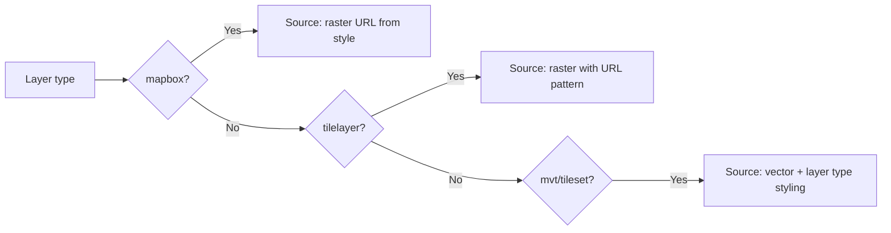

# Layers (CPT `map-layer`)

## Key Files

| File | Role |
|------|------|
| `src/includes/layers/class-layers.php` | `Jeo\Layers` class — CPT, meta, capabilities |
| `src/includes/layer-types/class-layer-types.php` | Layer type registry |
| `src/includes/layer-types/*.js` | JS renderers per type |
| `src/includes/legend-types/class-legend-types.php` | Legend type registry |
| `src/includes/legend-types/*.js` | JS legend renderers |
| `src/js/src/layers-sidebar/` | Gutenberg sidebar for editing |
| `src/js/src/map-blocks/map-preview-layer.js` | Renders layer in preview |

## Custom Post Type: `map-layer`

### Meta Fields

| Meta Key | Type | Description |
|----------|------|-------------|
| `type` | string | Layer type (mapbox, tilelayer, mvt, etc.) |
| `attribution` | string | Attribution text |
| `source_url` | string | Source URL |
| `layer_type_options` | object | Type-specific options |
| `legend_type` | string | Legend type |
| `legend_type_options` | object | Legend options |
| `interactions` | array | Configured interactions |

## Layer Types

### Registration

Types are registered via `Jeo\Layer_Types::register_layer_type()` on the `jeo_register_layer_types` hook.

### Core Types

| Type | Description | JS File |
|------|-------------|---------|
| `mapbox` | Mapbox raster style | `mapbox.js` |
| `tilelayer` | Generic tiled raster | `tilelayer.js` |
| `mvt` | Mapbox Vector Tiles | `mvt.js` |
| `mapbox-tileset-raster` | Mapbox raster tileset | `mapbox-tileset-raster.js` |
| `mapbox-tileset-vector` | Mapbox vector tileset | `mapbox-tileset-vector.js` |

### Schema per Type (JSON Schema for @rjsf/core)

Defined in `layers-sidebar/layer-type-definitions.js`:

| Type | Fields |
|------|--------|
| `mapbox` | `style_id`, `access_token` |
| `tilelayer` | `url`, `scheme` |
| `mvt` | `url`, `source_layer`, `type`, `style_source_type` |
| `mapbox-tileset-raster` | `tileset_id`, `style_source_type`, `type` |
| `mapbox-tileset-vector` | `tileset_id`, `source_layer`, `type`, `style_source_type` |

### Extensibility

Register new types via:
```php
add_action( 'jeo_register_layer_types', function( $layer_types ) {
    $layer_types->register_layer_type( [
        'slug' => 'my-type',
        'name' => 'My Custom Layer',
        'js_handler' => 'my-type-handler',
    ] );
} );
```

The JS handler must be registered as a WordPress script and follow the `window.JeoLayerTypes` pattern.

## Legend Types

### Core Legend Types

| Type | Description | JS File |
|------|-------------|---------|
| `barscale` | Continuous color scale | `barscale.js` |
| `simple-color` | Color categories | `simple-color.js` |
| `icons` | Icon categories | `icons.js` |
| `circles` | Size-based circles | `circles.js` |

### Legend Editor

Located in `posts-sidebar/legends-editor/legend-editor.js`, with type-specific editors in `editors/`.

## Editing Sidebar

The `jeo-layers-sidebar` provides:
- Dynamic form via JSON Schema (`@rjsf/core`) with debounced dispatch (500ms)
- Attribution settings
- Legend settings
- Interaction settings (popup on click/hover)

The live map preview and post save lock / notices are handled by the `jeo/layer-editor` block (`map-blocks/layer-editor-preview.js`), which runs inside the Gutenberg content area (iframe in Block API v3). This block:
- Renders the MapLibre/Mapbox preview with the current layer options
- Manages `renderControl` status: `incomplete_form`, `ready`, `loaded`, `request_error`
- Dispatches notices and locks/unlocks post saving based on layer load status
- Runs in async mode (`AsyncModeProvider`) to batch re-renders
- Uses `loadedRef` guard on `onSourceData` to avoid redundant re-renders during tile loading
- Updates the map in-place (no `key`-based remount) when layer options change

## Layer Usage Modes

| Mode | Description |
|------|-------------|
| `fixed` | Always visible |
| `switchable` | Toggle on/off |
| `swappable` | Only one in group visible at a time |

## Frontend Rendering

`map-preview-layer.js` (used in both editor and frontend) renders:


```mermaid
graph LR
    A[Layer type] --> B{mapbox?}
    B -->|Yes| C[Source: raster URL from style]
    B -->|No| D{tilelayer?}
    D -->|Yes| E[Source: raster with URL pattern]
    D -->|No| F{mvt/tileset?}
    F -->|Yes| G[Source: vector + layer type styling]
```

## Per-Instance Vector Layer Styling

Vector layers (`mvt`, `mapbox-tileset-vector`) support per-instance paint/layout overrides stored on the map's `layers` meta, not on the layer CPT. This allows the same layer to have different styles in different maps.

### Key Files

| File | Role |
|------|------|
| `src/js/src/shared/layer-style-editor.js` | Reusable modal component for paint/layout editing |
| `src/js/src/map-blocks/layer-settings.js` | Style button per layer row in layers modal |
| `src/js/src/map-blocks/layers-settings.js` | `updateStyle` callback wired to layers array |
| `src/js/src/map-blocks/map-preview-layer.js` | Spreads `instance.style.paint/layout` into `<Layer>` |
| `src/includes/layer-types/mvt.js` | Merges `attributes.style` into `map.addLayer()` |
| `src/includes/layer-types/mapbox-tileset-vector.js` | Merges `attributes.style` into `map.addLayer()` |
| `src/js/src/jeo-map/class-jeo-map.js` | Forwards `style` from `layersDefinitions` to `JeoLayer` |

### `style` Object Shape

Stored as a property on each `layers[]` item in the map's `layers` meta:

```json
{
  "id": 123,
  "use": "fixed",
  "default": true,
  "style": {
    "paint": {
      "fill-color": "#ff0000",
      "fill-opacity": 0.6,
      "fill-outline-color": "#990000"
    }
  }
}
```

### Supported Paint Properties (by layer type)

| Layer `type` | Paint properties |
|---|---|
| `fill` | `fill-color`, `fill-opacity`, `fill-outline-color` |
| `line` | `line-color`, `line-opacity`, `line-width` |
| `circle` | `circle-color`, `circle-opacity`, `circle-radius`, `circle-stroke-color`, `circle-stroke-width` |

### Data Flow

```
Layers modal → Style button → LayerStyleEditor modal
  → onChange updates layers[i].style in map meta / block attrs
  → Preview: map-preview-layer.js reads instance.style → <Layer paint={...} />
  → Frontend: class-jeo-map.js reads layersDefinitions[i].style → JeoLayer attributes
  → mvt.js / mapbox-tileset-vector.js merge style.paint into map.addLayer()
```

### Backwards Compatibility

- Existing `layers[]` items without `style` → renderer defaults (unchanged behavior)
- REST schema allows additional properties → no breaking change
- `style` is optional everywhere; renderers check `if (attributes.style?.paint)` before merging
