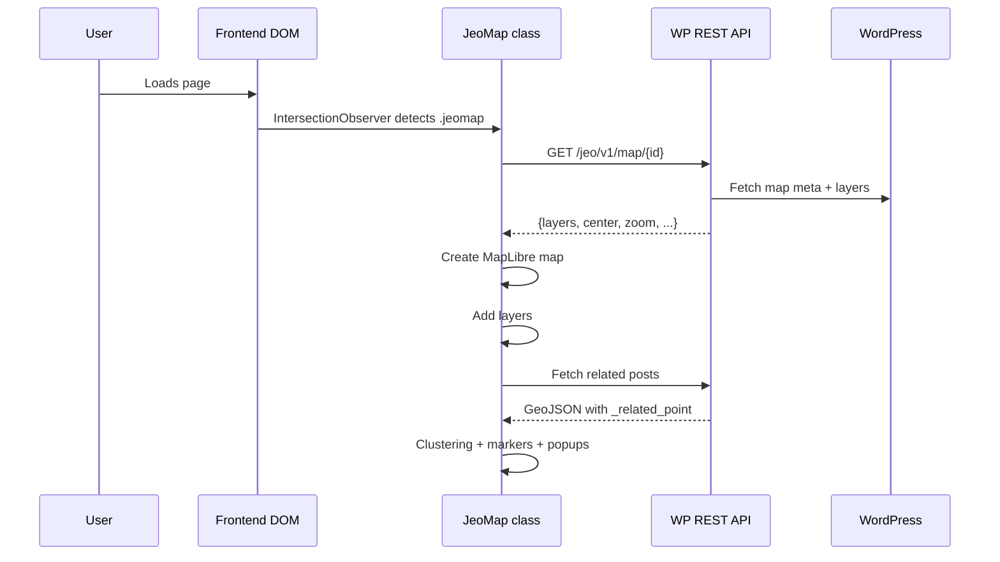

# Maps (CPT `map`)

## Key Files

| File | Role |
|------|------|
| `src/includes/maps/class-maps.php` | `Jeo\Maps` class — CPT, meta, shortcode |
| `src/js/src/jeo-map/class-jeo-map.js` | `JeoMap` class — frontend rendering |
| `src/js/src/jeo-map/index.js` | Entry point, DOM scan |
| `src/js/src/maps-sidebar/` | Gutenberg sidebar for editing |
| `src/templates/single-map.php` | Single map template |
| `src/templates/map-content-layers-list.php` | Layer list below map |

## Custom Post Type: `map`

### Meta Fields (15 fields)

| Meta Key | Type | Description |
|----------|------|-------------|
| `initial_zoom` | int (1-14) | Initial zoom level |
| `center_lat` | float | Center latitude |
| `center_lon` | float | Center longitude |
| `layers` | array | Layer IDs with configuration |
| `pan_limits` | array | Navigation bounds (min/max lat/lon) |
| `related_posts` | array | Related posts config |
| `disable_scroll_zoom` | boolean | Disable scroll zoom |
| `show_posts_sidebar` | boolean | Show posts sidebar |
| `use_native_clusters` | boolean | Use MapLibre native clusters |
| `posts_per_page` | int | Posts per page in popup |
| `max_cluster_radius` | int | Max cluster radius |
| `cluster_radius` | int | Cluster radius |
| `show_markers` | boolean | Show markers |
| `map_layers_load_as_style` | boolean | Load layers as style |

### Shortcode

```
[jeo-map id="{map_id}"]
```

### REST API

- `GET /wp-json/wp/v2/map` — List (standard WP CPT)
- `GET /wp-json/jeo/v1/map/{id}` — Full data for frontend rendering

## Frontend Rendering

1. DOM scan: `index.js` finds `.jeomap:not(.storymap)` elements
2. Each `<div>` becomes a `JeoMap` instance
3. `JeoMap` lazy-initializes via `IntersectionObserver`
4. Fetches data via REST, creates MapLibre/Mapbox map
5. Adds layers, controls, legends
6. Fetches related posts → GeoJSON clustering → markers/popups

## Template Rendering

Single map content (`the_content` filter) injects:
1. `<div class="jeomap" data-map_id="{id}">`
2. `map-content-layers-list.php` template with layer list

## Sidebar Editor (Gutenberg)

The `jeo-maps-sidebar` provides:
- Live map preview (MapLibre)
- Zoom controls (initial, min, max)
- Layer selector with drag-and-drop
- Related posts selector
- Copyable embed URL

## Data Flow


