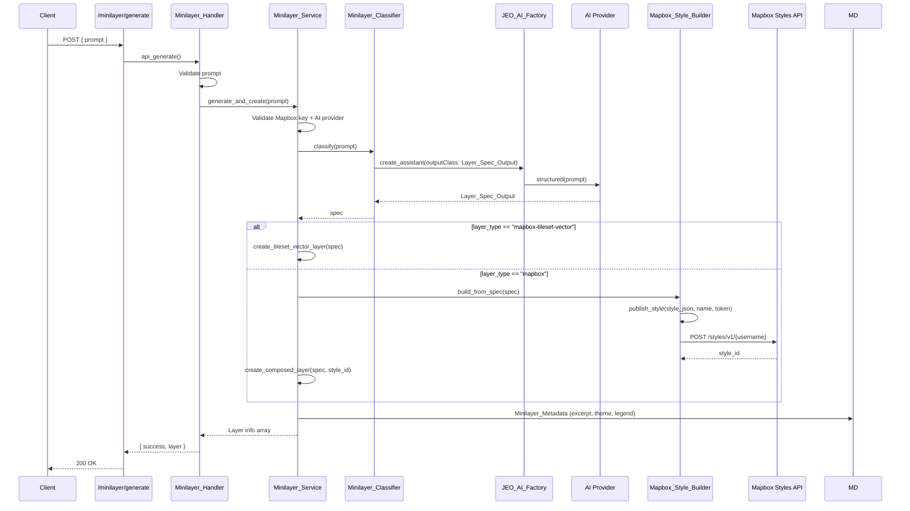

# Minilayer (AI-Generated Layers)

Creates Mapbox-compatible map layers from natural-language prompts and auto-creates a JEO layer (CPT `map-layer`).

The pipeline is now deterministic: a single structured-output classifier decides whether the prompt can be approximated with built-in Mapbox tilesets or requires a composed style. The Mapbox DevKit MCP has been removed.

## Key Files

| File | Class | Role |
|------|-------|------|
| `src/includes/ai/class-minilayer-classifier.php` | `Minilayer_Classifier` | Single structured-output classifier — prompt → `Layer_Spec_Output` |
| `src/includes/ai/class-layer-spec-output.php` | `Layer_Spec_Output` | Structured output DTO with `#[SchemaProperty]` attributes |
| `src/includes/ai/class-minilayer-handler.php` | `Minilayer_Handler` | REST endpoint, delegates to `Minilayer_Service` |
| `src/includes/ai/class-minilayer-service.php` | `Minilayer_Service` | Shared service — runs classifier, creates `mapbox-tileset-vector` or composed `mapbox` layer CPTs, stores `default_style`, attribution, theme and legend |
| `src/includes/ai/class-minilayer-metadata.php` | `Minilayer_Metadata` | Helpers for post excerpt, `layer-theme` taxonomy, and `simple-color` legend generation from layer paint |
| `src/includes/ai/class-generate-layer-tool.php` | `Generate_Layer_Tool` | NeuronAI tool for the minimap agent — conditionally registered when a Mapbox API key is available |
| `src/includes/ai/class-mapbox-style-builder.php` | `Mapbox_Style_Builder` | Deterministic builder that publishes composed styles to the Mapbox Styles API |
| `src/js/src/shared/layer-style-editor.js` | `LayerStyleEditor` | Modal UI for layer styling — includes "Use AI default style" checkbox |
| `src/js/src/map-blocks/map-preview-layer.js` | `renderLayer` | Gutenberg preview — resolves effective style from `use_default` flag |
| `src/includes/layer-types/mapbox-tileset-vector.js` | layer type | Front-end rendering — applies `default_style` or instance style with filter support |

## Flow (REST Endpoint)



## Reuse by Generate_Layer_Tool

The minimap agent's `Generate_Layer_Tool` delegates to `Minilayer_Service::generate_and_create()` — the same pipeline as the REST endpoint. The tool is conditionally registered when a Mapbox API key is available. See [`.architecture/ai/README.md`](ai/README.md) for the minimap-side integration details.

## REST Endpoint

```
POST /jeo/v1/minilayer/generate
Permission: edit_posts
Body: { "prompt": string, "layer_name"?: string }
Response: { "success": true, "layer": { "id", "title", "type", "style_id", "edit_url", ... } }
Error:   { "success": false, "error": "Human-readable message" }
```

## Classifier Output (`Layer_Spec_Output`)

The classifier returns a structured object with the following fields:

| Field | Type | Description |
|-------|------|-------------|
| `can_approximate` | bool | False when the prompt asks for data not available in any tileset or external source |
| `layer_type` | string | `"mapbox-tileset-vector"` or `"mapbox"` |
| `layer_title` | string | Human-readable title |
| `tileset_id` | ?string | Mapbox tileset ID (tileset-vector only) |
| `source_layer` | ?string | Source layer within the tileset (tileset-vector only) |
| `layer_geometry_type` | ?string | `fill`, `line`, `symbol`, `circle`, `fill-extrusion`, `heatmap` |
| `suggested_filter` | ?array | MapLibre filter expression |
| `suggested_paint` | ?array | Default paint properties |
| `style_json` | ?array | Complete Mapbox GL style JSON (composed mapbox only) |
| `external_sources` | ?array | Map of source IDs to URLs |
| `limitations` | string | Honest description of what the layer cannot show |
| `theme` | ?string | Best-matching `layer-theme` taxonomy term for catalog/minimap disambiguation |

## Layer Type Decision

The classifier uses a decision tree, preferring `mapbox-tileset-vector` whenever possible:

| Condition | `layer_type` | CPT `type` |
|-----------|-------------|------------|
| Single built-in tileset + single source-layer + vector geometry + solid colors sufficient | `mapbox-tileset-vector` | `mapbox-tileset-vector` |
| External sources, multiple tilesets, data-driven styling, raster overlays, or complex composition | `mapbox` | `mapbox` |
| Data not available in any source | — | Error (`can_approximate: false`) |

### `mapbox-tileset-vector` additional fields

`tileset_id`, `source_layer`, `layer_geometry_type`, `suggested_filter`, `suggested_paint`

### Validation

Requires all three tileset fields present and `layer_geometry_type` to be one of: `fill`, `line`, `symbol`, `circle`, `fill-extrusion`, `heatmap`.

## Default Style (CPT Meta `default_style`)

When the classifier returns `suggested_filter` and/or `suggested_paint`, these are saved as the `default_style` meta on the layer CPT:

```
meta: {
  default_style: {
    filter: ["==", "class", "wood"],
    paint: { "fill-color": "#2d5a27", "fill-opacity": 0.6 }
  }
}
```

### How default_style is used

The `default_style` is exposed via REST and consumed by both the Gutenberg preview and the front-end:

1. **Gutenberg preview** (`map-preview-layer.js`): `resolveStyle()` checks `instance.style.use_default`. When true, uses `layer.default_style` from CPT meta instead of `instance.style`.

2. **Front-end** (`mapbox-tileset-vector.js`): Same logic in `addLayer()` — if `attributes.style.use_default` is true, applies `attributes.default_style` (filter + paint).

3. **Style editor modal** (`layer-style-editor.js`): Shows a "Use AI Default Style" checkbox when `default_style` exists. When checked, sets `style.use_default: true` and disables manual paint controls. When unchecked, user can edit paint normally.

### Style resolution logic

```
instance.style.use_default === true && layer.default_style exists
  → effectiveStyle = layer.default_style (from CPT, may contain filter + data-driven paint)

instance.style.use_default === false (or no default_style)
  → effectiveStyle = instance.style (manual paint/layout, no filter)
```

## Layer CPT Creation

Creates a `map-layer` post. The type depends on the classifier output:

### mapbox-tileset-vector

- `type` = `mapbox-tileset-vector`
- `layer_type_options` = `{ tileset_id, source_layer, type, style_source_type: "vector" }`
- `default_style` = `{ filter, paint }` (when suggested by AI)
- No Mapbox Styles API call is made — creation is instant

### mapbox (fallback)

- `type` = `mapbox`
- `layer_type_options` = `{ style_id: "username/style_id" }`
- `Mapbox_Style_Builder::publish_style()` validates the published style via `Jeo::fetch_mapbox_style()`

Title: from `layer_name` param > `layer_title` (AI-derived) > fallback

## Metadata and Legend

Every AI-generated layer is enriched with:

| Meta / Field | Source | Purpose |
|--------------|--------|---------|
| `post_excerpt` | `Minilayer_Metadata::build_excerpt()` | Description shown in layer library / minimap disambiguation |
| `attribution` | Limitations string or source label | Credit and caveats |
| `layer-theme` taxonomy | Classifier `theme` field (tileset-vector) or source adapter (boundary) | Thematic grouping in the layer library |
| `use_legend`, `legend_title`, `legend_type`, `legend_type_options` | Derived from paint color | Automatic `simple-color` legend when a representative color exists |

Legend generation:

- Tileset-vector layers extract the first color from `suggested_paint` (`fill-color`, `line-color`, `circle-color`) and create a `simple-color` legend entry using the layer title.
- Boundary layers use the boundary outline/fill color.
- Composed `mapbox` styles attempt to extract the first usable color from `style_json.layers`; if none is found, no legend is generated.

## WP-CLI Commands

The `AI_CLI` class registers commands under `wp jeo ai` for local testing and observability:

| Command | Purpose |
|---------|---------|
| `wp jeo ai generate-layer <prompt> [--layer_name=<name>]` | Runs `Minilayer_Service::generate_and_create()` and prints the created layer info. |
| `wp jeo ai generate-boundary <place> [--type=<type>] [--context=<context>] [--layer_name=<name>]` | Runs `Place_Polygon_Service::create_layer()` and prints the boundary layer info. |
| `wp jeo ai test-minilayer <prompt>` | Runs `Minilayer_Classifier::classify()` only — no side effects. |

## Observability

- Every `Minilayer_Classifier::classify()` call is logged via `AI_Logger::insert_log()` with the active provider, prompt, and resulting spec.
- Structured-output mode reports 0 tokens (provider limitation), but the prompt and response are stored for debugging and cost review.

## Prompt Architecture

The `Minilayer_Classifier::instructions()` prompt has 6 sections:

1. **Workflow** — Step-by-step process with layer type decision before style creation
2. **Available Mapbox Tilesets** — Inventory of source-layers, geometry types, and classes in each tileset
3. **Layer Type Decision** — Explicit decision tree for mapbox-tileset-vector vs mapbox
4. **Capability Boundaries & Approximation Guide** — What tilesets can/cannot show, with mapping table
5. **Theme and Metadata** — `layer_title`, `theme`, and `limitations` guidance
6. **Response Format** — Structured `Layer_Spec_Output` schema
7. **Design Principles** — Relevance first, visual hierarchy, color palettes by theme, honesty

## Tileset Inventory

### mapbox-streets-v8 (mapbox.mapbox-streets-v8)

Key source-layers available for `mapbox-tileset-vector`:

| Source Layer | Geometry | Common Use |
|---|---|---|
| `admin` | line, polygon | Boundaries (admin_level 0/1/2) |
| `water` | polygon | Water bodies |
| `waterway` | line | Rivers, streams (class: river, stream, canal) |
| `landuse` | polygon | Land cover (class: wood, agriculture, park, residential, industrial) |
| `landuse_overlay` | polygon | Protected areas (class: national_park, wetland) |
| `road` | line | Roads, railways |
| `building` | polygon | Building footprints (z13+) |
| `place_label` | point | Place labels (has iso_3166_2 for states) |
| `poi_label` | point | Points of interest |

### mapbox-terrain-v2 (mapbox.mapbox-terrain-v2)

| Source Layer | Geometry | Use |
|---|---|---|
| `contour` | line | Elevation contour lines |
| `hillshade` | polygon | Terrain shading |

### Limitations (cannot filter by)

- No `iso_3166_2` on `admin` polygons (only on `place_label` points)
- No thematic data (deforestation, climate, demographics)
- No time-series or real-time data

## Design Principles

The classifier prompt includes these design principles:

1. **PREFER `mapbox-tileset-vector`** over `mapbox` whenever possible (vector is interactive, lighter, and sharper at all zoom levels)
2. **Base/terrain layers** (background, land, water, roads, labels) may use raster; thematic/data layers should prefer vector
3. **RELEVANCE FIRST**: Match the style to the user's intent — if they ask about "rivers", water/waterway layers should be the PRIMARY visual focus
4. **VISUAL HIERARCHY**: Emphasize relevant layers, de-emphasize irrelevant ones
5. **LAYER MINIMIZATION**: Only include layers that contribute to the user's theme; keep styles performant
6. **COLOR PALETTES** by theme:
   - Water / hydrography: blues (#1a5276, #2980b9, #3498db)
   - Forest / vegetation: greens (#1a5a27, #27ae60, #2ecc71)
   - Urban / infrastructure: grays / oranges (#5d6d7e, #e67e22)
   - Administrative: purples / reds (#8e44ad, #c0392b)
   - Terrain / elevation: browns (#795548, #a1887f)
7. **HONESTY**: Never claim the style shows data it doesn't contain — use the `limitations` field when approximation is imperfect
8. **GOOD CONTRAST AND READABILITY**: Ensure the style is legible at all zoom levels
9. **EXTERNAL SOURCES**: When the user provides a URL, include it as a source with appropriate layers and styling

## Error Handling

The `Minilayer_Handler` returns user-friendly error messages:

| Error Code | HTTP Status | Message |
|---|---|---|
| `minilayer_no_mapbox_key` | 400 | "Mapbox API key is not configured. Set it in JEO Settings." |
| `minilayer_no_provider` | 400 | "No AI provider configured. Set one in JEO AI Settings." |
| `minilayer_classifier_error` | 400 | "Could not classify the layer request. Please try again." |
| `minilayer_classifier_invalid` | 502 | "The classifier returned an unexpected response. Please try again." |
| `minilayer_not_approximable` | 400 | "The request cannot be approximated with available map data." |
| `minilayer_invalid_type` | 400 | "The AI returned an unsupported layer type." |
| `minilayer_missing_tileset_field` | 400 | "The AI response is missing a required tileset field." |
| `minilayer_invalid_geometry` | 400 | "The AI returned an invalid geometry type." |
| `minilayer_missing_json` | 400 | "The AI response is missing composed style JSON." |
| `minilayer_missing_style_id` | 502 | "The AI did not create a valid style. Please try again." |

## Migration from MCP

The previous implementation used `Minilayer_Agent` with the Mapbox DevKit MCP. That class and `JEO_AI_Factory::create_minilayer_assistant()` have been removed. The classifier now performs the same decision logic in a single structured-output call, and `Mapbox_Style_Builder` handles direct Styles API publication.
