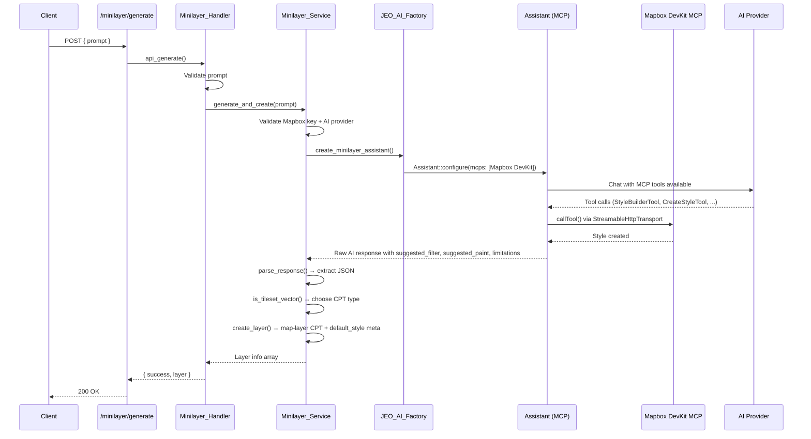

# Minilayer (AI-Generated Layers)

Creates Mapbox map styles from natural-language prompts and auto-creates a JEO layer (CPT `map-layer`).

## Key Files

| File | Class | Role |
|------|-------|------|
| `src/includes/ai/class-minilayer-agent.php` | `Minilayer_Agent` | Assistant factory with native MCP config (Mapbox DevKit) |
| `src/includes/ai/class-minilayer-handler.php` | `Minilayer_Handler` | REST endpoint, delegates to `Minilayer_Service` |
| `src/includes/ai/class-minilayer-service.php` | `Minilayer_Service` | Shared service — AI style generation, JSON parsing, layer CPT creation, `default_style` storage |
| `src/includes/ai/class-generate-layer-tool.php` | `Generate_Layer_Tool` | NeuronAI tool for the minimap agent — conditionally registered when a Mapbox API key is available |
| `src/js/src/shared/layer-style-editor.js` | `LayerStyleEditor` | Modal UI for layer styling — includes "Use AI default style" checkbox |
| `src/js/src/map-blocks/map-preview-layer.js` | `renderLayer` | Gutenberg preview — resolves effective style from `use_default` flag |
| `src/includes/layer-types/mapbox-tileset-vector.js` | layer type | Front-end rendering — applies `default_style` or instance style with filter support |

## Flow (REST Endpoint)



## Reuse by Generate_Layer_Tool

The minimap agent's `Generate_Layer_Tool` delegates to `Minilayer_Service::generate_and_create()` — the same pipeline as the REST endpoint. The tool is conditionally registered when a Mapbox API key is available. See [`.architecture/ai/README.md`](ai/README.md) for the minimap-side integration details.

## MCP Connection

- **Endpoint**: `https://mcp-devkit.mapbox.com/mcp` (hosted, SSE transport)
- **Auth**: Mapbox access token from `jeo_settings()->get_option('mapbox_key')` as Bearer token
- **Tools used**: `StyleBuilderTool`, `CreateStyleTool`, `ValidateStyleTool`, `PreviewStyleTool`, `RetrieveStyleTool`, `ListStylesTool`
- **Integration**: MCP config is passed declaratively to `AssistantConfig::$mcps` via `JEO_AI_Factory::create_minilayer_assistant()`. The `hacklabr/ai-assistant` library handles tool discovery, security validation, and invocation automatically through `McpConfigBridge`.

## REST Endpoint

```
POST /jeo/v1/minilayer/generate
Permission: edit_posts
Body: { "prompt": string, "layer_name"?: string }
Response: { "success": true, "layer": { "id", "title", "type", "style_id", "edit_url", ... } }
Error:   { "success": false, "error": "Human-readable message" }
```

## Response Parsing

The handler extracts a JSON object from the AI response (handling thinking tags, markdown fences, bracket matching). Expected keys: `style_id`, `style_name`, `layer_title`, `style_url`, `preview_url`, `style_json`, `layer_type`.

### Optional response fields

- `suggested_filter`: MapLibre filter expression (e.g. `["==", "class", "wood"]`)
- `suggested_paint`: Default paint properties (e.g. `{"fill-color": "#2d5a27", "fill-opacity": 0.6}`)
- `limitations`: Human-readable description of what the style cannot show
- `external_sources`: Map of source IDs to URLs for third-party sources

## Layer Type Decision

The agent uses a decision tree to choose the layer type, preferring `mapbox-tileset-vector` whenever possible:

| Condition | `layer_type` | CPT `type` |
|-----------|-------------|------------|
| Single built-in tileset + single source-layer + vector geometry + solid colors sufficient | `mapbox-tileset-vector` | `mapbox-tileset-vector` |
| External sources, multiple tilesets, data-driven styling, raster overlays, or complex composition | `mapbox` | `mapbox` |

### `mapbox-tileset-vector` additional response fields

`tileset_id`, `source_layer`, `layer_geometry_type`, `suggested_filter`, `suggested_paint`

### `is_tileset_vector()` validation

Requires all three tileset fields present and `layer_geometry_type` to be one of: `fill`, `line`, `symbol`, `circle`, `fill-extrusion`, `heatmap`.

## Default Style (CPT Meta `default_style`)

When the minilayer agent returns `suggested_filter` and/or `suggested_paint`, these are saved as the `default_style` meta on the layer CPT:

```
meta: {
  default_style: {
    filter: ["==", "class", "wood"],
    paint: { "fill-color": "#2d5a27", "fill-opacity": 0.6 }
  }
}
```

### How default_style is used

The `default_style` is exposed via REST and consumed by both the Gutenberg preview and the front-end:

1. **Gutenberg preview** (`map-preview-layer.js`): `resolveStyle()` checks `instance.style.use_default`. When true, uses `layer.default_style` from CPT meta instead of `instance.style`.

2. **Front-end** (`mapbox-tileset-vector.js`): Same logic in `addLayer()` — if `attributes.style.use_default` is true, applies `attributes.default_style` (filter + paint).

3. **Style editor modal** (`layer-style-editor.js`): Shows a "Use AI Default Style" checkbox when `default_style` exists. When checked, sets `style.use_default: true` and disables manual paint controls. When unchecked, user can edit paint normally.

### Style resolution logic

```
instance.style.use_default === true && layer.default_style exists
  → effectiveStyle = layer.default_style (from CPT, may contain filter + data-driven paint)

instance.style.use_default === false (or no default_style)
  → effectiveStyle = instance.style (manual paint/layout, no filter)
```

## Layer CPT Creation

Creates a `map-layer` post. The type depends on the layer selection:

### mapbox-tileset-vector

- `type` = `mapbox-tileset-vector`
- `layer_type_options` = `{ tileset_id, source_layer, type, style_source_type: "vector" }`
- `default_style` = `{ filter, paint }` (when suggested by AI)

### mapbox (fallback)

- `type` = `mapbox`
- `layer_type_options` = `{ style_id: "username/style_id" }`

Title: from `layer_title` (AI-derived from prompt) > `layer_name` param > `style_name` > fallback

## Prompt Architecture

The `Minilayer_Agent::instructions()` prompt has 6 sections:

1. **Workflow** — Step-by-step process with layer type decision before style creation
2. **Available Mapbox Tilesets** — Inventory of source-layers, geometry types, and classes in each tileset
3. **Layer Type Decision** — Explicit decision tree for mapbox-tileset-vector vs mapbox
4. **Capability Boundaries & Approximation Guide** — What tilesets can/cannot show, with mapping table
5. **Response Format** — JSON format with optional suggested_filter, suggested_paint, limitations
6. **Design Principles** — Relevance first, visual hierarchy, color palettes by theme, honesty

## Tileset Inventory

### mapbox-streets-v8 (mapbox.mapbox-streets-v8)

Key source-layers available for `mapbox-tileset-vector`:

| Source Layer | Geometry | Common Use |
|---|---|---|
| `admin` | line, polygon | Boundaries (admin_level 0/1/2) |
| `water` | polygon | Water bodies |
| `waterway` | line | Rivers, streams (class: river, stream, canal) |
| `landuse` | polygon | Land cover (class: wood, agriculture, park, residential, industrial) |
| `landuse_overlay` | polygon | Protected areas (class: national_park, wetland) |
| `road` | line | Roads, railways |
| `building` | polygon | Building footprints (z13+) |
| `place_label` | point | Place labels (has iso_3166_2 for states) |
| `poi_label` | point | Points of interest |

### mapbox-terrain-v2 (mapbox.mapbox-terrain-v2)

| Source Layer | Geometry | Use |
|---|---|---|
| `contour` | line | Elevation contours |
| `hillshade` | polygon | Terrain shading |

### Limitations (cannot filter by)

- No `iso_3166_2` on `admin` polygons (only on `place_label` points)
- No thematic data (deforestation, climate, demographics)
- No time-series or real-time data

## Design Principles

The agent prompt includes these design principles:

1. **PREFER `mapbox-tileset-vector`** over `mapbox` whenever possible (vector is interactive, lighter, and sharper at all zoom levels)
2. **Base/terrain layers** (background, land, water, roads, labels) may use raster; thematic/data layers should prefer vector
3. **RELEVANCE FIRST**: Match the style to the user's intent — if they ask about "rivers", water/waterway layers should be the PRIMARY visual focus
4. **VISUAL HIERARCHY**: Emphasize relevant layers, de-emphasize irrelevant ones
5. **LAYER MINIMIZATION**: Only include layers that contribute to the user's theme; keep styles performant
6. **COLOR PALETTES** by theme:
   - Water / hydrography: blues (#1a5276, #2980b9, #3498db)
   - Forest / vegetation: greens (#1a5a27, #27ae60, #2ecc71)
   - Urban / infrastructure: grays / oranges (#5d6d7e, #e67e22)
   - Administrative: purples / reds (#8e44ad, #c0392b)
   - Terrain / elevation: browns (#795548, #a1887f)
7. **HONESTY**: Never claim the style shows data it doesn't contain — use the `limitations` field when approximation is imperfect
8. **GOOD CONTRAST AND READABILITY**: Ensure the style is legible at all zoom levels
9. **EXTERNAL SOURCES**: When the user provides a URL, include it as a source with appropriate layers and styling

## Error Handling

The `Minilayer_Handler` returns user-friendly error messages:

| Error Code | HTTP Status | Message |
|---|---|---|
| `minilayer_no_mapbox_key` | 400 | "Mapbox API key is not configured. Set it in JEO Settings." |
| `minilayer_no_provider` | 400 | "No AI provider configured. Set one in JEO AI Settings." |
| `minilayer_agent_error` | 400 | "Could not generate the map style. Please try again." |
| `minilayer_parse_error` | 502 | "The AI returned an unexpected response. Please try again." |
| `minilayer_missing_style_id` | 502 | "The AI did not create a valid style. Please try again." |


