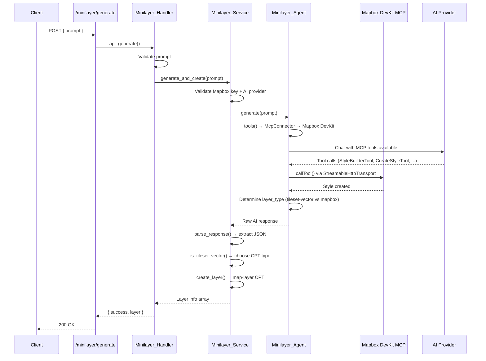

# Minilayer (AI-Generated Layers)

Creates Mapbox map styles from natural-language prompts and auto-creates a JEO layer (CPT `map-layer`).

## Key Files

| File | Class | Role |
|------|-------|------|
| `src/includes/ai/class-minilayer-agent.php` | `Minilayer_Agent` | NeuronAI Agent with Mapbox DevKit MCP tools |
| `src/includes/ai/class-minilayer-handler.php` | `Minilayer_Handler` | REST endpoint, delegates to `Minilayer_Service` |
| `src/includes/ai/class-minilayer-service.php` | `Minilayer_Service` | Shared service — AI style generation, JSON parsing, layer CPT creation. Used by both the REST handler and `Generate_Layer_Tool` |
| `src/includes/ai/class-generate-layer-tool.php` | `Generate_Layer_Tool` | NeuronAI tool for the minimap agent — conditionally registered when a Mapbox API key is available |

## Flow (REST Endpoint)



## Integration with Minimap Agent

The minimap agent can optionally use `Generate_Layer_Tool` to create custom layers when existing search results are insufficient. This integration is gated on the Mapbox API key:

1. `Minimap_Agent::create()` checks for a Mapbox key
2. If present, `Generate_Layer_Tool` is registered as an available tool
3. The agent's system prompt includes layer generation instructions with an authorization gate
4. The agent must ask the user for confirmation before generating a layer (cost implications)
5. `Generate_Layer_Tool` delegates to `Minilayer_Service::generate_and_create()` — same pipeline as the REST endpoint

The tool is never available without a Mapbox key, and the system prompt includes a "Layer Limitations" section instead, asking the agent to suggest configuring a Mapbox key.

## MCP Connection

- **Endpoint**: `https://mcp-devkit.mapbox.com/mcp` (hosted, StreamableHttpTransport)
- **Auth**: Mapbox access token from `jeo_settings()->get_option('mapbox_key')` as Bearer token
- **Tools used**: `StyleBuilderTool`, `CreateStyleTool`, `ValidateStyleTool`, `PreviewStyleTool`, `RetrieveStyleTool`, `ListStylesTool`

## REST Endpoint

```
POST /jeo/v1/minilayer/generate
Permission: edit_posts
Body: { "prompt": string, "layer_name"?: string }
Response: { "success": true, "style": {...}, "layer": { "id", "title", "type", "style_id", "edit_url", ... } }
```

## Response Parsing

The handler extracts a JSON object from the AI response (handling thinking tags, markdown fences, bracket matching). Expected keys: `style_id`, `style_name`, `layer_title`, `style_url`, `preview_url`, `style_json`, `layer_type`.

## Layer Type Selection

The agent determines the layer type after creating the style:

| Condition | `layer_type` | CPT `type` |
|-----------|-------------|------------|
| Style only styles/filters a single Mapbox vector tileset, primary layer is vector | `mapbox-tileset-vector` | `mapbox-tileset-vector` |
| Style needs custom sources, raster overlays, multiple tilesets, or satellite imagery | `mapbox` | `mapbox` |

### `mapbox-tileset-vector` additional response fields

`tileset_id`, `source_layer`, `layer_geometry_type`

### `is_tileset_vector()` validation

Requires all three tileset fields present and `layer_geometry_type` to be one of: `fill`, `line`, `symbol`, `circle`, `fill-extrusion`, `heatmap`.

## Layer CPT Creation

Creates a `map-layer` post. The type depends on the layer selection:

### mapbox-tileset-vector

- `type` = `mapbox-tileset-vector`
- `layer_type_options` = `{ tileset_id, source_layer, type, style_source_type: "vector" }`

### mapbox (fallback)

- `type` = `mapbox`
- `layer_type_options` = `{ style_id: "username/style_id" }`

Title: from `layer_title` (AI-derived from prompt) > `layer_name` param > `style_name` > fallback

## Design Principles

The agent is instructed to:
- Prefer vector layers over raster for thematic/data layers
- Base/terrain layers (background, land, water, roads, labels) may use raster
- Prefer `mapbox-tileset-vector` when only styling/filtering Mapbox built-in tilesets
- Use Mapbox vector tilesets (e.g. `mapbox://mapbox-streets-v8`) when possible
- Ensure good contrast and readability
- Keep styles performant with minimal layers
