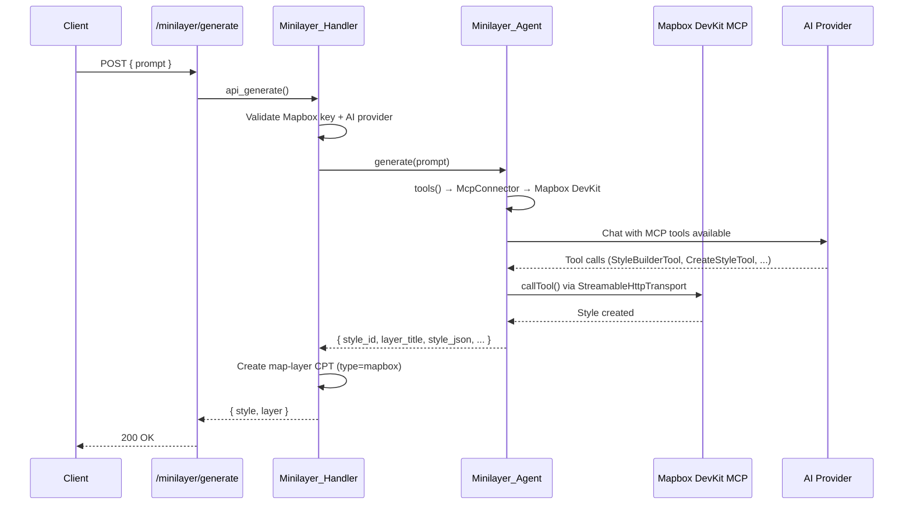

# Minilayer (AI-Generated Layers)

Creates Mapbox map styles from natural-language prompts and auto-creates a JEO layer (CPT `map-layer`).

## Key Files

| File | Class | Role |
|------|-------|------|
| `src/includes/ai/class-minilayer-agent.php` | `Minilayer_Agent` | NeuronAI Agent with Mapbox DevKit MCP tools |
| `src/includes/ai/class-minilayer-handler.php` | `Minilayer_Handler` | REST endpoint, JSON parsing, layer CPT creation |

## Flow



## MCP Connection

- **Endpoint**: `https://mcp-devkit.mapbox.com/mcp` (hosted, StreamableHttpTransport)
- **Auth**: Mapbox access token from `jeo_settings()->get_option('mapbox_key')` as Bearer token
- **Tools used**: `StyleBuilderTool`, `CreateStyleTool`, `ValidateStyleTool`, `PreviewStyleTool`, `RetrieveStyleTool`, `ListStylesTool`

## REST Endpoint

```
POST /jeo/v1/minilayer/generate
Permission: edit_posts
Body: { "prompt": string, "layer_name"?: string }
Response: { "success": true, "style": {...}, "layer": { "id", "title", "type", "style_id", "edit_url" } }
```

## Response Parsing

The handler extracts a JSON object from the AI response (handling thinking tags, markdown fences, bracket matching). Expected keys: `style_id`, `style_name`, `layer_title`, `style_url`, `preview_url`, `style_json`.

## Layer CPT Creation

Creates a `map-layer` post with:
- `type` = `mapbox`
- `layer_type_options` = `{ style_id: "username/style_id" }`
- Title: from `layer_title` (AI-derived from prompt) > `layer_name` param > `style_name` > fallback

## Design Principles

The agent is instructed to:
- Prefer vector layers over raster
- Use Mapbox vector tilesets (e.g. `mapbox://mapbox-streets-v8`) when possible
- Ensure good contrast and readability
- Keep styles performant with minimal layers
