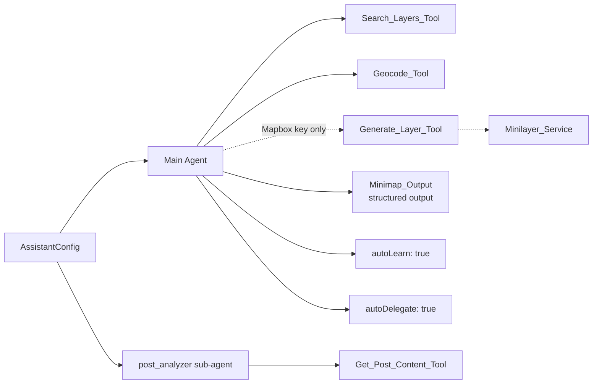
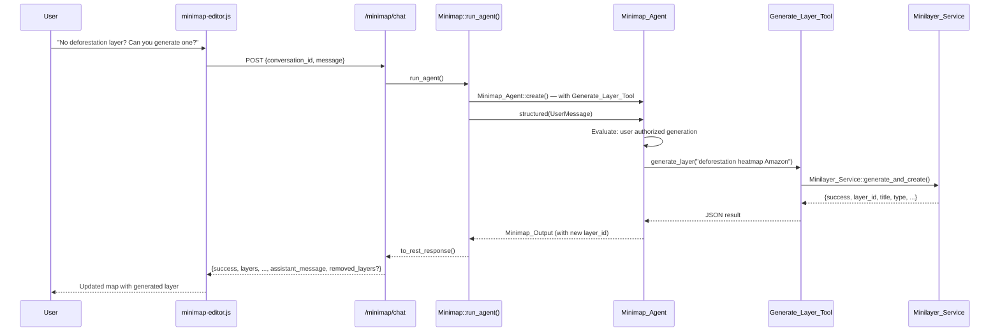
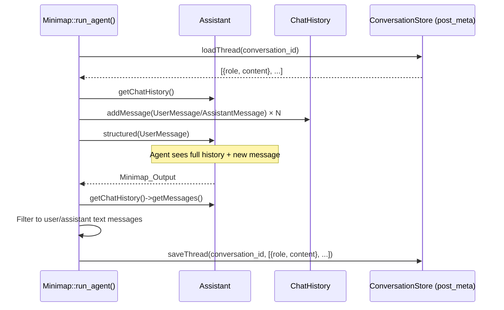
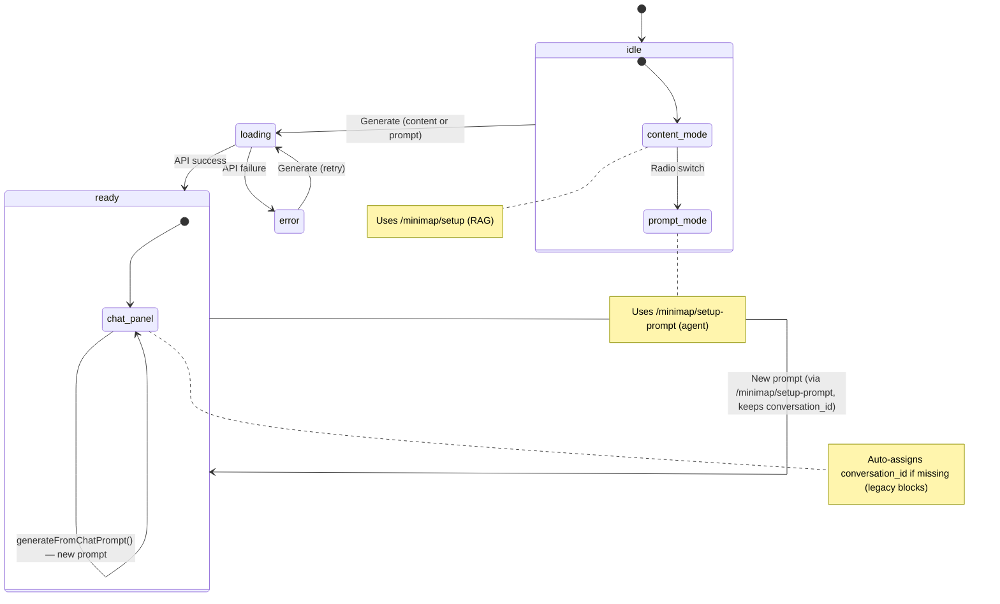
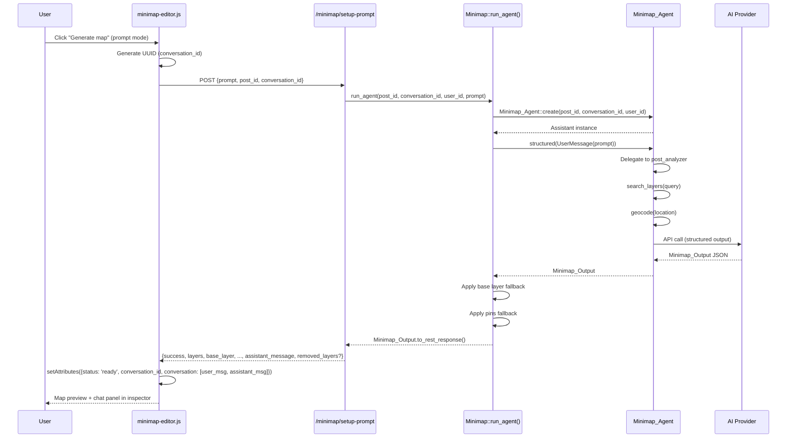
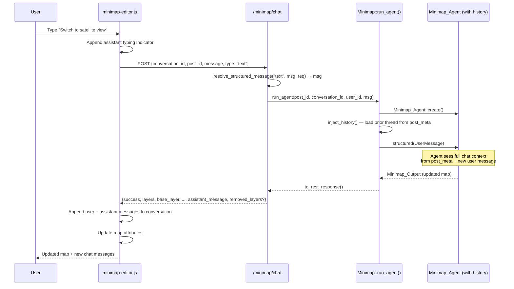

# Minimap — AI-Assisted Map Block

The `jeo/ai-minimap` block generates interactive contextual maps inside the Gutenberg editor using a combination of RAG-based layer search and a full AI agent for prompt-based generation and multi-turn refinement.

## Key Files

| File | Role |
|------|------|
| `src/includes/minimap/class-minimap.php` | `Jeo\Minimap` singleton — REST endpoints, base layer CRUD, geolocation pins, luminance heuristic, conversation history persistence (`inject_history`/`persist_history`) |
| `src/includes/ai/class-minimap-agent.php` | `Jeo\AI\Minimap_Agent` — static factory that builds a configured `Assistant` instance |
| `src/includes/ai/class-minimap-output.php` | `Jeo\AI\Minimap_Output` — structured output DTO with `#[SchemaProperty]` attributes |
| `src/includes/ai/class-search-layers-tool.php` | Agent tool: semantic layer search via `RAG_Worker::find_matching_layers()` |
| `src/includes/ai/class-geocode-tool.php` | Agent tool: geocoding with fallback chain (active geocoder → Mapbox → defaults) |
| `src/includes/ai/class-generate-layer-tool.php` | Agent tool (conditional): generates custom Mapbox styles and creates layer CPTs via `Minilayer_Service`. Only available when a Mapbox API key is configured. |
| `src/includes/ai/class-get-post-content-tool.php` | Agent tool: post content + `_related_point` meta (used by post_analyzer sub-agent) |
| `src/includes/ai/class-wp-storage.php` | `StorageInterface` adapter for `post_meta` and `user_meta` |
| `src/includes/ai/class-wp-user-memory-storage.php` | `StorageInterface` adapter for `user_meta` memories — strips redundant user ID from the namespace so preferences are reusable across contexts |
| `src/includes/ai/class-wp-option-storage.php` | `StorageInterface` adapter for `wp_options` (single option per namespace, `autoload=false`) |
| `src/js/src/map-blocks/minimap-editor.js` | Edit component — placeholder, map preview, inspector chat panel |
| `src/js/src/map-blocks/minimap-display.js` | Save component — renders `<div class="jeomap">` for frontend JS |
| `src/js/src/map-blocks/index.js` | Block registration with `conversation_id` and `conversation` attributes |
| `src/js/src/map-blocks/minimap-config.js` | Attribute coercion helpers |

## Architecture Overview

```mermaid
graph TB
    subgraph "Gutenberg Editor"
        PH[Placeholder<br/>idle/loading state] -->|Generate| API1[/minimap/setup<br/>or /minimap/setup-prompt]
        CH[Chat Panel<br/>inspector sidebar] -->|Refine| API2[/minimap/chat]
        BV[Base Layer Dropdown] -->|Change variant| API2
    end

    subgraph "Backend — Jeo\Minimap"
        API1 --> RUN[run_agent]
        API2 --> RUN
        RUN --> AGENT[Minimap_Agent::create]
    end

    subgraph "AI Agent (hacklabr/ai-assistant)"
        AGENT --> MAIN[Main Agent]
        AGENT --> SUB[post_analyzer<br/>Sub-Agent]
        MAIN --> T1[Search_Layers_Tool]
        MAIN --> T2[Geocode_Tool]
        MAIN -.->|Mapbox key only| T4[Generate_Layer_Tool]
        SUB --> T3[Get_Post_Content_Tool]
        T4 -.-> MLS[Minilayer_Service]
        MLS -.-> MLA[Minilayer_Agent]
        MAIN --> OUT[Structured Output<br/>Minimap_Output]
    end

    subgraph "Storages"
        S1[WP_Storage<br/>post_meta<br/>conversations]
        S2[WP_Option_Storage<br/>wp_options<br/>learning]
        S3[WP_User_Memory_Storage<br/>user_meta<br/>user memory]
    end

    AGENT --> S1
    AGENT --> S2
    AGENT --> S3

    RUN -->|Apply fallbacks| RES[Base layer + pins<br/>post-processing]
    RES -->|REST response| CH
```

## REST Endpoints

### `POST /jeo/v1/minimap/setup` — Generate from post content

Legacy RAG-based endpoint (no AI agent). Uses `RAG_Worker::find_matching_layers()` directly. When a `conversation_id` is provided, the generated map state is persisted as a synthetic conversation thread so subsequent chat messages can build on the existing map.

| Parameter | Type | Required | Description |
|-----------|------|----------|-------------|
| `post_id` | int | Yes | Post to analyze |
| `top_k` | int | No | Max layers (default 5) |
| `conversation_id` | string | No | UUID — if provided, persists initial context for chat continuity |

Response: `{ success, layers[], base_layer, center_lat, center_lon, initial_zoom, pins[], message, removed_layers? }`

### `POST /jeo/v1/minimap/setup-prompt` — Generate from prompt (AI agent)

Uses the full AI agent with structured output. The agent receives context about the post and may delegate to the `post_analyzer` sub-agent to extract geographic information from the post content — useful when the prompt references specific sections of the post (e.g. "map based on the Amazon section").

| Parameter | Type | Required | Description |
|-----------|------|----------|-------------|
| `prompt` | string | Yes | Text description of desired map |
| `post_id` | int | Yes | Post ID — enables post content analysis via post_analyzer and conversation storage |
| `conversation_id` | string | No | UUID for conversation continuity |

Response: `{ success, layers[], base_layer, center_lat, center_lon, initial_zoom, pins[], message, assistant_message, base_variant?, removed_layers? }`

### `POST /jeo/v1/minimap/chat` — Multi-turn refinement (AI agent)

Refines an existing map through conversation. The agent maintains context via conversation storage.

| Parameter | Type | Required | Description |
|-----------|------|----------|-------------|
| `conversation_id` | string | Yes | Block conversation UUID |
| `message` | string | No* | User message (*required unless `type=regenerate`) |
| `type` | string | No | `text` (default), `base_variant`, `add_layers`, `regenerate` |
| `post_id` | int | Yes | Post ID for conversation storage and pin extraction |
| `payload` | object | No | Structured data (e.g. `{ variant: "satellite" }`) |
| `current_map_state` | object | No | Live block attributes (`layers`, `base_layer`, `center_lat`, `center_lon`, `initial_zoom`, `pins`) — injected as system prompt context so the AI always knows the current map regardless of conversation history |

Structured types are resolved to natural language by `resolve_structured_message()` before being sent to the agent:

| Type | Resolved Prompt |
|------|----------------|
| `base_variant` | `"Change the base layer variant to {variant}."` |
| `add_layers` | `"Search for and add additional map layers about: {topic}"` |
| `regenerate` | `"Generate a completely new map suggestion, ignoring previous choices."` |
| `text` | Passed through as-is |

## Agent Architecture

### Minimap_Agent Factory

`Minimap_Agent::create()` builds an `Assistant` with:



### Optional Minilayer Integration

When a Mapbox API key is configured, `Minimap_Agent::create()` registers `Generate_Layer_Tool` alongside the standard tools. This tool allows the agent to generate custom Mapbox styles and create new layer CPTs when existing layers are insufficient.

**Authorization gate:** The system prompt instructs the agent to NEVER call `generate_layer` without explicit user authorization via chat. On the initial auto-generation (from post content or prompt), the agent only uses existing layers and reports gaps in `assistant_message`. The user must explicitly confirm (e.g. "yes", "go ahead") before the agent invokes the tool.

When no Mapbox key is configured, the tool is omitted entirely and the prompt includes a "Layer Limitations" section instructing the agent to suggest connecting a Mapbox key.

### Default Style from Generated Layers

When `Generate_Layer_Tool` creates a `mapbox-tileset-vector` layer that includes `suggested_filter` and/or `suggested_paint` from the AI, these are stored as `default_style` CPT meta on the layer. The minimap agent then sets `style.use_default: true` on the layer instance in its structured output, activating the AI-suggested filter/paint without the user needing to configure it manually.

The user can later toggle `use_default` off in the `LayerStyleEditor` modal (Gutenberg layer settings) to override with manual paint values. See [`.architecture/minilayer/README.md`](../minilayer/README.md) for the full `default_style` storage and resolution flow.

### Tool Error Handling

The minimap agent's system prompt includes explicit instructions for handling tool failures gracefully:

- **`search_layers` failure** → informational `assistant_message`, map renders with base layer + pins only
- **`generate_layer` failure** → user-friendly explanation via `assistant_message`, suggests retrying or adjusting the prompt
- **Technical error details** (WP_Error messages, API error codes, stack traces) are never exposed to the user
- The map is always rendered (with base layer + pins at minimum) even when tools fail

**Flow: Layer generation via chat**



### Storage Strategy

| Storage | Class | Backend | Namespace | Purpose |
|---------|-------|---------|-----------|---------|
| Conversation | `WP_Storage` | `post_meta` | Per post ID | Chat history per block instance |
| Learning | `WP_Option_Storage` | `wp_options` | Global | Agent self-improvement across sessions |
| User Memory | `WP_User_Memory_Storage` | `user_meta` | `memories` (namespace normalised) | User preferences (base variant, layer preferences). The ai-assistant library builds namespaces as `memories/{userId}`; this adapter strips the redundant user ID because the `usermeta.user_id` column already scopes the row. Resulting meta key: `_jeo_ai_memories_{memory_id}` |

### Structured Output (Minimap_Output)

The agent always returns a `Minimap_Output` DTO via NeuronAI structured output:

| Property | Type | Description |
|----------|------|-------------|
| `layers` | `array` | Thematic layer definitions (`id`, `use`, `default`, `show_legend`, optional `reason`) |
| `base_layer` | `?array` | Base terrain layer with `variant` (dark/light/satellite) |
| `center_lat` | `float` | Map center latitude |
| `center_lon` | `float` | Map center longitude |
| `initial_zoom` | `int` | Zoom level (0-20) |
| `pins` | `array` | Geolocation pins from post |
| `base_variant` | `?string` | Agent-chosen variant (null = luminance heuristic fallback) |
| `message` | `string` | Info/warning for the block editor |
| `assistant_message` | `string` | Chat message shown in the inspector panel |
| `removed_layers` | `int[]` | IDs returned by the agent that were discarded because they do not correspond to published map-layer posts |

### Conversation History Persistence

`run_agent()` injects prior chat history before the agent call and persists the updated history after:



**Serialization**: Only `user` and `assistant` text messages are stored (tool calls, tool results are excluded). Each message is a simple `{role: string, content: string}` array. Stored via `ConversationStore` → `WP_Storage` → `update_post_meta()` (PHP `serialize()`).

**Injection**: Prior messages are loaded and added to the assistant's chat history via `addMessage()` BEFORE `structured()` is called. This works because `resolveState()` is lazy — the state is created once and reused, and `init()` resets `toolRuns`/`steps` but NOT the chat history.

#### Content-based generation context (persist_initial_context)

When a map is generated from post content via `/minimap/setup`, the RAG-based flow does not use the AI agent and therefore produces no conversation history. To ensure chat refinement works, `persist_initial_context()` stores a synthetic thread:

```
[user]    "Generate a map for this post based on its content."
[assistant] "Map generated from post content with the following configuration:
             Layers: - Layer Name (ID: 123), ...
             Center: -14.235, -51.925 | Zoom: 8
             Base: dark
             Pins: 2 geolocation point(s)"
```

This synthetic history is loaded by `inject_history()` on the first chat message, giving the AI agent full context about the existing map.

#### Live state context (build_state_context)

In addition to conversation history, `/minimap/chat` also receives the current block attributes as `current_map_state`. `build_state_context()` formats this as a context string passed to `Minimap_Agent::create()` as `initial_context`, which appends it to the system prompt. This ensures the AI always knows the live map state even if conversation history is stale or missing.

### Post-Processing in `run_agent()`

After the agent returns, `Minimap::run_agent()` applies two safety nets:

1. **Base layer fallback**: If `base_layer` is null, creates one using the agent's `base_variant` or the luminance heuristic (`determine_base_variant()`)
2. **Pin fallback**: If the agent returned no pins and a `post_id` exists, fills pins from `_related_point` post meta

## Editor State Machine



### `conversation_id` Lifecycle

| Event | Behavior |
|-------|----------|
| First generation (content) | Frontend generates UUID, stores as `conversation_id` attribute |
| First generation (prompt) | Frontend generates UUID, passes to `/minimap/setup-prompt`, stores as attribute |
| Legacy block (saved before `conversation_id` existed) | `useEffect` auto-assigns UUID when `status === 'ready'` and `conversation_id` is empty |
| `sendChat()` called without `conversation_id` | Generates UUID on the fly, stores it, proceeds with API call |

### Chat Panel Actions (Inspector Sidebar)

The inspector sidebar shows three action types when the block is in `ready` state:

| Action | Endpoint | Callback | Behavior |
|--------|----------|----------|----------|
| **Send** | `/minimap/chat` | `sendChat(text, 'text')` | Refinement — agent modifies existing map based on user instruction. User message + assistant response appended to conversation |
| **Regenerate** | `/minimap/chat` | `sendChat('', 'regenerate')` | Full replacement — agent generates a completely new map. No user message in conversation, only assistant response |
| **New prompt** | `/minimap/setup-prompt` | `generateFromChatPrompt()` | Fresh generation — starts a new agent call with a fresh prompt. Keeps `conversation_id` for learning continuity. User prompt + assistant response appended to conversation |
| **Base variant change** | `/minimap/chat` | `sendChat(text, 'base_variant', {variant})` | Structured control — backend resolves to natural language. Single API call (replaces old two-call approach) |

All actions use `chatLoading` state (not `status: 'loading'`) so the map preview stays visible during processing.

## Block Attributes

| Attribute | Type | Default | Description |
|-----------|------|---------|-------------|
| `layers` | `array` | `[]` | Thematic layer definitions |
| `base_layer` | `object` | `null` | Base terrain layer with variant |
| `center_lat` | `number` | — | Map center latitude |
| `center_lon` | `number` | — | Map center longitude |
| `initial_zoom` | `number` | — | Zoom level |
| `pins` | `array` | `[]` | Geolocation pins (`lat`, `lon`, `relevance`, `address`) |
| `show_pins` | `boolean` | `true` | Toggle pin visibility |
| `status` | `string` | `'idle'` | Block state: `idle` → `loading` → `ready` / `error` |
| `message` | `string` | `''` | Info/warning message |
| `prompt` | `string` | `''` | User's text prompt (for initial generation) |
| `conversation_id` | `string` | `''` | UUID assigned on first generation |
| `conversation` | `array` | `[]` | Chat history (`{role, text, ts}[]`) |

## Flow: First Generation (from prompt)



## Flow: Chat Refinement



## Base Layer System

### Luminance Heuristic

When the agent doesn't choose a `base_variant`, `determine_base_variant()` computes the average luminance of layer legend colors:

- Average luminance > 0.5 → `dark` base (bright legends need dark background)
- Average luminance ≤ 0.5 → `light` base (dark legends need light background)
- No colors found → `dark` (default)

### Base Layer CRUD

Base layers are `map-layer` CPTs tagged with `_jeo_is_base_layer` meta:

1. **Find existing**: Query by meta key, then by title heuristics (keywords: "dark", "light", "satellite")
2. **Create new**: `wp_insert_post()` with pre-configured tile URLs per runtime (Mapbox GL or tilelayer)
3. **Filterable**: `jeo_minimap_base_layers` filter allows custom base layer definitions

## Conventions

- **Stable block identity**: `conversation_id` (UUID) is generated on first generation and stored as a block attribute, ensuring conversation continuity across editor sessions
- **Agent never writes preferences**: User preferences are suggested via agent output and stored by the backend in user_meta, never written directly by the agent
- **Structured controls**: Base variant changes, layer additions, and regeneration are sent as typed messages (`type` field) to the chat endpoint and resolved to natural language server-side
- **Fallback chain**: Agent output is always post-processed with luminance heuristic and pin extraction to ensure complete, usable maps
- **Layer generation authorization**: When Mapbox is available, the agent must always ask for explicit user confirmation via chat before generating custom layers (`generate_layer` tool). Initial auto-generation never creates custom layers
- **Debounced map interaction**: `onMove` and `onZoom` handlers use 300 ms lodash debounce to avoid excessive `setAttributes` calls and re-renders during map pan/zoom
- **Layer render guard**: The map preview only attempts to render layers when `loadedLayers.length > 0`, preventing an empty-map flash while REST metadata is still loading
- **Layer validation reporting**: Invalid or non-published layer IDs returned by the agent are silently removed, and `removed_layers` is included in the REST response so the UI can warn the user
- **Geographic scope guard**: The system prompt instructs the agent to avoid overly broad national layers as thematic overlays when the requested scope is local/regional
- **Hybrid layer retrieval**: `RAG_Worker::find_matching_layers()` combines semantic RAG results with a direct `WP_Query` text search on layer titles/content, giving priority to RAG scores while ensuring literal matches are included
