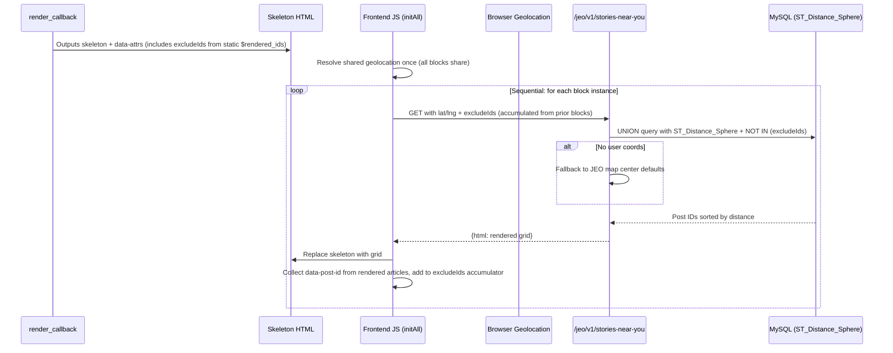

# Stories Near You (`jeo/stories-near-you`)

Self-contained block in `src/includes/stories-near-you/class-stories-near-you.php`.

## Key Files

| File | Role |
|------|------|
| `src/includes/stories-near-you/class-stories-near-you.php` | Self-registering class: block type, REST endpoint, SQL query, rendering |
| `src/js/src/map-blocks/stories-near-you-editor.js` | Gutenberg edit component (InspectorControls + ServerSideRender) |
| `src/js/src/stories-near-you/stories-near-you-frontend.js` | Frontend: geolocation + REST fetch + DOM rendering |
| `src/css/stories-near-you.css` | Skeleton, grid, post card, responsive styles |

## Data Flow



## Location Resolution (3-tier fallback)

1. **Browser Geolocation API** → lat/lng sent to REST endpoint
2. _(future)_ **IP Geolocation** → resolved server-side from `$_SERVER['REMOTE_ADDR']`
3. **Map center defaults** → from JEO settings (`map_default_lat`, `map_default_lng`)

## Block Attributes

| Attribute | Type | Default | Purpose |
|-----------|------|---------|---------|
| `postsPerPage` | number | 6 | Total posts to display (max 36) |
| `postsPerRow` | number | 3 | Columns in grid (max 6) |
| `category` | number | 0 | Single category ID filter (0 = none) |
| `tag` | number | 0 | Single tag ID filter (0 = none) |
| `showThumbnail` | boolean | true | Toggle featured image |
| `showCategory` | boolean | true | Toggle category badge |
| `showDate` | boolean | true | Toggle post date |
| `showExcerpt` | boolean | true | Toggle excerpt |

## Cross-Block Non-Repetition (Dedup)

When multiple `jeo/stories-near-you` blocks exist on the same page, posts are never repeated across blocks.

### Server-Side Path (Editor Preview)

PHP `render_callback` uses a `static $rendered_ids` array. Each block invocation passes already-rendered IDs to `get_nearby_posts()` as `$exclude_ids`, which adds a `NOT IN` clause to the SQL. WordPress renders blocks in document order (top-to-bottom), so ordering is guaranteed.

### Frontend Path (REST)

1. `initAll()` resolves geolocation **once** and shares it across all block instances.
2. Blocks are processed **sequentially** (`for...of` with `await`), not in parallel.
3. After each block renders, its `data-post-id` attributes are collected and appended to the `excludeIds` accumulator.
4. The next block sends the accumulated `excludeIds` to the REST endpoint.
5. The REST endpoint parses `excludeIds` via `parse_exclude_ids()` and passes them to `get_nearby_posts()`.

### REST Parameter

| Param | Type | Description |
|-------|------|-------------|
| `excludeIds` | string | Comma-separated post IDs to exclude (e.g. `"123,456,789"`) |

### Trade-off

Sequential fetching means N blocks take ~N×200ms instead of ~200ms total. Acceptable for typical 2-3 block pages.

## REST Endpoint

`GET /jeo/v1/stories-near-you`

Params: `lat`, `lng`, `postsPerPage`, `postsPerRow`, `category`, `tag`, `showThumbnail`, `showCategory`, `showDate`, `showExcerpt`, `excludeIds`

Returns: `{ html: "<div class=\"jeo-stories-near-you__grid\">...</div>" }`

## SQL Query

Uses `ST_Distance_Sphere()` to sort by proximity. UNION of primary (`_geocode_lat_p`/`_geocode_lon_p`) and secondary (`_geocode_lat_s`/`_geocode_lon_s`) coordinate indexes. Optional taxonomy JOINs for category/tag filtering. Deduplicates post IDs after UNION. Supports `excludeIds` via `NOT IN` clause for cross-block non-repetition.

## Webpack Entry

| Entry | File | Dependency |
|-------|------|------------|
| `storiesNearYou` | `stories-near-you/stories-near-you-frontend.js` | standalone |

## HTML Structure

```html
<div class="wp-block-jeo-stories-near-you">
  <div class="jeo-stories-near-you__grid jeo-stories-near-you__grid--cols-3">
    <article class="jeo-stories-near-you__post" data-post-id="123">
      <figure class="jeo-stories-near-you__post-featured-image">
        <a href="..."></a>
      </figure>
      <div class="jeo-stories-near-you__post-content">
        <span class="jeo-stories-near-you__post-terms">
          <span class="jeo-stories-near-you__post-term">Category</span>
        </span>
        <h3 class="jeo-stories-near-you__post-title">
          <a href="...">Post Title</a>
        </h3>
        <time class="jeo-stories-near-you__post-date" datetime="...">January 1, 2026</time>
        <p class="jeo-stories-near-you__post-excerpt">Excerpt text...</p>
      </div>
    </article>
  </div>
  <!-- Skeleton state -->
  <div class="jeo-stories-near-you__skeleton ...">...</div>
  <!-- Error state -->
  <div class="jeo-stories-near-you__error hidden">...</div>
  <!-- Block attributes for JS -->
  <script type="application/json" class="jeo-stories-near-you-attrs">{...}</script>
</div>
```

Inner elements use CSS `order` properties so themes can reorder thumbnail/category/title/date/excerpt via CSS.
