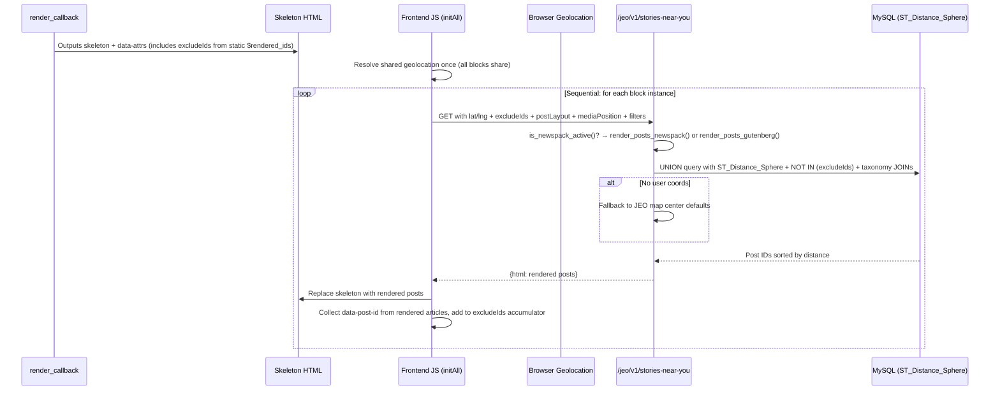

# Stories Near You (`jeo/stories-near-you`)

Self-contained block split across three PHP files in `src/includes/stories-near-you/`.

## Key Files

| File | Role |
|------|------|
| `src/includes/stories-near-you/class-stories-near-you.php` | Main class: block registration, REST endpoint, SQL query, rendering dispatch, skeleton/empty/error states |
| `src/includes/stories-near-you/trait-stories-near-you-gutenberg.php` | Gutenberg rendering trait: `render_posts_gutenberg()`, `render_post_card_gutenberg()`, `build_gutenberg_inline_style()` |
| `src/includes/stories-near-you/trait-stories-near-you-newspack.php` | Newspack rendering trait: `render_posts_newspack()`, `map_newspack_attrs()`, `build_newspack_wrapper_classes()`, `enqueue_newspack_styles()` |
| `src/js/src/map-blocks/stories-near-you-editor.js` | Gutenberg edit component (InspectorControls + ServerSideRender) |
| `src/js/src/stories-near-you/stories-near-you-frontend.js` | Frontend: geolocation + REST fetch + DOM rendering |
| `src/css/stories-near-you.css` | Skeleton, consent UI, error states, Gutenberg list/featured overrides, image-scale, avatar, read-more |
| `src/js/src/map-blocks/index.js` | Block registration with all attributes |

## Architecture

The main class `Stories_Near_You` uses two traits to separate rendering logic:

```
Stories_Near_You (main class)
├── Stories_Near_You_Gutenberg (trait)
│   ├── render_posts_gutenberg()
│   ├── render_post_card_gutenberg()
│   └── build_gutenberg_inline_style()
└── Stories_Near_You_Newspack (trait)
    ├── render_posts_newspack()
    ├── map_newspack_attrs()
    ├── build_newspack_wrapper_classes()
    └── enqueue_newspack_styles()
```

`render_posts()` dispatches to the appropriate trait method based on `is_newspack_active()`. The Newspack trait falls back to Gutenberg rendering if the template file is not found.

## Style Delegation

The block does not define its own card styles. It delegates to the active context:

### Newspack Path (when Newspack Blocks is active)

- Calls `newspack_blocks_enqueue_block_homepage_articles_styles()` to load Newspack CSS.
- Creates a `WP_Query` with JEO's geolocated post IDs and iterates using Newspack's `article.php` template.
- Wrapper classes: `wpnbha is-grid columns-N`, `image-alignleft`, `image-alignright`, `image-behind`, `is-landscape`, etc.

### Gutenberg Path (default)

- Emulates `core/latest-posts` HTML structure: `<ul class="wp-block-latest-posts is-grid columns-N">` with `<li>` per post.
- CSS loaded from WordPress core block library.
- JEO CSS provides minimal overrides for `list`, `list-reverse`, and `featured` layouts (not natively supported by `core/latest-posts`).
- Image size: `medium_large`. Aspect ratio applied via inline `style`.

### Fallback

If Newspack template file is not found, `render_posts_newspack()` falls back to `render_posts_gutenberg()`.

## Card Models

| `postLayout` | `mediaPosition` | Newspack classes | Gutenberg classes |
|---|---|---|---|
| `grid` | `top` (default) | `is-grid columns-N image-aligntop` | `is-grid columns-N` (native) |
| `grid` | `left` | `is-grid columns-N image-alignleft` | `is-grid jeo-snu-list jeo-snu-is-N` (collapsed to column) |
| `grid` | `right` | `is-grid columns-N image-alignright` | `is-grid jeo-snu-list-reverse jeo-snu-is-N` (collapsed to column) |
| `grid` | `behind` | `is-grid columns-N image-alignbehind` | `is-grid jeo-snu-featured` |
| `list` | `top` | `image-aligntop` (stack) | `wp-block-latest-posts__list` (native stack) |
| `list` | `left` | `image-alignleft` | `jeo-snu-list jeo-snu-is-N` |
| `list` | `right` | `image-alignright` | `jeo-snu-list-reverse jeo-snu-is-N` |
| `list` | `behind` | `image-alignbehind` | `jeo-snu-featured` |

Legacy `cardLayout` (`grid`/`list`/`list-reverse`/`featured`) is auto-migrated to `postLayout` + `mediaPosition` in `sanitize_atts()`.

## Image Scale

| `imageScale` | Flex-basis (horizontal layouts) |
|---|---|
| 1 | 25% |
| 2 | 33% (default) |
| 3 | 50% |
| 4 | 75% |

CSS classes: `.jeo-snu-is-1` through `.jeo-snu-is-4` (Gutenberg path only; Newspack uses its own `is-N` classes).

## Data Flow



## Location Resolution (3-tier fallback)

1. **Browser Geolocation API** → lat/lng sent to REST endpoint (rounded to `geolocation_precision` decimal places)
2. _(future)_ **IP Geolocation** → resolved server-side from `$_SERVER['REMOTE_ADDR']`
3. **Map center defaults** → from JEO settings (`map_default_lat`, `map_default_lng`)

### Geolocation Timeout (`GEOLOCATION_OVERALL_TIMEOUT`)

The W3C Geolocation API's `timeout` option (10s, `GEOLOCATION_TIMEOUT`) only starts counting **after** the user grants permission. If the user dismisses or ignores the browser's permission dialog, neither the success nor error callback fires, leaving the returned Promise — and the skeleton loader — pending indefinitely.

To guard against this, `BrowserGeolocationProvider.getLocation()` wraps its Promise in a `Promise.race` with a hard `GEOLOCATION_OVERALL_TIMEOUT` (20s). If the overall timeout fires first, `getLocation()` resolves `null`, which triggers the server-side map-center fallback via `fetchAndRender(null)`. This covers three scenarios:

- **Saved consent + ignored prompt on page reload** — server-rendered skeleton is replaced after timeout.
- **Multi-block pages (`resolveSharedLocation`)** — all blocks' skeletons resolve after the shared timeout.
- **Consent click + ignored prompt** — dynamically-shown skeleton resolves; consent UI was already removed, so the fallback renders directly.

The orphaned `getCurrentPosition` callback (if permission is granted late) calls `resolve()` on an already-settled Promise — a harmless no-op.

### User Location Precision (`geolocation_precision`)

Global plugin setting (Settings > General > User location precision) controlling how many decimal places are kept from the browser geolocation result before sending to the REST endpoint. Range: 1–5, default: 2. Lower values = less precision, more privacy. Does **not** affect post geocoding or stored coordinates — only the user's browser-reported location.

Passed to frontend via `wp_localize_script` as `jeo_snu_config.geolocationPrecision`. Applied in `BrowserGeolocationProvider.getLocation()` using `toFixed()`.

## Block Attributes

| Attribute | Type | Default | Purpose |
|-----------|------|---------|---------|
| `postsPerPage` | number | 6 | Total posts to display (max 36) |
| `postsPerRow` | number | 3 | Columns in grid layout (max 6, grid only) |
| `postLayout` | string | `"grid"` | Layout: `grid` / `list` |
| `mediaPosition` | string | `"top"` | Media position: `top` / `left` / `right` / `behind` |
| `imageShape` | string | `"landscape"` | Image crop: `landscape` / `portrait` / `square` / `uncropped` |
| `typeScale` | number | 4 | Typography scale 1–10 (maps to em values) |
| `imageScale` | number | 3 | Image width in horizontal layouts 1–4 |
| `colGap` | number | 3 | Column gap 1–3 (8px / 16px / 32px) |
| `minHeight` | number | 0 | Min height in vh for featured layout (0–100) |
| `showThumbnail` | boolean | true | Toggle featured image |
| `showCategory` | boolean | true | Toggle category badge |
| `showDate` | boolean | true | Toggle post date |
| `showExcerpt` | boolean | true | Toggle excerpt |
| `excerptLength` | number | 55 | Excerpt word count (5–200) |
| `showAuthor` | boolean | true | Toggle author |
| `showAvatar` | boolean | true | Toggle author avatar (requires showAuthor) |
| `showReadMore` | boolean | false | Toggle read more link |
| `readMoreLabel` | string | `""` | Custom read more label (empty = "Read more") |
| `categories` | string | `""` | Comma-separated category IDs to include |
| `tags` | string | `""` | Comma-separated tag IDs to include |
| `categoryExclusions` | string | `""` | Comma-separated category IDs to exclude |
| `tagExclusions` | string | `""` | Comma-separated tag IDs to exclude |
| `customTaxonomies` | string | `""` | JSON: `[{"slug":"tax","terms":[1,2]}]` |
| `postType` | string | `""` | Post type slug filter (intersected with geo-enabled types) |
| `category` | number | 0 | *(legacy)* Single category ID — migrated to `categories` |
| `tag` | number | 0 | *(legacy)* Single tag ID — migrated to `tags` |
| `cardLayout` | string | `""` | *(legacy)* `grid`/`list`/`list-reverse`/`featured` — migrated to `postLayout` + `mediaPosition` |

## Cross-Block Non-Repetition (Dedup)

When multiple `jeo/stories-near-you` blocks exist on the same page, posts are never repeated across blocks.

### Server-Side Path (Editor Preview)

PHP `render_callback` uses a `static $rendered_ids` array. Each block invocation passes already-rendered IDs to `get_nearby_posts()` as `$exclude_ids`, which adds a `NOT IN` clause to the SQL. WordPress renders blocks in document order (top-to-bottom), so ordering is guaranteed.

### Frontend Path (REST)

1. `initAll()` resolves geolocation **once** and shares it across all block instances.
2. Blocks are processed **sequentially** (`for...of` with `await`), not in parallel.
3. After each block renders, its `data-post-id` attributes are collected and appended to the `excludeIds` accumulator.
4. The next block sends the accumulated `excludeIds` to the REST endpoint.
5. The REST endpoint parses `excludeIds` via `parse_id_list()` and passes them to `get_nearby_posts()`.

### Frontend Waterfall (Consent Flow)

When multiple blocks exist and the user has **not** previously consented to geolocation:

1. All blocks render their consent prompts.
2. Each instance receives a shared `waterfallTrigger` callback via `setWaterfallTrigger()`.
3. When the user clicks **"Use my location"** on **any** block, `triggerWaterfall()` fires:
   - Persists consent to `localStorage`.
   - Obtains geolocation **once** from the browser.
   - Removes all consent prompts across all blocks.
   - Shows skeletons on blocks that haven't rendered yet.
   - Runs the sequential waterfall **in DOM order**, skipping any block that already rendered (e.g. via "Skip").
4. If the user clicks **"Skip"** instead, only that individual block renders without location (no waterfall).
5. Subsequent clicks on "Use my location" reuse the same promise (singleton pattern) to prevent duplicate waterfalls.

### Trade-off

Sequential fetching means N blocks take ~N×200ms instead of ~200ms total. Acceptable for typical 2-3 block pages.

## REST Endpoint

`GET /jeo/v1/stories-near-you`

Params: `lat`, `lng`, `postsPerPage`, `postsPerRow`, `postLayout`, `mediaPosition`, `imageShape`, `showThumbnail`, `showCategory`, `showDate`, `showExcerpt`, `showAuthor`, `showAvatar`, `showReadMore`, `readMoreLabel`, `excerptLength`, `colGap`, `typeScale`, `imageScale`, `minHeight`, `excludeIds`, `categories`, `tags`, `categoryExclusions`, `tagExclusions`, `customTaxonomies`, `postType`

Returns: `{ html: "..." }` — rendered HTML using the active context's classes.

## SQL Query

Uses `ST_Distance_Sphere()` to sort by proximity. UNION of primary (`_geocode_lat_p`/`_geocode_lon_p`) and secondary (`_geocode_lat_s`/`_geocode_lon_s`) coordinate indexes. Dynamic taxonomy JOINs for category/tag/custom taxonomy filtering. Exclusion sub-queries for category/tag exclusions. Deduplicates post IDs after UNION. Supports `excludeIds` via `NOT IN` clause for cross-block non-repetition.

## Webpack Entry

| Entry | File | Dependency |
|-------|------|------------|
| `storiesNearYou` | `stories-near-you/stories-near-you-frontend.js` | standalone |

## HTML Structure — Newspack Path

```html
<div class="wp-block-jeo-stories-near-you wpnbha is-grid columns-3 is-landscape">
  <div data-posts>
    <article data-post-id="123" class="post-has-image">
      <figure class="post-thumbnail">
        <a href="..."></a>
      </figure>
      <div class="entry-wrapper">
        <div class="cat-links"><a href="...">Category</a></div>
        <h3 class="entry-title"><a href="...">Post Title</a></h3>
        <p>Excerpt text...</p>
        <div class="entry-meta">
          <span class="byline">by <span class="author vcard">Author</span></span>
          <time class="entry-date published" datetime="...">Date</time>
        </div>
      </div>
    </article>
  </div>
</div>
```

## HTML Structure — Gutenberg Path

### Skeleton (initial load / consent pending)

```html
<div class="wp-block-jeo-stories-near-you">
  <ul class="wp-block-latest-posts__list is-grid columns-3 jeo-stories-near-you__skeleton">
    <li class="jeo-stories-near-you__skeleton-card">
      <div class="jeo-stories-near-you__skeleton-thumb"></div>
      <div class="jeo-stories-near-you__skeleton-content">
        <div class="jeo-stories-near-you__skeleton-line jeo-stories-near-you__skeleton-line--title"></div>
      </div>
    </li>
  </ul>
  <div class="jeo-stories-near-you__error hidden">...</div>
  <script type="application/json" class="jeo-stories-near-you-attrs">...</script>
</div>
```

Skeleton uses core `wp-block-latest-posts__list is-grid columns-N` classes so the grid layout matches the rendered output (provided by WordPress core block library CSS). The `jeo-stories-near-you__skeleton` class is a marker for JS removal. For `list` layout, `is-grid` and `columns-N` are omitted.

### Rendered content

```html
<div class="wp-block-jeo-stories-near-you">
  <ul class="wp-block-latest-posts wp-block-latest-posts__list is-grid columns-3 has-dates has-author">
    <li data-post-id="123">
      <div class="wp-block-latest-posts__featured-image">
        <a href="..."></a>
      </div>
      <div class="jeo-snu-list__content">
        <div class="wp-block-post-terms taxonomy-category"><a href="...">Category</a></div>
        <a class="wp-block-latest-posts__post-title" href="..." style="font-size:1.2em">Post Title</a>
        <time class="wp-block-latest-posts__post-date" datetime="...">Date</time>
        <div class="wp-block-latest-posts__post-author">
          
          <span>by Author</span>
        </div>
        <div class="wp-block-latest-posts__post-excerpt">Excerpt text...</div>
        <a class="wp-block-latest-posts__read-more" href="...">Read more</a>
      </div>
    </li>
  </ul>
</div>
```

## CSS Responsibilities

| Source | Responsible for |
|--------|----------------|
| WordPress core (`wp-block-latest-posts`) | Gutenberg grid, card spacing, typography defaults |
| Newspack Blocks | All Newspack card styles, image shapes, media positions |
| JEO (`stories-near-you.css`) | Skeleton, consent UI, error/empty states, `.jeo-snu-list`/`-reverse`/`-featured` overrides, `.jeo-snu-is-N` image-scale variants, `.jeo-snu-avatar`, `.wp-block-latest-posts__read-more`, grid+list collapse, responsive breakpoints |

## Editor Panels

The editor (`stories-near-you-editor.js`) provides these InspectorControls panels:

1. **Location Preview** — Lat/Lng for ServerSideRender preview
2. **Post Card** — Layout (`postLayout`), Media position (`mediaPosition`), Image shape, Columns
3. **Query Settings** — Posts per page, Post type (only shown if >1 geo-enabled types)
4. **Filters** — Categories/Tags (multi-select), Category/Tag exclusions
5. **Display** — Thumbnail, Category, Date, Excerpt (with length), Author (with avatar), Read more (with label)
6. **Typography & Spacing** — Type scale (1–10), Image scale (1–4, horizontal only), Column gap (1–3), Min height (featured only)

Text color uses native Gutenberg `supports.color` (not a custom attribute). Link color also supported.
