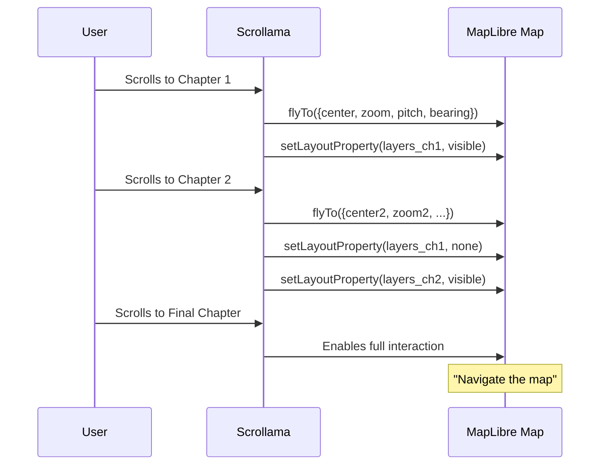

# Storymap (Scrollytelling)

## Key Files

| File | Role |
|------|------|
| `src/includes/storymap/class-storymap.php` | CPT `storymap`, template, archives |
| `src/js/src/jeo-storymap/storymap-display.js` | Frontend rendering (scrollama) |
| `src/js/src/maps-sidebar/storymap-sidebar.js` | Gutenberg sidebar (embed URL) |
| `src/templates/single-storymap.php` | Single template |
| `src/templates/embed-storymap.php` | Embed template |

## Custom Post Type: `storymap`

- Template lock: uses `jeo/storymap` as mandatory block
- Archives: optionally included in general archives (`pre_get_posts`)
- REST: enriched with co-author data

## Block `jeo/storymap`

### InnerBlocks (Chapters)

Each chapter (`jeo/storymap-chapter`) contains:
- Text content (RichText)
- Navigation config: `center_lat`, `center_lon`, `zoom`, `pitch`, `bearing`
- Selected layers for the chapter
- Side scrolling behavior

### Block Template

```json
[
  ["jeo/storymap-chapter", {}],
  ["jeo/storymap-chapter", {}]
]
```

Storymap blocks are restricted to 1 per post.

## Frontend Rendering

### StoryMapDisplay Class

1. DOM scan: `.story-map-container`, `.storymap`
2. Lazy-init via `IntersectionObserver`
3. Creates shared MapLibre/Mapbox map
4. Uses `scrollama` for scroll-driven chapter navigation
5. Each chapter: `flyTo()` with center/zoom/pitch/bearing
6. Manages layer visibility per chapter
7. Optional final step: "Navigate the map" → full `JeoMap` instance



## Embed

Storymaps can be embedded via URL:
```
/embed/?map_id={storymap_id}
```

Template: `templates/embed-storymap.php`

## Webpack Entry Points

| Entry | File | Dependency |
|-------|------|------------|
| `jeoStorymap` | `jeo-storymap/storymap-display.js` | `jeoMap` |
