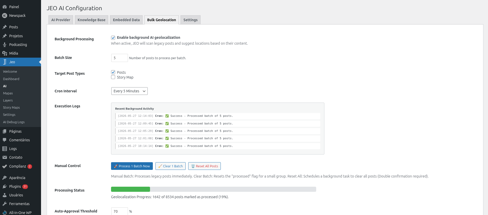
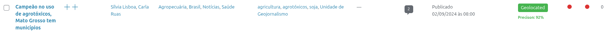
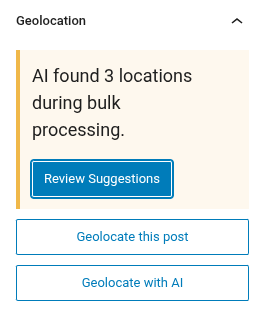
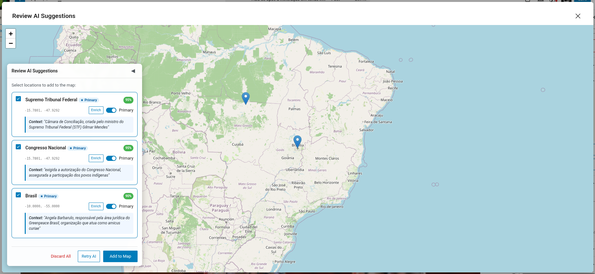

# AI Bulk Geolocation

Bulk Geolocation allows you to georeference many posts at once using AI. This is useful when you have a large archive of posts that were not geolocated when first published.

## How it works

The Bulk Geolocation system processes posts in batches using WordPress cron (WP-Cron). It selects posts that do not have geolocation data (`_related_point` meta) and sends them to the AI for analysis.

## Setting up

1. Configure an AI provider in **Jeo → AI** (see [AI Settings](ai-settings.md)).
2. Go to the **Bulk Geolocation** tab in **Jeo → AI**.
3. Select the post types to process, set the confidence threshold, and configure the batch size.
4. Start the bulk process.

## Processing

Once started, the system processes posts in the background:

- Each batch selects posts without geolocation data and sends them to the AI.
- A **JEO AI Status** column appears in the WordPress admin post list, showing the georeferencing status for each post.
- Processed posts are marked for review — they are not published automatically.

## Reviewing results

After processing, you can review the AI-suggested geolocation for each post:

1. Go to the post list and look for posts with a "pending review" AI status.
2. Click on a post to open the editor.
3. The Geolocation sidebar will show the AI-suggested points.
4. Approve or adjust the points as needed.

You can also use the **bulk action** on the WordPress post list (`edit.php`) to approve multiple posts at once. Select the posts, choose **Approve JEO AI Geolocations** from the bulk actions dropdown, and a preview modal will appear showing each post's suggested locations, confidence scores, and an approve/reject action.

## Monitoring

- **Jeo → AI Debug Logs**: View token usage, provider, and model for each AI call.
- The Bulk Geolocation tab shows the current batch progress and any errors encountered.

## Requirements

- An AI provider must be configured.
- Posts must have title and/or content for the AI to analyze.
