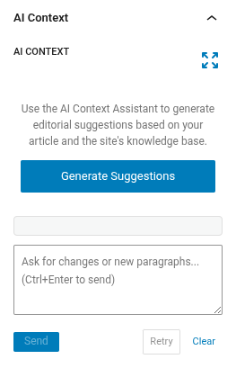
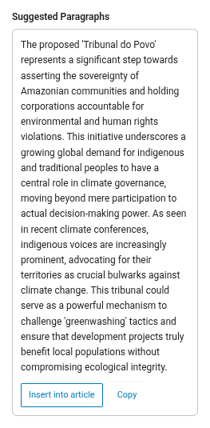
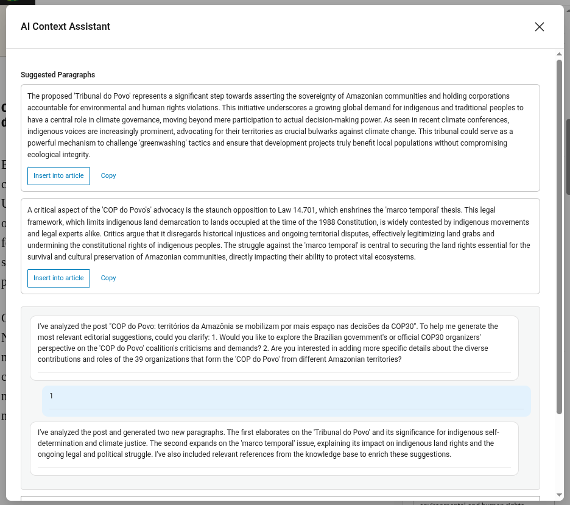

# AI Context Assistant — Editorial Suggestions

The AI Context Assistant is a Gutenberg sidebar panel that helps you enrich your articles with AI-suggested paragraphs and references to related content from your site's knowledge base.

## Opening the panel

1. Open or create a post in the Gutenberg editor (the post type must be enabled in **JEO Settings → General**).
2. In the **Document** sidebar, find the **AI Context** panel.
3. If the panel is collapsed, click its title to expand it.

## Generating suggestions

Click **Generate Suggestions**. The AI will analyze your article's content and the site's vectorized article archive to produce:

- **Suggested paragraphs** — ready-to-insert text blocks that complement your article. Paragraphs may include inline formatting (bold, italic) and links to related articles.
- **Related references** — articles from your knowledge base that are relevant to the topic.

The generation is **not automatic** — you control when it runs to avoid unnecessary API calls.

<!--  -->

## Using suggested paragraphs

Each suggested paragraph has two actions:

### Insert into article

Click **Insert into article** to add the paragraph as a Gutenberg `core/paragraph` block at the end of the document. Inline formatting and links are preserved. Once inserted, the button changes to **Inserted** to prevent duplicates.

### Copy

Click **Copy** to copy the paragraph as rich text (HTML with links) to your clipboard. You can then paste it anywhere — the WordPress editor, Google Docs, Word, etc. The copy uses a triple-fallback mechanism for maximum compatibility:

1. Modern `ClipboardItem` API (HTML + plain text)
2. DOM selection + `execCommand('copy')` (works in Gutenberg iframes)
3. Plain text only (universal fallback)

<!--  -->

## Refining with chat

After the initial generation, you can refine suggestions through the chat textarea:

- **"Make it shorter"** — condenses the suggested paragraphs.
- **"Focus on environmental impact"** — rewrites with a specific angle.
- **"Add more historical context"** — expands with additional background.
- **"Include data about the Amazon region"** — adds region-specific content.

Press **Ctrl+Enter** or click **Send** to submit your message.

### Retry

Click **Retry** to ask the AI to generate new suggestions without typing a message. Useful when you want a different take on the same topic.

### Clear

Click **Clear** to reset the entire conversation and remove all suggestions. A new conversation starts fresh on the next "Generate Suggestions" click.

## Expanding the panel

Click the **expand** button (top-right corner of the panel) to open the chat interface in a larger modal. This provides a better experience for longer conversations. The modal shares the same state as the compact panel.

<!--  -->

## Persistence

Your conversation is saved automatically. If you close the panel, refresh the page, or reopen the editor later, your chat history and last suggestions are restored.

## Customizing the AI prompt

By default, the Context Assistant uses a built-in system prompt optimized for editorial suggestions. You can customize it:

1. Go to **JEO → AI Configuration → Context Assistant** tab.
2. Check **"Use a custom system prompt"**.
3. Edit the prompt in the textarea.
4. Save settings.

When unchecked, the tab shows the default prompt in a read-only field for reference.

## Requirements

- An AI provider must be configured in **JEO → AI** (see [AI Settings](ai-settings.md)).
- For best results, index your posts in the Knowledge Base (**JEO → AI → Knowledge Base** tab). The assistant uses RAG to find related articles from the vectorized archive.
- The article must have at least 100 characters of content before the AI can generate suggestions. If the article is too short, the assistant will ask you to write more or specify what you want.
