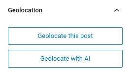
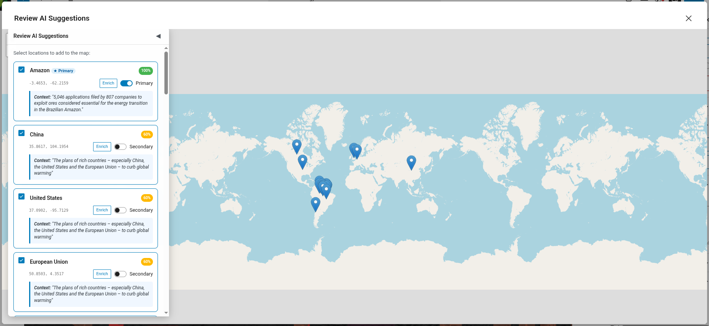
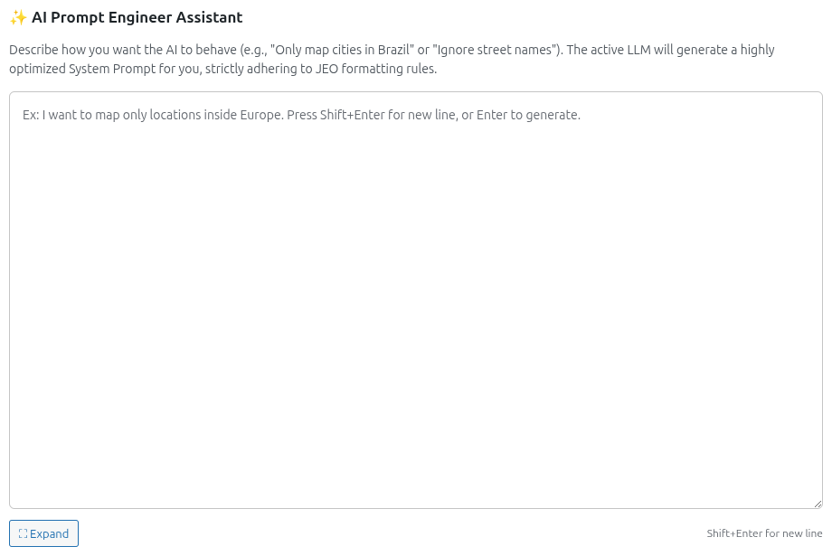
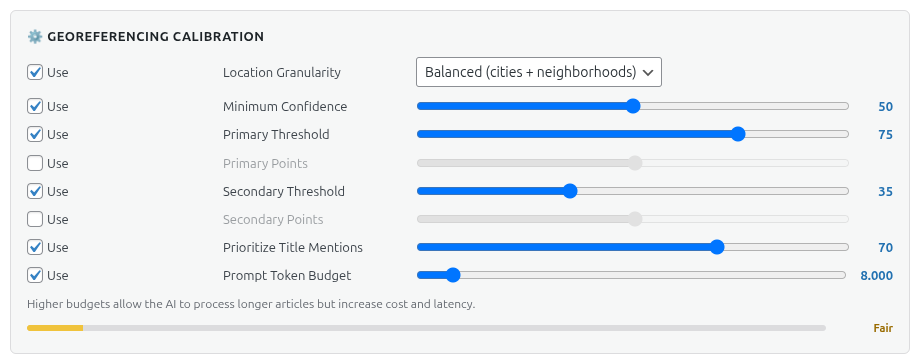

# AI Georeferencing

JEO can automatically georeference your posts using AI. Instead of manually searching and adding geolocation points, the AI analyzes your post content and suggests relevant locations with coordinates and confidence scores.

## How it works

When editing a post, the **Geolocation** sidebar panel includes an **Geolocate with AI** button. Clicking it sends your post title and content to the configured AI provider, which returns suggested geolocation points.

### Flow

1. Click **Geolocate with AI** in the Geolocation sidebar panel.
2. The AI analyzes the post content and identifies geographic references.
3. Suggested points appear with location name, coordinates, and a confidence score.
4. Review and approve or adjust the suggested points.
5. The points are saved as geolocation data for the post.

## Georeferencing with custom prompts

Under **Jeo → AI → Provider**, you'll find the **AI Prompt Engineer Assistant** section. Describe how you want the AI to behave (e.g., "Only map cities in Brazil" or "Ignore street names") and the active LLM will generate an optimized system prompt that incorporates your calibration settings. The generated prompt can be reviewed and edited before use.

### Calibration

Under **Jeo → AI → Provider**, in the **Georeferencing Calibration** section, you can fine-tune georeferencing behavior:

- **Location Granularity**: Controls the level of geographic detail — Broad (countries, regions), Balanced (cities + neighborhoods), or Fine (streets, landmarks, POIs).
- **Minimum Confidence**: Minimum confidence score for a point to be suggested (0–100).
- **Primary Threshold**: Confidence score above which a location is classified as PRIMARY (main geographic focus).
- **Primary Points**: Maximum number of PRIMARY locations the AI can suggest.
- **Secondary Threshold**: Confidence score range for SECONDARY locations (mentioned but not central).
- **Secondary Points**: Maximum number of SECONDARY locations the AI can suggest.
- **Prioritize Title Mentions**: How much the post title influences the AI's location detection (0–100%).
- **Max Tokens**: Token budget for the generated system prompt.

Each setting has a **Use** toggle — disable it to exclude that rule from the AI prompt.

## Multi-turn refinement

After the initial georeferencing, you can chat with the AI to refine the results. For example, you can ask it to add a specific city, remove an incorrect point, or adjust the confidence of a suggestion.

The conversation history is preserved per post, so you can continue refining in subsequent editing sessions.

## Requirements

- An AI provider must be configured in **Jeo → AI** (see [AI Settings](ai-settings.md)).
- The post must have a title and/or content for the AI to analyze.
