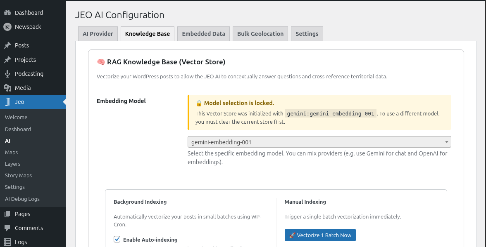

# AI Settings

JEO includes built-in AI capabilities for georeferencing posts, generating maps, and creating custom map layers. Before using these features, you need to configure an AI provider.

See [AI in JEO](ai-in-jeo.md) for an overview of the AI architecture and how each piece works.

## Configuring an AI provider

Navigate to **Jeo → AI** in the WordPress dashboard. The settings page is organized into tabs:

### Provider tab

Select one of the 10 supported AI providers and enter your API key:

| Provider | Requires API key |
|----------|-----------------|
| Google Gemini | Yes |
| OpenAI | Yes |
| DeepSeek | Yes |
| Anthropic | Yes |
| Ollama | No (local) |
| Mistral | Yes |
| ZAI | Yes |
| HuggingFace | Yes |
| Grok | Yes |
| Cohere | Yes |

After selecting a provider and entering the key, click **Test Connection** to verify it works.

### Knowledge Base tab

The Knowledge Base (RAG) stores vectorized versions of your posts and layers, allowing the AI to search for contextually relevant content when georeferencing or generating maps.

- **Embedding model**: Choose an embedding model from your provider (or use Ollama locally).
- **Auto-indexing**: Automatically index new and updated posts/layers in the background.
- **Batch size**: Number of items processed per indexing cycle.
- **Cron interval**: How often the background indexing runs.
- **Search results (topK)**: Maximum number of semantic matches returned per search (1–50, default 10).
- **Actions**: Manually trigger indexing for posts or layers, backup/restore the vector store, or clear it.

### Embedded Data tab

JEO ships with built-in Brazilian geographic dictionaries (biomes, conservation units, indigenous lands, hydrographic basins, and more). These help the AI recognize geographic references in your content. This tab shows which dictionaries are loaded.

### Bulk Geolocation tab

Configure batch geolocation settings for processing many posts at once. See [AI Bulk Geolocation](ai-bulk-geolocation.md) for details.

### Context Assistant tab

Customize the system prompt used by the [AI Context Assistant](ai-context-assistant.md) — the editorial suggestions sidebar in the Gutenberg editor.

- **Use custom prompt**: Check this box to override the built-in default prompt with your own.
- **Custom prompt**: Editable textarea for your custom system prompt. When unchecked, the tab shows the default prompt in a read-only field for reference.

Leave the custom prompt empty to use the built-in default, which is optimized for journalistic editorial assistance with RAG integration.

## Structured output

When enabled (default), the AI returns results in a strict JSON format enforced by the provider. This improves accuracy for georeferencing and map generation. You can disable it in the AI settings if your provider does not support it.

## Cost tracking

JEO tracks AI usage in **Jeo → AI Debug Logs**. Each log entry records the provider, model, input/output tokens, and the prompt and response. Use this to monitor costs and troubleshoot responses.
