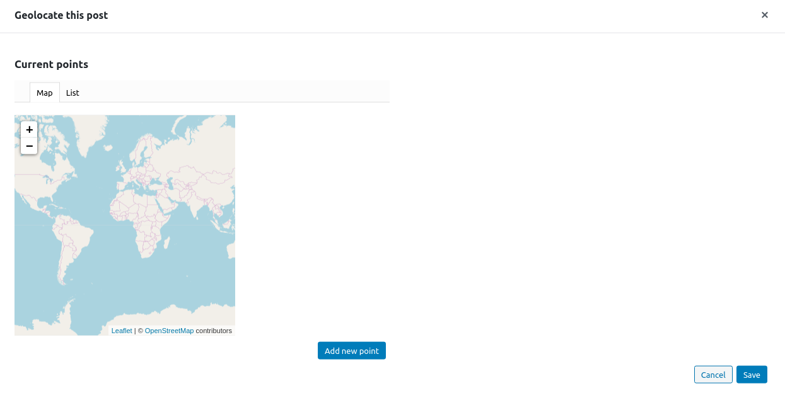

# Geolocating posts

When editing a post, JEO will add an extra panel to the sidebar: **Geolocation**. Clicking on **Geolocate this post**, a popup containing two tabs (**Map** and **List**) will then be displayed.

New points can be added to the post by clicking on **Add new point** button. You can search for a specific location in the search bar.

It's also possible to choose the relevance of each point, which is useful when you have more than one point.

## Map tab

The Map tab allows you to move a point by dragging its marker and dropping it on the new location.

## List tab

The List tab allows you to visualize all the created points and delete a specific point.
