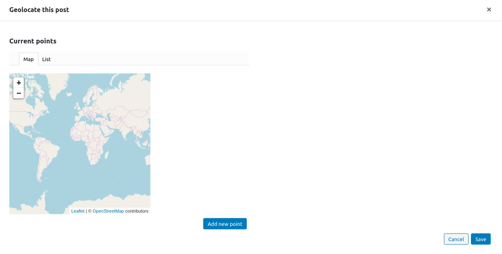
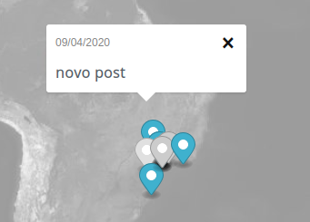

# Geolocating posts

When editing a post, JEO will add an extra panel to the sidebar: **Geolocation**. Clicking on **Geolocate this post**, a popup will then be displayed.

New points can be added to the post by clicking on **Add new point** button. You can search for a specific location in the search bar.

It's also possible to choose the relevance of each point, which is useful when you have more than one point.

## Visualizing a map with geolocated posts

Maps with geolocated posts contain markers at the location of each post. Clicking on them will open a popup with its title and publication date. Clicking on the title will take you to the post itself.

## AI Georeferencing

Alternatively, JEO can georeference posts automatically using AI. The AI analyzes the post content and suggests geolocation points with confidence scores. You can then review and approve the suggestions. See [AI Georeferencing](ai-georeferencing.md).

For bulk processing many posts at once, see [AI Bulk Geolocation](ai-bulk-geolocation.md).
