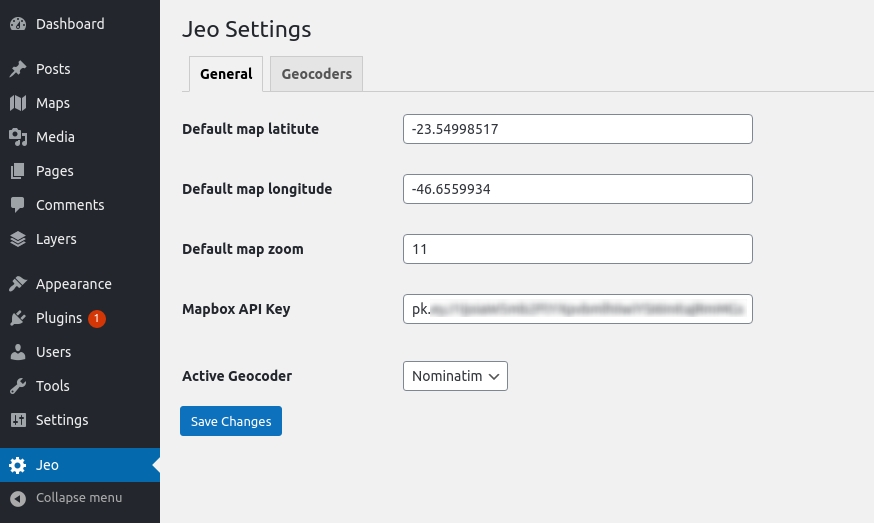

# Getting started

## Installing

After activating the plugin, a new item will appear on the WordPress dashboard: a menu containing the **Maps**, **Layers** and **Story Maps** post types, and the JEO settings menus.

## Configuring the plugin

Under JEO main menu, at Jeo Settings page, you can configure:

* the default latitude, longitude, and zoom for your maps;
* the [Mapbox API settings](https://docs.mapbox.com/help/how-mapbox-works/access-tokens/) and [Carto API settings](https://carto.com/developers/carto-js/guides/get-api-key/) that'll be used by the plugin;
* the update interval related to carto layers data (if carto layers are being used);
* the geocoder that'll be used by the plugin -- currently only [Nominatim](https://nominatim.openstreetmap.org/) is available.7
* the style of some functionalities of the plugin, such as fonts ans colors.

