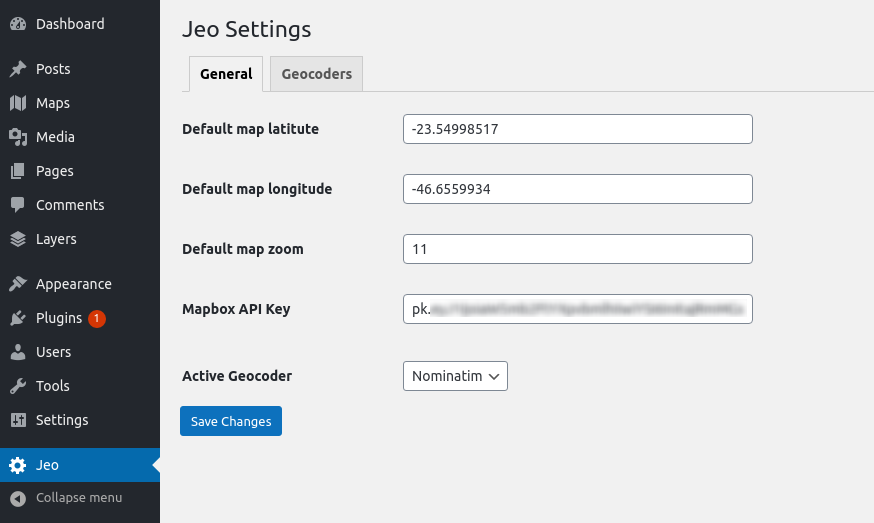
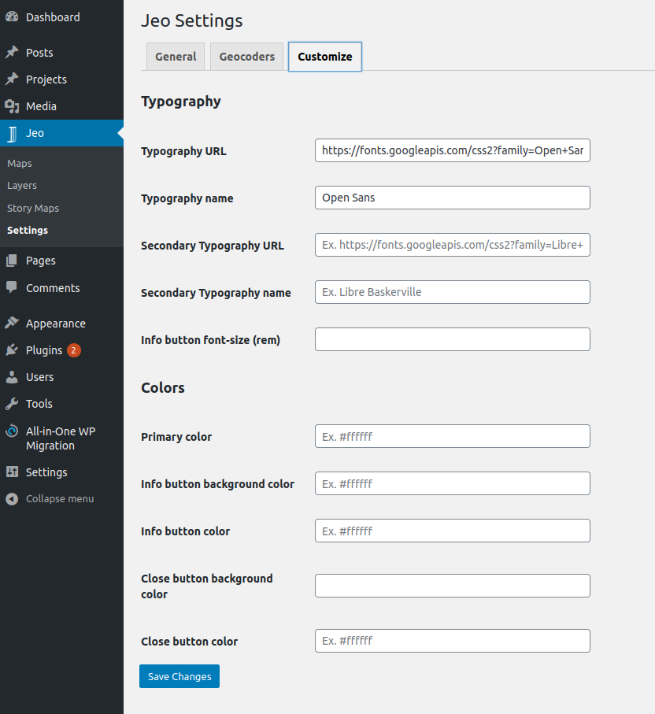
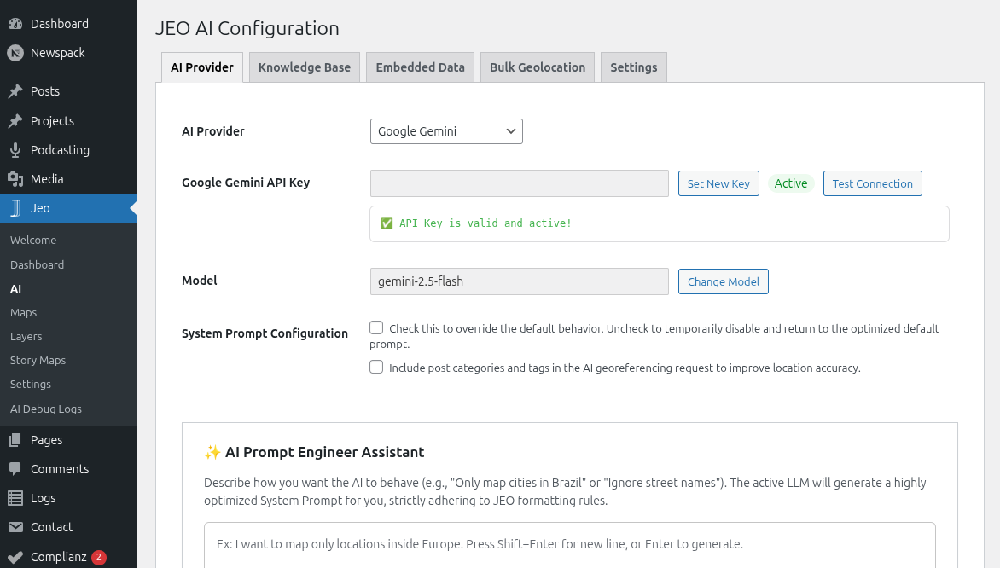

# Getting started

## Installing

After activating the plugin, a new item will appear on the WordPress dashboard: the **Jeo** menu, containing:

- **Maps** — Create and manage interactive map posts
- **Layers** — Create and manage data layer posts
- **Story Maps** — Create scrollytelling map experiences
- **AI** — Configure AI providers, knowledge base, and bulk geolocation
- **Settings** — General map, geocoder, and style settings

## Configuring the plugin

Under JEO main menu, at **Jeo → Settings**, you can configure:

* the default latitude, longitude, and zoom for your maps;
* the [Mapbox API settings](https://docs.mapbox.com/help/how-mapbox-works/access-tokens/) that'll be used by the plugin;
* the geocoder that'll be used by the plugin — currently [Nominatim](https://nominatim.openstreetmap.org/) is the built-in option, with extensibility for additional geocoders via hook.
* the style of some functionalities of the plugin, such as fonts and colors.

## Configuring AI features

Under **Jeo → AI**, you can configure AI-powered features:

* Select an AI provider (Google Gemini, OpenAI, DeepSeek, Anthropic, Ollama, Mistral, and others) and enter the API key.
* Set up the Knowledge Base (RAG) to index your posts and layers for smarter AI results.
* Configure bulk geolocation for processing posts in batches.

See [AI Settings](ai-settings.md) for detailed instructions.

