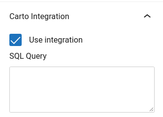
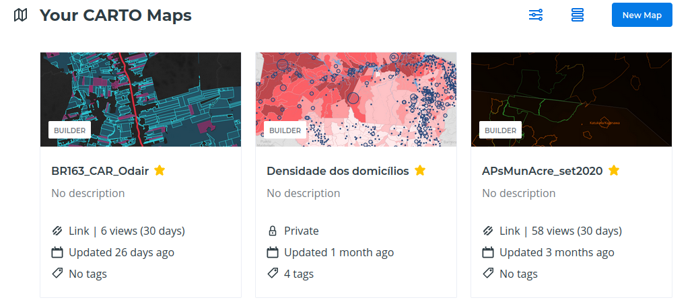
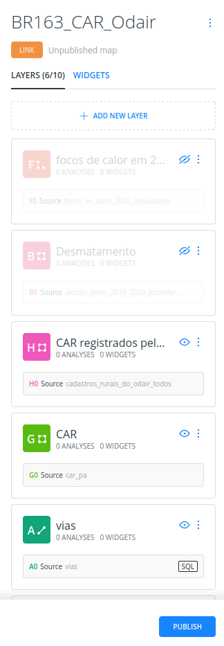
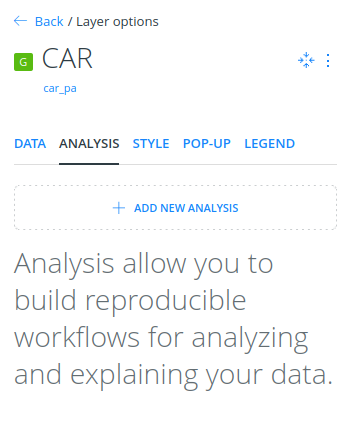

# Creating a layer

One of the custom post types that JEO plugin provides is **Layer**. Is in the layer where you will be able to add legend and color to your map. A map may contain one or more layers.

Entering the Layer post editor, you'll see a preview of the current layer (or a default layer if the current layer haven't been edited yet) and four sidebar panels: **Settings**, **Carto Integration**, **Attributions** and **Legend**.

## Layer settings

On the **Layer settings** panel, you can change the layer type.

JEO supports four layer types out-of-the-box:

- [Mapbox styles](https://docs.mapbox.com/studio-manual/overview/map-styling/)
- [Mapbox tilesets](https://docs.mapbox.com/help/glossary/tileset/)
- [Mapbox vector tiles](https://docs.mapbox.com/vector-tiles/reference/) (MVTs)
- [TileLayers](https://en.wikipedia.org/wiki/Tiled_web_map)

 You can also inform an address, following the standard `username/id`, to compose your map style. If an access token is needed for this layer, you can put it into the `Acess token` input.

There's also an **Edit interactions** button. Here, you can add popups to your layer when specific actions (clicking or hovering the mouse) are made (e.g.: Clicking on a building and displaying its height)

## Layer legend

On the **Layer legend** panel, you can add legends to your layer (barscale, simple-color, icons or circles and colorize them.

## Creating a Carto integrated Layer

When the checkbox `Use integration` is selected, the following field shows up: 

- SQL Query: Code that'll be used to retrieve layer data from Carto.

To get this SQL Query, go to your Carto Dashboard page and click on the map which has the layer to be used in the plugin.

Inside the map page, a layer list will be shown.

Select a layer and go to Data tab. At the sidebar's bottom, change from `Values` to `SQL`. The code that will be shown is the SQL Query.

## Attributions

Here is where you can give layer credits, setting a link to download it or access more information about it. These attributions will be shown on the bottom of the map and inside the popup that shows up when the `INFO` button is clicked in a map.