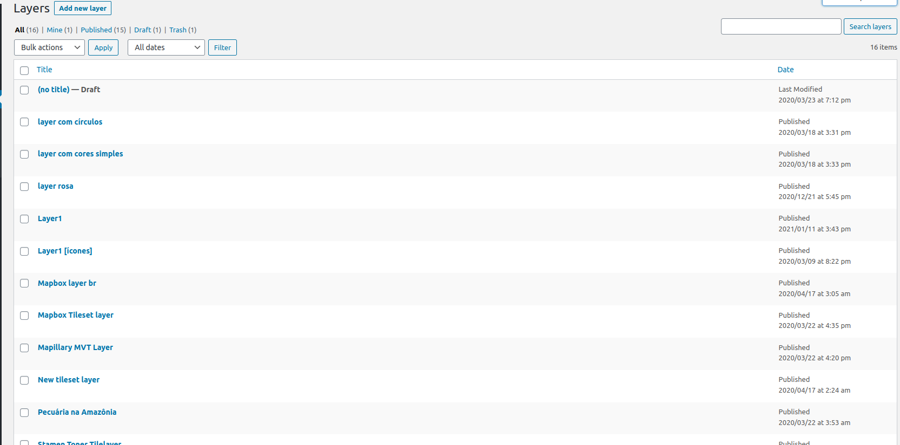
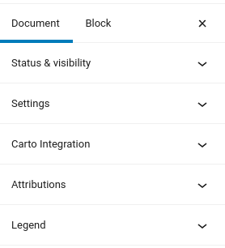
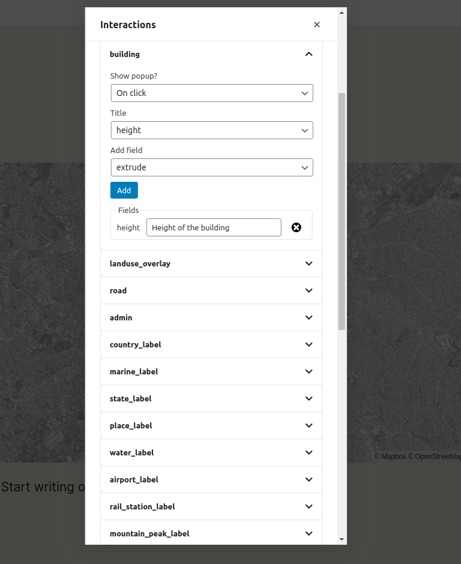
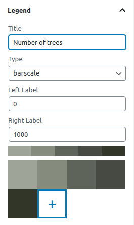

# Creating a layer

One of the custom post types that JEO plugin provides is **Layer**. Layers are where you add legends, colors, and data sources to your maps. A map may contain one or more layers.

Entering the Layer post editor, you'll see a preview of the current layer (or a default layer if the current layer hasn't been edited yet) and three sidebar panels: **Settings**, **Attributions** and **Legend**.

## Layer settings

On the **Layer settings** panel, you can change the layer type.

JEO supports four layer types out-of-the-box:

| Type | Required fields | Optional fields | Best for |
|------|-----------------|-----------------|----------|
| [Mapbox styles](https://docs.mapbox.com/studio-manual/overview/map-styling/) | Style ID (`username/style-id`) | Access token | Complete styled maps created in Mapbox Studio |
| [Mapbox tilesets](https://docs.mapbox.com/help/glossary/tileset/) | Tileset ID (`username.tilesetid`) | Access token | Raster data hosted on Mapbox |
| [Mapbox vector tiles](https://docs.mapbox.com/vector-tiles/reference/) (MVTs) | Tileset ID, source layer, geometry type | Access token | Vector data with interactive features |
| [TileLayers](https://en.wikipedia.org/wiki/Tiled_web_map) | Tile URL template (`https://.../{z}/{x}/{y}.png`) | — | Third-party tile servers (XYZ URLs) |

If the **Access token** field is left empty, the layer will use the Mapbox API key configured in **Jeo → Settings**. You only need to fill this field when the layer requires a different token than the global one.

There's also an **Edit interactions** button. Here, you can add popups to your layer when specific actions (clicking or hovering the mouse) are made (e.g.: clicking on a building and displaying its height).

## Layer legend

On the **Layer legend** panel, you can add legends to your layer (barscale, simple-color, icons, or circles) and customize their colors.

## Attributions

Here is where you can give layer credits, setting a link to download it or access more information about it. These attributions will be shown on the bottom of the map and inside the popup that shows up when the `INFO` button is clicked in a map.
