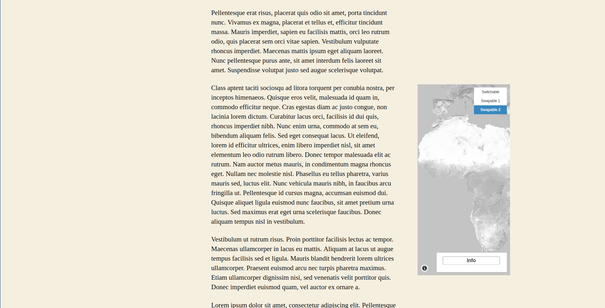
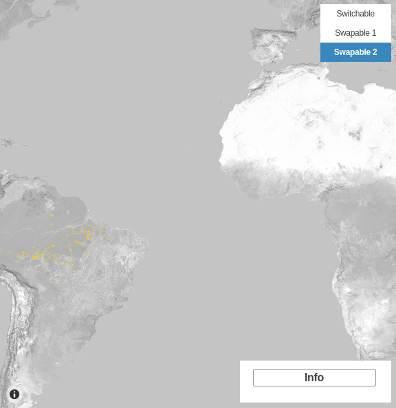

# Map block

After [creating maps](map-post.md), it is possible to display them apart or inside a block. This functionality makes possible to group maps, increasing your post organization.

## Displaying a map apart

When creating a new post, note that is available a new block category: **JEO**.

Selecting **JEO Map** block, you can search for any map you've created.

With a map selected, you are able to choose an optional alignment (`Left`, `Right`, `Centre`, `Wide Width` or `Full Width`). `Centre` is the standard alignment.

### Left

### Right

### Wide Width

### Full Width

## Displaying grouped maps

Besides the alignment option, there's also a group functionality available to arrange maps.

## Visualizing a map into a post

If your map has more than one layer, you can swap them and select which one do you want to see,depending on the map layer settings. [Check out more about map layers here](layer-post.md)

