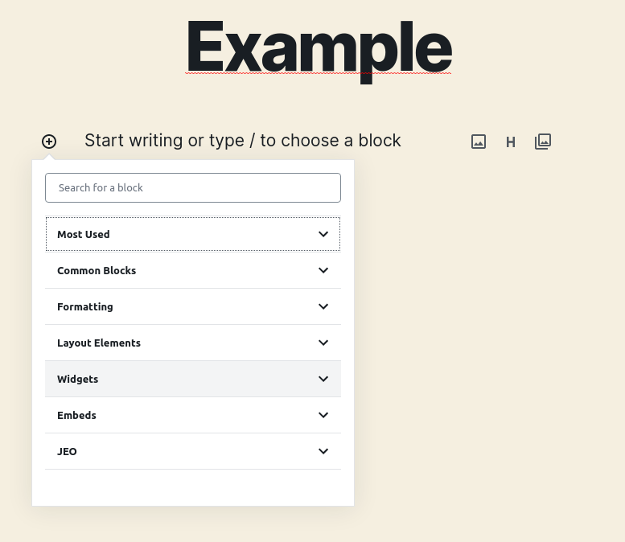
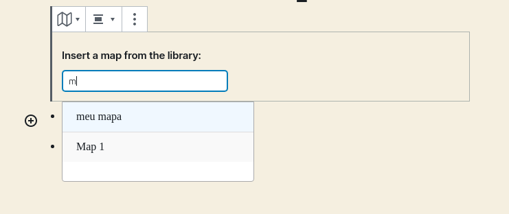
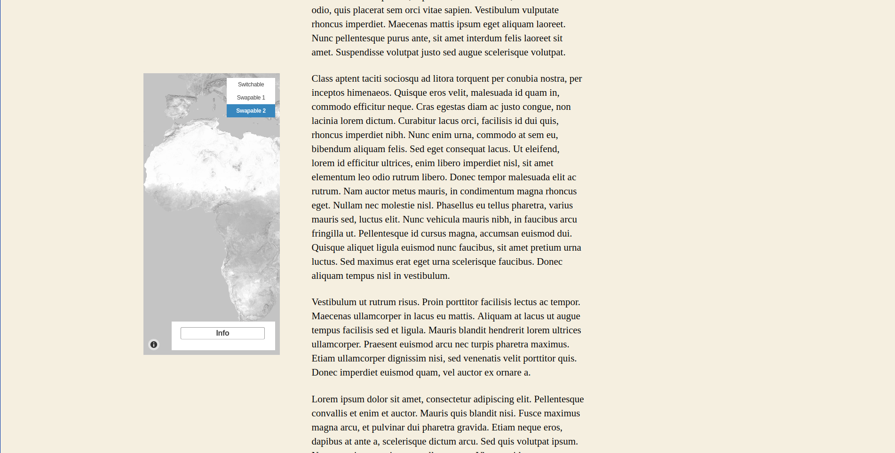
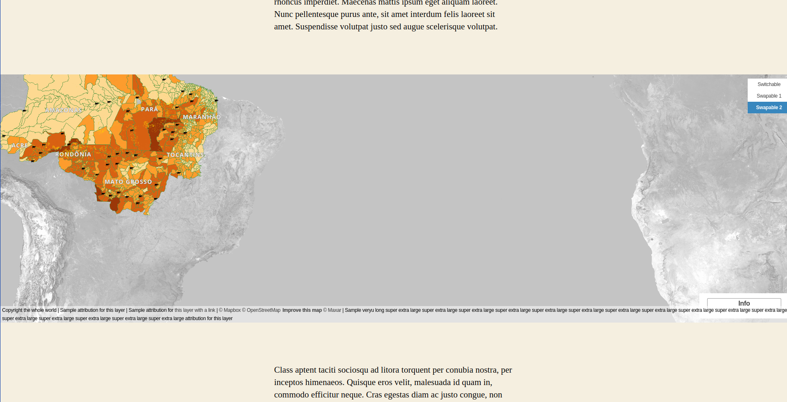
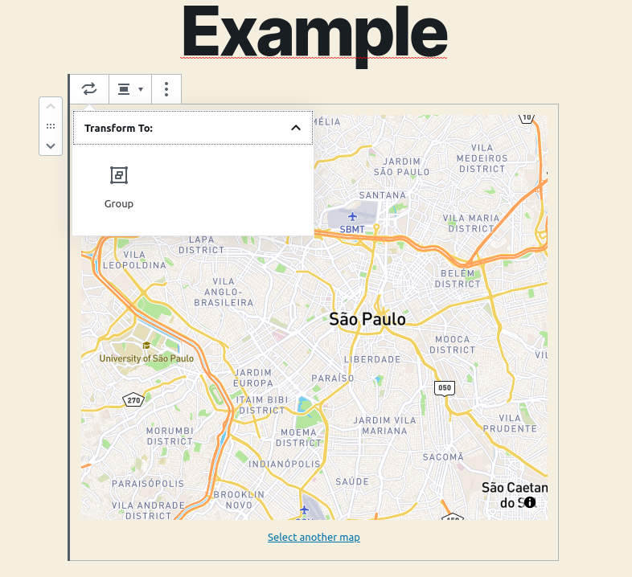
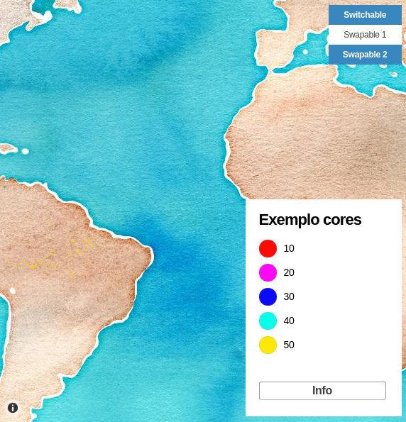
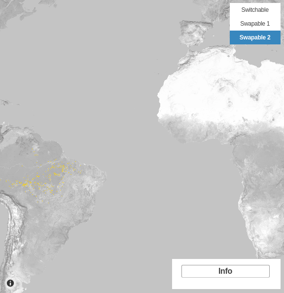

# Map block

After [creating maps](map-post.md), you can display them inside any post using the **JEO Map** block.

## Adding a map to a post

When creating a new post, you'll find a new block category: **JEO**.

Select the **JEO Map** block and search for any map you've created.

### Alignment options

With a map selected, you can choose an alignment:

| Alignment | Description |
|-----------|-------------|
| Center | Default. Map is centered within the content area |
| Left | Map floats left with text wrapping around it |
| Right | Map floats right with text wrapping around it |
| Wide Width | Map extends beyond the content area |
| Full Width | Map spans the full width of the page |

## Grouping maps

Besides the alignment option, there's also a group functionality available to arrange multiple maps together.

## Layer swapping

If your map has more than one layer, you can swap them and select which one you want to see, depending on the map layer settings. [Check out more about map layers here](layer-post.md)

