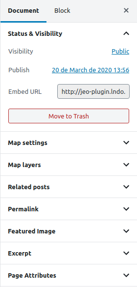

# Embedding a map

JEO plugin allows a map to be inserted into a post by pasting a link on the editor. This is what is called `Embed map` and it's very easy to be done.

When editing a [Map](map-post.md), one of the setting panels is `Status & Visibility`. There you can find the `embed URL` of that specific map.

Copying this link and pasting on the post editor will result on an embed map.

**Warning**: If your post displays a *Not Found* error, do the following steps:

- Go to Wordpress Dashboard > Settings > Permalinks
- Change the Common Settings (you may change to a different setting and then change back to the original) and click on `Save Changes`

Now you should be able to see the embed maps with no problems.
