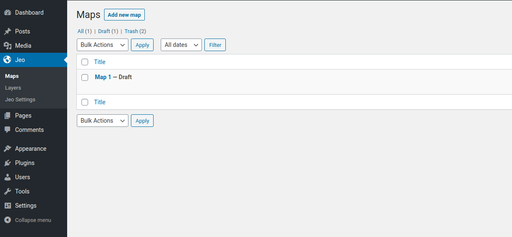
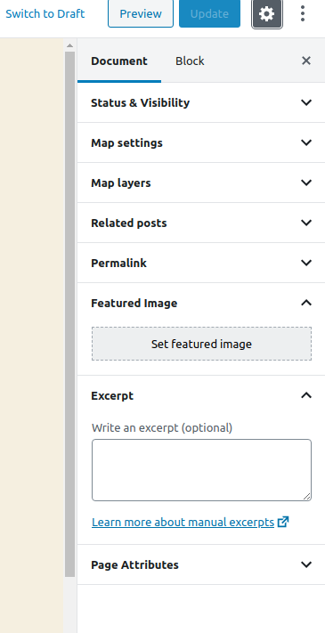
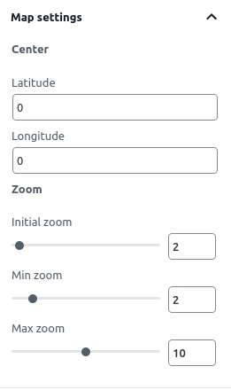
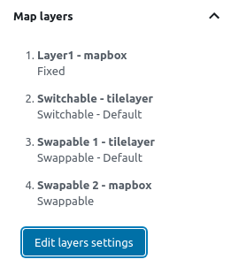
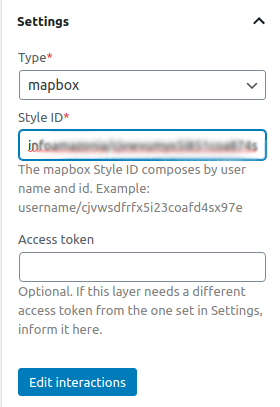
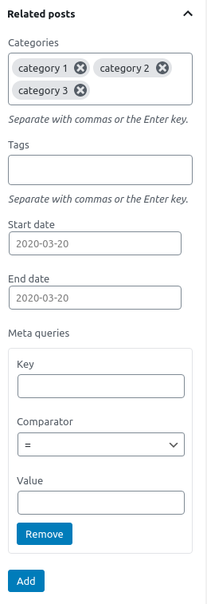

# Creating maps

One of the custom post types that JEO plugin provides is **Map**.

Entering the Map post editor, you'll see a preview of the current map (or a default map, if no layers are selected) and three sidebar panels: **Map settings**, **Map layers**, and **Related posts**.

## Map settings

On the **Map settings** panel, you can change the initial center of the map by setting a latitude and longitude. You can also change the default zoom settings or even disable it.

When viewing a map in a post, clicking with the right mouse button and dragging makes the map rotate. Scrolling the mouse wheel changes the map zoom. Both of these options can be enabled or disabled with the checkboxes.

## Map layers

On the **Map layers** panel, you can visualize all the layers which are part of the map.

Clicking on **Edit layers settings** opens a popup. There, you can add, remove and rearrange layers, define their types, and whether their legends will be shown on the map. You can also load specific interactions for each layer by clicking on `Load interactions`.

### Legend types

Each layer's legend can be set to one of these types:

- **Fixed**: The layer is always visible. Good for base reference layers.
- **Switchable**: The user can toggle the layer on and off independently. Good for optional overlays.
- **Swappable**: Only one swappable layer is visible at a time (radio behavior). Good for comparing different datasets.

### Layer styling

Some layer types support custom styling. When using **Mapbox vector tiles** with `fill`, `line`, or `circle` geometry, a style editor allows you to customize colors, opacity, and filters. Layers generated by AI also come with a suggested default style that you can accept or override. Other layer types (Mapbox styles, tilesets, TileLayers) use the styling defined in their source.

[Check out how to create new layers here](layer-post.md)

## Related posts

On the **Related posts** panel, you can set which geolocated posts will be used as markers on the map. You can filter posts by categories, tags, date interval, or — for advanced uses — meta queries using WordPress `post_meta`.

