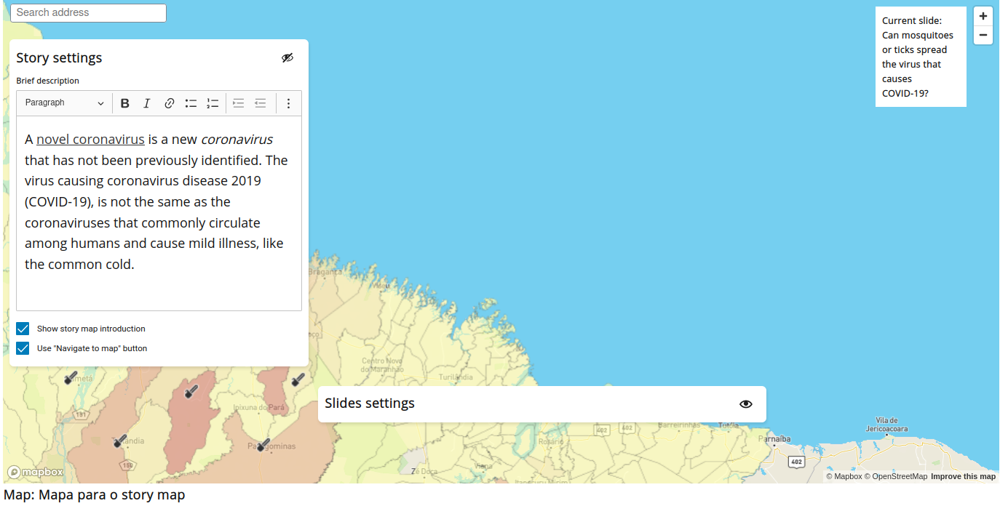
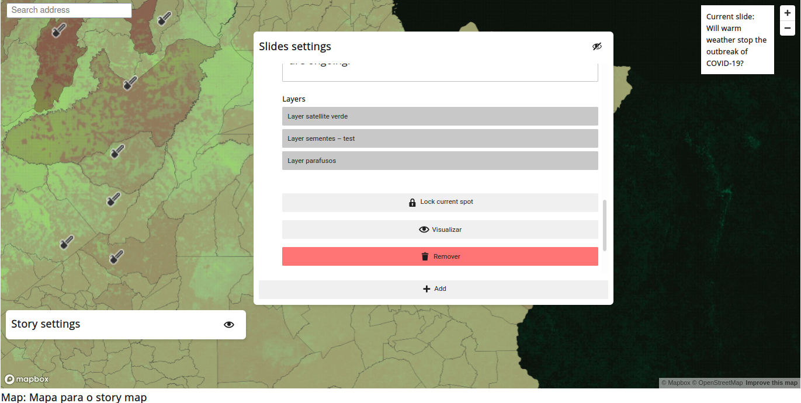
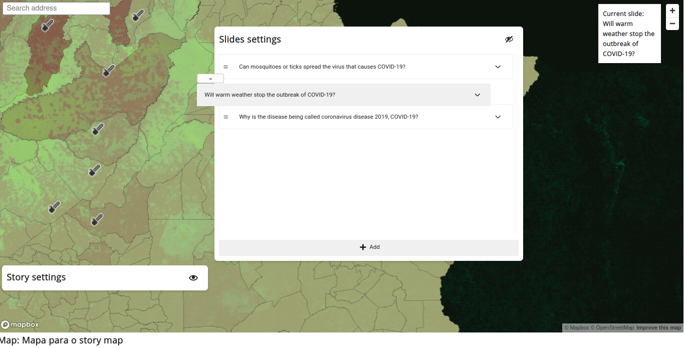
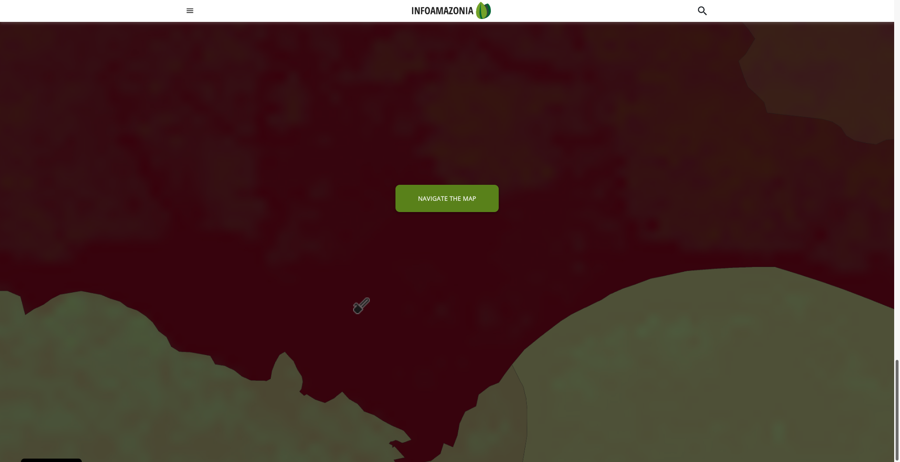

# Story Map
Story Map is a way of making an interactive storytelling with customized maps and layers. You are able to select specific locations and related layers and texts to these locations. This will generate a map that, when the page is scrolled, will change from one location/layer/text to another. This group of location, layer and text are called **Slide**.

## Creating a Story Map
Story Map is a custom post type in JEO Plugin. When creating one, you'll be asked for a map. All of the layers that you are going to use in your Story Map come from this previous selected map. Also, Story Map has a `Navigate function`, which we will talk about later. This Navigate function also uses this selected map to work.

### Story settings
Here you can set a description for your story map which will be shown at the beginning of the post, with the title and publish date. You can also define whether or not your story map will have an introduction and a `Navigate map button`.

**All the text fields has a buit-in Rich Text Editor. This means that you can put bold text, links, lists, etc inside your text field.**

`Navigate map button` appears at the end of a Story Map and allows the user to navigate through the map. This map will follow all the settings of the previous selected.

### Slides settings

A Story Map slide contains a title, content, location and selected layers (The order of the layers will always follow the map layers order that were defined when creating this map). You can remove a slide by clicking on **Remove** button, preview the map in a slide clicking on **Preview** button, and set the location to the current slide clicking on **Lock current spot** button. You can see what's the current slide at the top-right side of the block.

You can pick a location to a slide by dragging the map with left mouse button and changing its peaching and bearing by dragging the map with right mouse button.

Slides can be rearranged by clicking on `=` icon and dragging it to put the slide in another position.

## Looking at a Story Map

This is how a Story Map look in a post:

Clicking on **START** will take the user to the first slide. Clicking on **skip intro** will take the user to the map itself so they can navigate through it (this button is only available if the navigate setting is enabled in story map settings). These buttons, the title, description and publish date only appears if `Shows story map introduction` is enabled. If it isn't, the story map starts on the first slide.

While the page is scrolled, the current slide changes to the next one and the map do a transition to the next location and change its layers. At the end of the storytelling, if the correct setting is enabled, a **NAVIGATE THE MAP** button will shows up. Clicking on it will take the user to the map itself and allowing they to interact with it.

